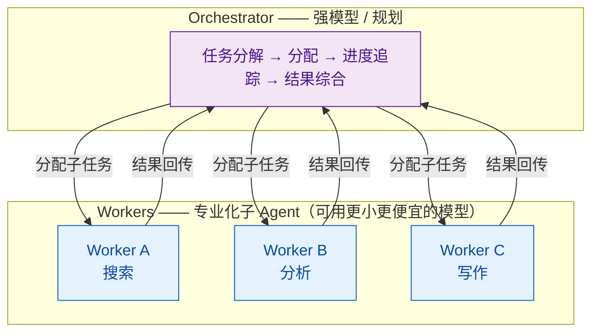

# 如何设计一个分层 Agent 架构（Orchestrator / Worker 模式）？

> 难度：中级
> 分类：Agent 架构

## 简短回答

分层 Agent 架构（Orchestrator-Worker 模式）是一种将复杂任务分解为"指挥"和"执行"两个层次的设计模式。Orchestrator（编排器）负责理解目标、分解任务、分配工作、综合结果；Worker（工作者）是专业化的子 Agent，各自擅长特定领域的任务执行。这种架构的核心优势是可扩展性和专业化分工，适合问题结构在运行时动态涌现的复杂场景。

## 详细解析

### 什么是 Orchestrator-Worker 模式？

Orchestrator-Worker 是一种集中式任务管理架构：一个智能控制器（Orchestrator）保持对整体系统的全局视野，负责将复杂问题分解为可管理的子任务，分发给专业化的 Worker Agent 执行，再将各 Worker 的局部结果综合为完整的解决方案。

与固定的 Prompt Chaining 或工具路由不同，Orchestrator-Worker 的假设是：**子任务的数量和类型取决于输入的特性，而非预定义的流程。**

### 核心架构


*Orchestrator-Worker 两层分工：强模型编排器负责分解、分配、综合，专业化 Worker 并行执行并回传结果。*

### Orchestrator 的职责

1. **任务理解**：解析用户的高层目标
2. **任务分解**：将目标拆解为具体的子任务
3. **任务分配**：根据 Worker 的能力选择最合适的 Worker
4. **进度追踪**：监控各 Worker 的执行状态
5. **结果综合**：将各 Worker 的结果整合为最终输出
6. **动态调整**：根据中间结果决定下一步——是继续分解、重新分配、还是结束

```python
class Orchestrator:
    def __init__(self, workers: dict[str, Worker], llm):
        self.workers = workers  # {"search": SearchWorker, "analyze": AnalyzeWorker, ...}
        self.llm = llm

    def run(self, task: str) -> str:
        # 1. 分解任务
        subtasks = self._decompose(task)
        results = {}

        while subtasks:
            # 2. 分配可并行执行的任务
            batch = self._get_parallel_batch(subtasks)

            # 3. 并行执行
            for subtask in batch:
                worker = self._select_worker(subtask)
                results[subtask.id] = worker.execute(subtask)

            # 4. 根据结果动态决定下一步
            subtasks = self._replan_if_needed(task, results)

        # 5. 综合结果
        return self._synthesize(task, results)

    def _decompose(self, task: str) -> list[SubTask]:
        """用 LLM 将高层任务分解为子任务"""
        response = self.llm.generate(
            f"将以下任务分解为具体的子任务，说明每个子任务需要的专业能力：\n{task}"
        )
        return parse_subtasks(response)

    def _select_worker(self, subtask: SubTask) -> Worker:
        """根据子任务类型选择合适的 Worker"""
        return self.workers[subtask.required_skill]
```

### Worker 的设计原则

每个 Worker 是一个专业化的 Agent，具备特定领域的能力：

```python
class SearchWorker(Worker):
    """专门负责信息检索的 Worker"""
    def __init__(self):
        self.tools = [web_search, database_query, document_retrieval]
        self.system_prompt = "你是信息检索专家，负责查找和整理相关信息。"

    def execute(self, subtask: SubTask) -> WorkerResult:
        # Worker 内部可以使用 ReAct 模式自主完成子任务
        agent = ReactAgent(
            llm=self.llm,  # 可以用更小、更便宜的模型
            tools=self.tools,
            system_prompt=self.system_prompt
        )
        return agent.run(subtask.description)

class AnalyzeWorker(Worker):
    """专门负责数据分析的 Worker"""
    def __init__(self):
        self.tools = [calculator, chart_generator, statistics_engine]
        self.system_prompt = "你是数据分析专家，负责处理和分析数据。"
```

### 层次化架构（Hierarchical）

对于超复杂任务，可以将 Orchestrator-Worker 模式递归应用，形成多层架构：

```
                      顶层 Orchestrator
                     /        |         \
              中层 Orch A  中层 Orch B  中层 Orch C
              /    \         |         /    \
         Worker  Worker   Worker  Worker  Worker
```

每个中层节点既是上层的 Worker，又是下层的 Orchestrator。这种递归结构适合企业级多团队协作场景。

```python
class HierarchicalOrchestrator(Orchestrator):
    """递归的层次化编排器"""
    def _select_worker(self, subtask: SubTask) -> Worker:
        if subtask.complexity > THRESHOLD:
            # 复杂子任务交给子 Orchestrator 进一步分解
            return SubOrchestrator(workers=self._get_sub_workers(subtask))
        else:
            # 简单子任务直接交给 Worker 执行
            return self.workers[subtask.required_skill]
```

### Orchestrator-Worker vs 其他多 Agent 模式

| 模式 | 特点 | 适用场景 |
|------|------|---------|
| **Orchestrator-Worker** | 集中控制，动态分解 | 问题结构在运行时涌现 |
| **Pipeline** | 固定顺序，前一步输出是后一步输入 | 结构确定的顺序处理 |
| **Peer-to-Peer** | Agent 间平等通信，无中心 | 协商、辩论、头脑风暴 |
| **Blackboard** | 共享状态空间，Agent 自主读写 | 知识密集型协作 |

### 设计中的关键考量

**1. Orchestrator 的模型选择**
- Orchestrator 需要强大的规划和推理能力，通常使用前沿模型（如 Claude Opus、GPT-4o）
- Worker 可以使用更小、更便宜的模型（如 Claude Haiku、GPT-4o-mini），因为它们只需在特定领域表现好

**2. 任务分配策略**
```python
# 静态路由：基于规则
if subtask.type == "search":
    return search_worker
elif subtask.type == "code":
    return code_worker

# 动态路由：让 LLM 选择
worker_selection = llm.generate(
    f"Given subtask '{subtask}' and available workers {worker_descriptions}, "
    f"which worker is most suitable?"
)
```

**3. 错误处理与容错**
- Worker 失败时，Orchestrator 应能检测并重新分配任务
- 设置 Worker 的超时和最大重试次数
- 某个 Worker 持续失败时，考虑降级或换用替代方案

**4. 状态管理**
- Orchestrator 维护全局状态（所有子任务的进度和结果）
- Worker 维护局部状态（自己的执行上下文）
- 考虑使用事件驱动架构使系统异步化，提高容错性

### 实际案例

**案例：自动化市场研究报告**

```
用户目标："分析 2026 年 AI Agent 市场，写一份报告"

Orchestrator 分解：
├── SubTask 1 → SearchWorker: 搜索市场规模数据
├── SubTask 2 → SearchWorker: 搜索主要玩家和竞争格局
├── SubTask 3 → AnalyzeWorker: 分析市场增长趋势
├── SubTask 4 → AnalyzeWorker: SWOT 分析
└── SubTask 5 → WriterWorker: 综合所有数据生成报告

执行流程：
1. SubTask 1 和 2 并行执行（都是搜索任务，互不依赖）
2. SubTask 3 和 4 依赖 1/2 的结果，在 1/2 完成后并行执行
3. SubTask 5 依赖所有前置任务，最后执行
```

## 常见误区 / 面试追问

1. **误区："越多层越好"** — 每增加一层都引入协调开销、延迟和成本。应使用满足需求的最简架构。如果单个 ReAct Agent 能完成任务，不要引入 Orchestrator-Worker。

2. **误区："Orchestrator 必须是 LLM"** — 对于结构确定的任务，Orchestrator 可以是确定性代码（if-else 路由、DAG 引擎），不必每次都调用 LLM。只有当任务分解需要理解自然语言语义时，才需要 LLM 做 Orchestrator。

3. **追问："Orchestrator-Worker 和微服务架构有什么关系？"** — 概念类似：Orchestrator 像 API Gateway + 业务编排层，Worker 像独立微服务。可以借鉴微服务的设计原则：单一职责、松耦合、独立部署、容错机制。

4. **追问："如何避免 Orchestrator 成为单点故障？"** — (1) Orchestrator 本身做无状态设计，状态存外部存储；(2) 设置 Orchestrator 超时，支持任务恢复；(3) 对关键任务可以引入多个 Orchestrator 做冗余。

## 参考资料

- [AI Agent Orchestration Patterns (Microsoft Azure)](https://learn.microsoft.com/en-us/azure/architecture/ai-ml/guide/ai-agent-design-patterns)
- [Choose a Design Pattern for Your Agentic AI System (Google Cloud)](https://docs.cloud.google.com/architecture/choose-design-pattern-agentic-ai-system)
- [Supervisor-Worker Pattern (Agentic Design)](https://agentic-design.ai/patterns/multi-agent/supervisor-worker-pattern)
- [Four Design Patterns for Event-Driven Multi-Agent Systems (Confluent)](https://www.confluent.io/blog/event-driven-multi-agent-systems/)
- [Orchestrator-Worker Agents: A Practical Comparison (Arize AI)](https://arize.com/blog/orchestrator-worker-agents-a-practical-comparison-of-common-agent-frameworks/)
