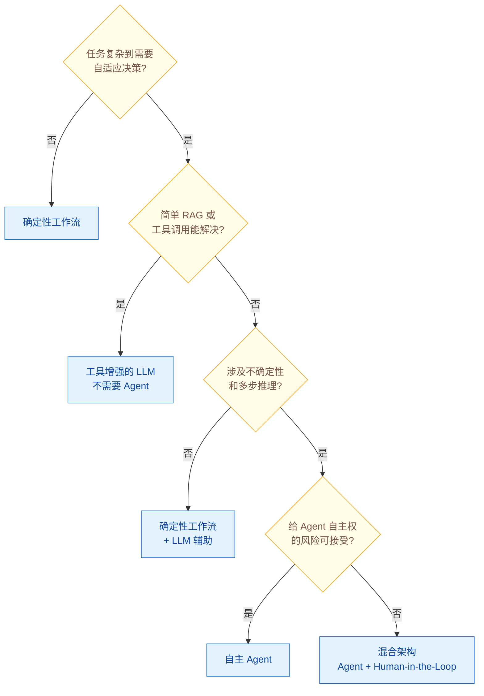

# Workflow vs Agent：什么时候用确定性工作流，什么时候用自主 Agent？

> 难度：中级
> 分类：Agent 架构

## 简短回答

确定性工作流和自主 Agent 不是二选一，而是一个连续光谱。工作流适合结构明确、需要可预测性和合规性的场景；Agent 适合开放性、需要动态判断的场景。实际生产中，最常见的模式是混合架构——用确定性工作流保证核心流程的可靠性，在需要灵活判断的环节嵌入 Agent。

## 详细解析

### 核心区别

| 维度 | 确定性工作流（Workflow） | 自主 Agent |
|------|------------------------|-----------|
| **控制方式** | 预定义代码路径 | LLM 自主决策 |
| **执行路径** | 固定、可预测 | 动态、运行时涌现 |
| **适应性** | 低（按规则执行） | 高（根据反馈调整） |
| **可审计性** | 高（每步可追踪） | 中（决策过程不透明） |
| **成本** | 低（可控） | 高（不确定的 LLM 调用次数） |
| **风险** | 低（行为可预测） | 高（可能做出意外决策） |
| **调试** | 简单 | 困难 |

### 什么时候用确定性工作流

适合工作流的场景特征：

1. **流程固定且已知**：每次执行的步骤相同，只是输入数据不同
2. **需要合规审计**：如果流程必须能逐步解释（如金融、医疗），不适合 Agent
3. **高可靠性要求**：不容许意外行为的关键路径
4. **简单任务**：表单处理、数据 ETL、基础提取——Agent 是过度设计

```python
# 确定性工作流示例：文档处理流水线
def document_pipeline(doc: Document) -> Report:
    text = extract_text(doc)           # 步骤 1：提取文本
    entities = extract_entities(text)   # 步骤 2：实体识别
    summary = summarize(text)           # 步骤 3：生成摘要
    report = format_report(entities, summary)  # 步骤 4：格式化输出
    return report
    # 每次执行路径完全相同，可预测、可审计
```

### 什么时候用自主 Agent

适合 Agent 的场景特征：

1. **问题结构不确定**：子任务的数量和类型取决于输入，无法预定义
2. **需要动态判断**：基于中间结果做决策，路径不可预知
3. **开放域探索**：如研究调查、自主诊断、个性化推荐
4. **多步推理**：需要跨多个工具、数据源进行综合推理

```python
# 自主 Agent 示例：客户问题诊断
# 不知道要查几个系统、问几个问题，完全取决于具体情况
agent = DiagnosticAgent(tools=[
    check_order_status,
    query_payment_system,
    search_knowledge_base,
    escalate_to_human,
])
result = agent.run("客户说付款了但订单状态没更新")
# Agent 自主决定：先查订单 → 再查支付 → 发现不一致 → 触发修复
```

### 光谱模型：从确定性到自主性

deepset 提出的光谱模型清晰地展示了这个连续体：

```
完全确定性 ←──────────────────────────→ 完全自主
   │                                       │
   │  1. 固定流水线                         │
   │  2. 条件分支（if-else 路由）           │
   │  3. LLM 辅助路由                      │
   │  4. 工具增强的 LLM                    │
   │  5. ReAct Agent                       │
   │  6. 自主多 Agent 系统                  │
   │                                       │
低风险/低成本                     高灵活性/高成本
```

大多数生产系统处于光谱的中间位置（Level 3-4）。

### 混合架构：最佳实践

实际生产中最常见的模式是混合架构：

```python
# 混合架构：确定性工作流 + Agent 嵌入
class HybridPipeline:
    def process_customer_request(self, request):
        # 步骤 1：确定性——验证身份（规则驱动）
        user = self.auth_service.verify(request.token)

        # 步骤 2：Agent——理解意图（需要 LLM 判断）
        intent = self.intent_agent.classify(request.message)

        # 步骤 3：确定性——路由到对应处理器
        if intent == "refund":
            handler = self.refund_workflow  # 固定流程
        elif intent == "technical_issue":
            handler = self.diagnostic_agent  # 需要 Agent 灵活处理
        else:
            handler = self.general_agent

        # 步骤 4：执行
        result = handler.run(request)

        # 步骤 5：确定性——日志和审计（固定流程）
        self.audit_log.record(request, result)
        return result
```

**核心原则**：确定性步骤处理可靠性关键的工作（验证、审计、合规），Agent 驱动的步骤处理需要判断、例外和个性化的工作。

### 决策框架

回答以下问题来选择方案：


*四问定控制权归属：复杂度、简单方案可解性、不确定性、风险，逐级从确定性工作流升级到自主 Agent。*

### 关键洞察

> "区别不在于使用了多少 AI，而在于流程的治理方式和执行期间由谁做决策。"

工作流由开发者预先决定执行路径，Agent 在运行时自主决定。这个区别决定了可预测性、可审计性和风险水平。

## 常见误区 / 面试追问

1. **误区："Agent 比 Workflow 更先进，应该总用 Agent"** — Agent 引入了不可预测性、高成本和调试困难。简单任务用 Agent 是过度设计，反而降低了可靠性。

2. **误区："用了 LLM 就是 Agent"** — 在固定流水线中嵌入 LLM 调用（如用 LLM 做文本分类）仍然是工作流，不是 Agent。Agent 的标志是 LLM 自主决定执行路径。

3. **追问："如何让 Agent 在混合架构中保持可控？"** — (1) 限制 Agent 的工具权限；(2) 设置 Human-in-the-Loop 审批关键操作；(3) 用 Guardrails 约束输出；(4) 设置最大步数和成本上限。

4. **追问："Anthropic 和 Google 对这个问题的观点是什么？"** — 两家都建议从最简架构开始。Anthropic 建议"从 Prompt 开始，只在必要时才升级到 Agent"。Google Cloud 的架构指南提供了从简单到复杂的渐进式设计模式选择。

## 参考资料

- [AI Agents and Deterministic Workflows: A Spectrum, Not a Binary Choice (deepset)](https://www.deepset.ai/blog/ai-agents-and-deterministic-workflows-a-spectrum)
- [Agentic Workflows vs AI Agents (Couchbase)](https://www.couchbase.com/blog/agentic-workflows-vs-ai-agents/)
- [Agentic AI Explained: Workflows vs Agents (Orkes)](https://orkes.io/blog/agentic-ai-explained-agents-vs-workflows/)
- [Deterministic Workflows vs Autonomous Agents vs Hybrid Models (Medium)](https://medium.com/@jmfloreszazo/deterministic-workflows-vs-autonomous-agents-vs-hybrid-models-when-to-use-each-approach-in-ai-c7327bea43a1)
- [What Are Agentic Workflows? (IBM)](https://www.ibm.com/think/topics/agentic-workflows)
