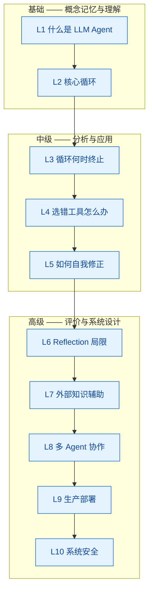

# 面试追问链：从「什么是 Agent」到系统设计的 10 层递进追问

> 难度：中级
> 分类：Agent 架构

## 简短回答

面试追问链（Interview Deep-Dive Chain）是一种结构化面试技术：面试官从基础问题出发，根据候选人回答逐层深入，最终触达系统设计层面。在 AI Agent 领域，一条典型追问链从"什么是 **LLM Agent**"起步，经过 **Agent Loop**、**终止条件**、**错误恢复**、**Self-Reflection**、**Reflection 局限性**、**RAG 集成**、**Multi-Agent 协作**、**生产部署**，最终落到 **安全与 Guardrails**。追问链的核心价值不在于"难倒候选人"，而在于**找到候选人的能力天花板并评估其思维深度**。好的追问链具备三个特征：**逻辑连贯**（每个问题自然承接上一个回答）、**难度递进**（从记忆型到分析型再到创造型）、**可调节**（面试官可根据候选人水平跳过或展开某些层级）。

## 详细解析

### 追问链全景图


*一条追问链从"什么是 Agent"问到"系统安全"，难度从概念记忆递进到系统设计，每层承接候选人的上一个回答。*

### 难度分层与能力映射

| 层级 | 难度 | 考察维度 | Bloom 认知层级 | 对应职级 |
|------|------|---------|---------------|---------|
| L1-L2 | 基础 | 概念记忆与理解 | 记忆 / 理解 | 初级工程师 |
| L3-L5 | 中级 | 分析与应用 | 应用 / 分析 | 中级工程师 |
| L6-L8 | 高级 | 评价与权衡 | 评价 | 高级工程师 |
| L9-L10 | 高级 | 系统设计与创造 | 创造 | Staff+ |

---

### L1（基础）—— 什么是 LLM Agent？

**面试官问：** "什么是 LLM Agent？它和普通 LLM 应用有什么区别？"

**期望答案要点：**
- Agent 是以 LLM 为推理引擎、能自主完成多步任务的系统
- 核心区别：感知（Perceive）→ 推理（Reason）→ 行动（Act）的循环
- 传统 LLM 应用是无状态单轮文本处理器；Agent 是有状态、目标驱动的自主系统
- Agent 具备工具使用（Tool Use）能力，能与外部世界交互

**评分标准：**
- **优秀：** 清晰区分 Agent 与传统 LLM 应用，提到自主性、状态管理、工具调用，并给出具体例子
- **合格：** 知道 Agent 能调用工具、多步执行，但底层机制描述模糊
- **不足：** 将 Agent 等同于"加了 System Prompt 的 ChatGPT"

**过渡逻辑：** 候选人提到"循环"或"多步"时，面试官追问循环的具体机制。

---

### L2（基础）—— Agent 的核心循环是怎样的？

**面试官问：** "你提到 Agent 会循环执行，这个循环具体是怎么工作的？"

**期望答案要点：**
- Agent Loop 四阶段：Observe → Think → Act → Observe
- Think 阶段由 LLM 完成推理，Act 阶段调用工具并获取结果
- 每次循环更新上下文（Context），积累到下一轮推理
- 典型实现模式：ReAct（Reasoning + Acting）

```python
class AgentLoop:
    def __init__(self, llm, tools, max_steps=10):
        self.llm, self.tools, self.max_steps = llm, tools, max_steps

    def run(self, goal: str) -> str:
        context = [{"role": "user", "content": goal}]
        for step in range(self.max_steps):
            response = self.llm.chat(context)           # Think
            if response.is_final_answer:
                return response.content
            result = self.tools.execute(                 # Act
                response.tool_call.name, response.tool_call.arguments
            )
            context.append({"role": "assistant", "content": response})
            context.append({"role": "tool", "content": result})  # Observe
        return "达到最大步数限制，任务未完成"
```

**评分标准：**
- **优秀：** 能画出循环流程，提到 ReAct 模式，理解上下文如何在循环间传递
- **合格：** 知道"LLM 调用 → 工具执行 → 再调用"的基本流程
- **不足：** 无法描述循环结构，认为 Agent 只是"调用一次 LLM 然后执行"

**过渡逻辑：** 候选人描述了循环后，面试官追问关键工程问题——循环不能无限跑，什么时候停？

---

### L3（中级）—— 循环什么时候终止？

**面试官问：** "这个循环不能永远跑下去吧？怎么决定什么时候该停？"

**期望答案要点：**
- **Max Steps 限制：** 硬性上限，防止无限循环
- **目标达成检测：** LLM 判断任务完成（如生成 `final_answer`）
- **收敛判断：** 检测连续几轮输出是否重复或无实质进展
- **资源预算：** Token 消耗、时间、API 调用次数达到上限

```
开始循环 → 超过 Max Steps? ──是──→ 优雅降级返回
              │ 否
              ↓
         LLM 输出终止? ──是──→ 返回最终结果
              │ 否
              ↓
         检测到死循环? ──是──→ 强制终止 + 告警
              │ 否
              ↓
         继续下一轮循环
```

**评分标准：**
- **优秀：** 提到多种终止策略并能分析 trade-off，理解"由系统而非 Agent 保证终止"的原则
- **合格：** 知道 Max Steps 和目标检测，但对死循环检测和优雅降级缺乏认识
- **不足：** 只知道 Max Steps，不理解为什么仅靠 LLM 自行判断终止是不可靠的

**过渡逻辑：** 终止是"正常结束"，但如果 Agent 执行过程中犯错了呢？面试官引入错误处理话题。

---

### L4（中级）—— 如果 Agent 在第一步就选错了工具怎么办？

**面试官问：** "假设 Agent 需要查数据库，但第一步却调了不相关的 API，怎么办？"

**期望答案要点：**
- **错误信息回传：** 将错误作为 Observation 反馈给 LLM，让它重新决策
- **重试策略：** 指数退避重试、限制同一工具连续重试次数
- **Self-Correction：** LLM 阅读错误信息后调整行动计划
- **Fallback 机制：** 工具不可用时切换备选工具或人工接管
- **预防措施：** 工具描述（Tool Description）要精准，减少选错概率

```python
def execute_with_recovery(self, tool_name, tool_args, max_retries=3):
    for attempt in range(max_retries):
        try:
            return {"status": "success", "result": self.tools.execute(tool_name, tool_args)}
        except ToolNotFoundError:
            return {"status": "error", "message": f"工具不存在，可用: {self.tools.list()}"}
        except ToolExecutionError as e:
            if attempt < max_retries - 1:
                return {"status": "error", "message": f"第{attempt+1}次失败: {e}，请换方案"}
    return {"status": "fatal", "message": "多次重试失败，请人工介入"}
```

**评分标准：**
- **优秀：** 区分"选错工具"和"工具执行失败"，提出预防 + 恢复的完整策略
- **合格：** 知道把错误信息反馈给 LLM 让它重试
- **不足：** 认为"选错工具就失败了"，不理解 Agent 的自我纠错能力

**过渡逻辑：** 候选人提到"自我纠错"时，面试官追问——怎么让这种能力更系统化？

---

### L5（中级）—— 如何让 Agent 有自我修正能力？

**面试官问：** "除了简单的重试，有没有更系统的方法让 Agent 反思并修正错误？"

**期望答案要点：**
- **Self-Reflection：** Agent 行动后显式评估自己的输出质量
- **Reflexion 框架：** Actor（执行）→ Evaluator（评估）→ Self-Reflection（反思改进）
- **外部验证器：** 单元测试、代码执行、规则校验等客观验证手段
- **经验记忆：** 将反思结论存入 Memory，避免重复犯错

```
Actor(执行者) ──行动──→ 环境/工具 ──反馈──→ Evaluator(评估者)
                                              │
                                         评估结果
                                              ↓
                                      Self-Reflection(反思者)
                                              │
                                         改进建议
                                              ↓
                                       经验记忆(Memory)
```

**评分标准：**
- **优秀：** 能描述 Reflexion 框架，区分内部反思与外部验证，理解经验记忆的价值
- **合格：** 知道"让 LLM 反思自己的输出"，但缺乏框架级认知
- **不足：** 将自我修正等同于"重试"，不理解反思与简单重试的本质区别

**过渡逻辑：** 候选人对 Reflection 有了解后，面试官切换到挑战模式——这方法有什么问题？

---

### L6（高级）—— Reflection 有什么局限？

**面试官问：** "Reflection 听起来很好，但它有什么局限性？什么场景会失效？"

**期望答案要点：**
- **推理幻觉：** LLM 可能"反思"出错误结论，越反思越偏
- **额外 Token 成本：** 每次反思需要额外 LLM 调用，成本线性增长
- **收敛不保证：** 没有数学证明反思一定改善结果，可能震荡
- **自我认知盲区：** LLM 难以发现自身系统性偏差
- **验证器依赖：** 没有可靠外部验证器的领域（如开放式创意任务），反思效果有限

| 维度 | Self-Reflection | 外部验证器 | 人工审核 |
|------|----------------|-----------|---------|
| 速度 | 快（秒级） | 中（秒~分钟） | 慢（分钟~小时） |
| 成本 | Token 费用 | 计算资源 | 人力成本 |
| 可靠性 | 低（可能幻觉） | 高（客观标准） | 最高 |
| 扩展性 | 好 | 好 | 差 |

**评分标准：**
- **优秀：** 指出 3 个以上局限，并提出缓解策略（如"反思 + 外部验证"组合）
- **合格：** 意识到 Token 成本和幻觉风险，但无法深入分析
- **不足：** 认为 Reflection 是万能的，未考虑过失败场景

**过渡逻辑：** 候选人提到"外部知识"或"验证器"不足时，面试官引导至 RAG 话题。

---

### L7（高级）—— 如何用外部知识辅助 Agent 决策？

**面试官问：** "Agent 自身知识有限，如何引入外部知识辅助决策？"

**期望答案要点：**
- **RAG 集成：** Agent 在推理前检索相关文档，增强上下文
- **Knowledge Graph：** 结构化知识图谱提供实体关系，辅助推理
- **动态上下文注入：** 根据任务阶段动态选择注入哪些知识
- **工具即知识：** 将数据库查询、API 调用作为知识获取手段
- **上下文窗口管理：** 知识太多挤占推理空间，需要 Relevance Ranking

```python
class RAGEnhancedAgent:
    def __init__(self, llm, tools, retriever):
        self.llm, self.tools, self.retriever = llm, tools, retriever

    def think(self, context: list) -> str:
        query = self._extract_search_query(context)
        docs = self.retriever.search(query, top_k=5)        # 检索
        augmented = [{"role": "system", "content": self._format(docs)}, *context]
        return self.llm.chat(augmented)                      # 增强推理
```

**评分标准：**
- **优秀：** 能描述 RAG 在 Agent Loop 中的集成位置，理解上下文窗口管理挑战
- **合格：** 知道 RAG 基本概念，但不清楚如何与 Agent Loop 结合
- **不足：** 将 RAG 等同于"把所有文档塞进 Prompt"

**过渡逻辑：** 当任务复杂到一个 Agent 无法胜任时，面试官引入 Multi-Agent 话题。

---

### L8（高级）—— 如果一个 Agent 不够，多个 Agent 如何协作？

**面试官问：** "任务太复杂一个 Agent 处理不了，你怎么设计多 Agent 协作？"

**期望答案要点：**
- **Multi-Agent 模式：** Orchestrator-Worker、Hierarchical、Peer-to-Peer
- **Handoff 机制：** Agent 间任务交接，包括上下文传递和责任转移
- **编排器（Orchestrator）：** 中央调度器分配任务、收集结果、处理冲突
- **专业化分工：** 每个 Agent 有独立 System Prompt、工具集和知识库

```
            ┌──────────────┐
            │ Orchestrator │
            └──┬───┬───┬──┘
     分配任务 │   │   │ 收集结果
       ┌──────┘   │   └──────┐
       ↓          ↓          ↓
  ┌────────┐ ┌────────┐ ┌────────┐
  │Worker-1│ │Worker-2│ │Worker-3│
  │代码生成 │ │测试验证 │ │文档撰写 │
  └────────┘ └────────┘ └────────┘
```

**评分标准：**
- **优秀：** 对比多种协作模式的 trade-off，理解 Handoff 的上下文传递挑战
- **合格：** 知道"拆分成多个 Agent"，但对编排机制描述不清
- **不足：** 认为"多个 Agent 就是多线程调同一个 LLM"

**过渡逻辑：** 架构设计完成后，面试官关注工程落地——这套系统怎么上生产？

---

### L9（高级）—— 这套多 Agent 系统如何部署到生产？

**面试官问：** "要把这套多 Agent 系统部署到生产环境，需要考虑哪些问题？"

**期望答案要点：**
- **架构设计：** Agent 作为微服务、消息队列解耦、状态持久化
- **可扩展性：** 水平扩展 Worker Agent、任务队列负载均衡
- **可观测性：** 每步 LLM 调用和工具执行都需 Trace（LangSmith / OpenTelemetry）
- **成本控制：** Token 监控、缓存策略、模型分级（简单任务用小模型）
- **容错设计：** Checkpoint 机制、崩溃恢复、幂等性保证

```python
production_config = {
    "agent":        {"max_steps": 25, "timeout_seconds": 300, "checkpoint": "redis"},
    "llm":          {"primary": "claude-sonnet-4", "fallback": "claude-haiku-4", "temperature": 0.0},
    "observability": {"trace_backend": "opentelemetry", "metrics": ["token_usage", "latency", "error_rate"]},
    "cost_control":  {"max_tokens_per_session": 100000, "cache": "semantic",
                      "model_routing": {"simple": "haiku", "complex": "sonnet"}},
}
```

**评分标准：**
- **优秀：** 覆盖可观测性、成本控制、容错、扩展四个维度，能给出具体技术选型
- **合格：** 知道需要监控和日志，但对 Trace 粒度和成本优化缺乏具体方案
- **不足：** 只关注功能实现，未考虑运维层面的挑战

**过渡逻辑：** 系统上了生产就面临安全风险，面试官最终追问安全性。

---

### L10（高级）—— 如何保证系统安全？

**面试官问：** "这套 Agent 系统直接与外部 API 和数据库交互，怎么保证它不会做出危险操作？"

**期望答案要点：**
- **Guardrails（护栏）：** 输入过滤（Prompt Injection 检测）、输出校验（敏感信息过滤）
- **权限最小化（Least Privilege）：** 每个 Agent 只拥有完成任务所需最小权限
- **沙箱执行：** 代码执行和文件操作在隔离环境中运行
- **Human-in-the-Loop：** 高风险操作（删除数据、转账）必须人工确认
- **Red Teaming：** 定期对 Agent 进行对抗性测试，发现安全漏洞

```
Layer 1 输入层:    Prompt Injection 检测 → 输入校验
       ↓
Layer 2 推理层:    System Prompt 防护 → 输出格式约束
       ↓
Layer 3 执行层:    权限检查 → 沙箱隔离 → 操作审计日志
       ↓
Layer 4 人工审核:  高风险操作拦截 → Human-in-the-Loop
```

**评分标准：**
- **优秀：** 能描述多层防护架构，理解 Prompt Injection 威胁，提到 Red Teaming 实践
- **合格：** 知道需要权限控制和人工确认，但安全思维不够系统化
- **不足：** 认为"限制工具权限就够了"，未考虑 Prompt Injection 和对抗性攻击

---

### 面试官视角：如何动态使用追问链

追问链不是死板题库，而是动态导航工具。面试官应根据候选人回答实时调整：

```python
class InterviewNavigator:
    LEVELS = {
        "junior": {"start": 1, "target": 3, "max": 5},
        "mid":    {"start": 2, "target": 5, "max": 7},
        "senior": {"start": 3, "target": 7, "max": 10},
        "staff":  {"start": 5, "target": 9, "max": 10},
    }

    def decide_next(self, current_level, answer_quality, candidate_level):
        cfg = self.LEVELS[candidate_level]
        if answer_quality == "excellent":
            return min(current_level + 2, cfg["max"])   # 跳级追问
        elif answer_quality == "good":
            return min(current_level + 1, cfg["max"])   # 正常递进
        elif answer_quality == "struggling":
            return current_level                        # 停留并引导
        else:
            return f"能力边界在 L{current_level}，建议结束追问"
```

## 常见误区 / 面试追问

1. **误区："背答案就够了，追问链上的每个答案我都背下来就能过面试"** — 追问链的核心价值在于考察思维过程而非记忆力。优秀的面试官会根据候选人回答动态调整追问方向，背诵标准答案的候选人在面试官稍微变换角度时就会暴露。真正有效的准备是理解每层问题之间的逻辑关联——为什么 L3 的终止条件自然引出 L4 的错误恢复？因为终止是"正常结束"，错误是"异常情况"，二者共同构成 Agent Loop 的健壮性要求。

2. **误区："面试追问就是刁难候选人，问到答不出来为止"** — 追问链的目标不是"难倒"候选人，而是精确定位其能力边界。好的追问过程应让候选人感到"被引导着思考"而非"被拷问"。面试官在候选人卡住时应提供线索（如"你有没有想过错误信息可以作为反馈？"），帮助其展示最佳水平。找到天花板后应及时停止，而非继续施压。

3. **追问："如果候选人在 L5 卡住了，你作为面试官会怎么引导？"** — 候选人卡住通常有两种情况。第一种是知道"重试"但不知道如何系统化，可引导："如果让 Agent 不仅重试，还要先分析为什么失败了，你会怎么设计？"——帮助候选人想到 Evaluator 概念。第二种是完全没接触过 Reflection，可降维引导："你自己写代码犯了错，思考过程是什么？先看报错、再分析原因、再修改——能不能让 Agent 也这样做？"如果引导后仍无法回答，说明能力边界在 L4-L5 之间，对应中级水平。

4. **追问："这条追问链如何适配不同级别（初级/中级/高级）的候选人？"** — 核心是调整"起点"和"天花板"。初级候选人从 L1 起，目标 L3，达到 L5 即超预期；中级从 L2 起，目标 L5-L6；高级从 L3 甚至 L5 起，目标 L8-L9；Staff 级别直接从 L5 起，期望完整回答到 L10。同一层级也可调整深度：对初级问"Agent Loop 是什么"，对高级问"你在生产中遇到过 Agent Loop 的哪些坑"——同是 L2 的问题，考察维度完全不同。

## 参考资料

- [Reflexion: Language Agents with Verbal Reinforcement Learning (Shinn et al., 2023)](https://arxiv.org/abs/2303.11366)
- [ReAct: Synergizing Reasoning and Acting in Language Models (Yao et al., 2023)](https://arxiv.org/abs/2210.03629)
- [Building Effective Agents (Anthropic Blog)](https://www.anthropic.com/engineering/building-effective-agents)
- [LLM Powered Autonomous Agents (Lilian Weng Blog)](https://lilianweng.github.io/posts/2023-06-23-agent/)
- [OWASP Top 10 for LLM Applications (OWASP Foundation)](https://owasp.org/www-project-top-10-for-large-language-model-applications/)
