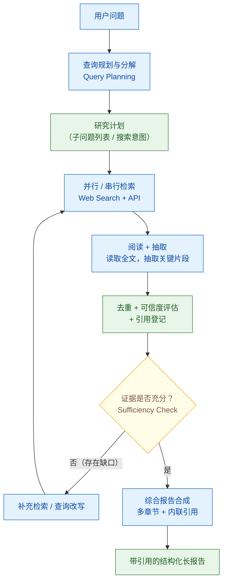

# 什么是 Deep Research / Agentic Search Agent？它和 Agentic RAG 有何区别？

> 难度：中级
> 分类：Agent 架构

## 简短回答

**Deep Research Agent**（深度研究智能体）是一种端到端的"检索—阅读—再检索—综合"型 Agent，它把一个复杂问题转化为多轮、多源的自主调研过程，最终产出一份**带引用的结构化长报告**。它的工作形态更像一个人类研究员：先拆解问题、制定研究计划，再并行或串行地检索数十乃至上百个来源，逐篇阅读并抽取关键信息，判断已有证据是否充分、是否存在覆盖缺口，必要时补充检索，最后把所有发现综合成一篇连贯的多章节报告。与"给一个问题、返回一段答案"的传统问答不同，Deep Research 的产物是**长报告**，强调广度、深度和可溯源性。

与 **Agentic RAG** 的本质区别在于**抽象层次不同**：Agentic RAG 是一种**检索增强模式**——Agent 自主决定何时检索、如何改写查询、是否需要多跳，它是嵌在更大系统里的一个组件，输出通常是对当前问题的简短回答；Deep Research 则是一种**产品形态**——它在 Agentic Search 循环之上，叠加了**研究规划、全量阅读抽取、充分性判断、长报告合成、引用管理**等能力，把这些组装成一个面向"长尾复杂调研"场景的完整产品。一句话概括：**Agentic RAG 是"检索的自主化"，Deep Research 是"检索自主化之上的报告生成产品化"。**

理解这道题的关键，是抓住 Deep Research 的三个独有要素：**显式的研究计划（plan-first）**、**基于证据充分性的迭代终止（sufficiency-aware loop）**、**面向长报告的综合与引用管理（synthesis + citation）**。这三个要素也是它在面试中与 Agentic RAG 区分的核心论据。

## 详细解析

### Deep Research 的核心循环

Deep Research 的内核是一个**充分性感知的多轮检索循环**。主流产品（OpenAI Deep Research、Perplexity Deep Research、Gemini Deep Research）的实现细节各有差异，但都遵循同一个高层骨架：


*Deep Research 的内核是充分性感知的多轮检索循环：证据不足就改写补检，充分才进入带引用的长报告合成。*

这个循环的每一个环节都值得展开，因为它们正是 Deep Research 区别于普通检索增强的关键。

#### 1. 查询规划与分解（Query Planning）

传统搜索把用户的原始问题直接扔给搜索引擎；Deep Research 的第一步是**先把问题拆解成可检索的子问题和搜索意图**。一个复杂研究问题（如"对比 2025 年三大云厂商的 Agent 托管方案"）会被拆成若干独立的搜索任务，每个任务对应一个聚焦的搜索查询。Gemini Deep Research 会把生成的研究计划**显式呈现给用户审阅和修改**，用户认可后才真正开始检索——这种"plan-first, search-second"的模式是其可解释性和可控性的来源。

查询改写/分解的常见手段包括：**子问题拆分**（把多跳问题拆成单跳）、**视角枚举**（同一主题从正/反、不同利益方展开）、**时间限定补全**（补上"最新""2026"等时效约束）、**去歧义改写**（消解指代和模糊表述）。

#### 2. 并行 / 串行检索（Parallel / Serial Retrieval）

拆解后的子查询会被分发到检索层执行。Deep Research 的检索源通常是**开放 Web 搜索**（而非私有知识库），这与以企业文档为检索语料的 RAG 形成对照。为了提升效率，相互独立的子查询会**并行检索**；存在依赖关系的（后一个搜索依赖前一个的结果）则串行执行。这种"并行 fan-out + 串行 chain"的混合调度，本质上是 Anthropic 所说的 **Orchestrator-Worker 模式**：一个 Orchestrator 负责规划与综合，多个 Worker 并行执行检索与抽取。

#### 3. 阅读 + 抽取（Read & Extract）

这是 Deep Research 与普通搜索结果摘要的关键分水岭。传统搜索只看摘要片段（snippet）；Deep Research 会**点进链接、读取网页/PDF 全文**，再由 LLM 抽取与子问题相关的关键信息（事实、数据、观点、引用）。这一步往往消耗大量上下文和算力，但也是它能产出深度内容的原因——它不满足于搜索引擎给的"摘要的摘要"。

#### 4. 充分性判断（Sufficiency Check）

循环每跑一轮，Agent 都要回答一个问题：**"我现在掌握的证据，足以回答用户的研究问题吗？"** 这是 Deep Research 的"停止条件"。判断充分性既要看**覆盖广度**（研究计划的子问题是否都有证据支撑），也要看**证据质量**（来源是否权威、是否互相印证、是否存在矛盾）。若发现某个子问题证据薄弱或缺失，Agent 会触发**补充检索**——可能是改写查询、换关键词、或针对缺口发起新一轮搜索。充分性判断避免了两种失败：证据不足就草草收场，或无意义地无限检索。

#### 5. 综合报告合成 + 引用管理（Synthesis & Citation）

当证据被判定为充分，Agent 进入**综合阶段**：把散落在数十个来源中的信息，组织成一篇有结构、有逻辑、**带内联引用**的长报告。这要求 LLM 完成跨源信息融合、去重、矛盾调和、观点归纳，并为每一条论断标注来源。引用管理（哪些论断对应哪个来源、如何去重同一事实的多个出处）是工程上很容易出错的一环，也是"幻觉引用"的高发区。

### 核心循环伪代码

下面用一个简化的 Python 伪代码刻画这个循环，帮助在面试中讲清结构（省略错误处理与并发细节）：

```python
from dataclasses import dataclass


@dataclass
class Evidence:
    """单条证据：来自某个来源的、与某子问题相关的抽取结果"""
    sub_question: str        # 对应哪个子问题
    content: str             # 抽取出的关键信息
    source_url: str          # 来源链接
    credibility: float       # 可信度评分 0-1
    cited: bool = False      # 是否已用于最终报告


class DeepResearchAgent:
    """Deep Research 核心循环的骨架实现"""

    def __init__(self, llm, web_search, max_rounds: int = 10):
        self.llm = llm
        self.web_search = web_search
        self.max_rounds = max_rounds

    def run(self, question: str) -> str:
        # 1. 查询规划：把复杂问题拆成子问题 + 搜索意图
        plan = self._plan_research(question)          # -> list[str] 子问题
        evidence_pool: list[Evidence] = []
        pending_queries = plan[:]

        # 2-4. 充分性感知的多轮检索循环
        for round_idx in range(self.max_rounds):
            # 2. 并行检索：独立子查询 fan-out
            raw_results = self.web_search.batch(pending_queries)

            # 3. 阅读全文 + 抽取关键信息
            for query, docs in zip(pending_queries, raw_results):
                for doc in docs:
                    extracted = self._read_and_extract(doc, query)
                    credibility = self._assess_credibility(doc)
                    evidence_pool.append(Evidence(
                        sub_question=query,
                        content=extracted,
                        source_url=doc.url,
                        credibility=credibility,
                    ))

            # 4. 去重 + 覆盖度分析
            evidence_pool = self._deduplicate(evidence_pool)
            coverage = self._analyze_coverage(plan, evidence_pool)

            # 充分性判断：所有子问题都有足够高质量证据？
            gaps = self._find_gaps(coverage)          # 证据不足的子问题
            if not gaps:
                break                                  # 证据充分，退出循环

            # 5. 针对缺口改写查询、补充检索
            pending_queries = self._rewrite_for_gaps(gaps, evidence_pool)
        else:
            # 达到最大轮次仍未充分，降级处理
            pass

        # 6. 综合报告合成：多章节 + 内联引用
        report = self._synthesize_report(question, plan, evidence_pool)
        return report
```

这段伪代码揭示了 Deep Research 的三个灵魂要素：`_plan_research`（显式规划）、`_find_gaps` + `_rewrite_for_gaps`（充分性感知的迭代）、`_synthesize_report`（带引用的长报告合成）。三者缺一，就退化成普通的 Agentic RAG。

### Deep Research vs Agentic RAG vs 传统搜索

这道面试题的核心是**边界划分**。用一张表把三者放在同一坐标系下：

| 维度 | 传统搜索（Search） | Agentic RAG | Deep Research |
|------|-------------------|-------------|---------------|
| **抽象层次** | 工具 / 功能 | 检索增强模式（组件） | 端到端产品形态 |
| **检索源** | 开放 Web | 私有知识库 / 文档库为主 | 开放 Web 为主 |
| **检索轮数** | 1 次 | 通常 1-3 轮 | 数十轮，可读上百来源 |
| **是否读全文** | 否，只看 snippet | 通常检索 chunk 片段 | 是，读取并抽取全文 |
| **停止条件** | 单次返回 | 找到答案即停 | 显式的充分性判断 |
| **典型输出** | 链接列表 | 针对问题的简短回答 | 多章节、带引用的长报告 |
| **是否显式规划** | 否 | 可选（ReAct 式） | 是，plan-first |
| **引用管理** | 无 | 弱（标注来源即可） | 强（内联引用 + 去重 + 溯源） |
| **延迟 / 成本** | 秒级、低 | 秒-分钟级、中 | 分钟-数十分钟级、高 |
| **适用场景** | 事实查询、导航 | 问答、知识库对话 | 长尾调研、行业分析、文献综述 |
| **类比** | 图书馆检索目录 | 带参考书的答题助手 | 一位能写报告的研究助理 |

**最容易混淆的是中间两列**。可以这样记忆边界：

- **Agentic RAG 落点在"检索的自主性"**——它解决的是"Agent 能不能自己决定何时检索、怎么改写、要不要多跳"。它的输出还是"答问题"。
- **Deep Research 落点在"调研的产品化"**——它在自主检索之上，额外解决了"如何把数十个来源的证据组织成一篇可信报告"。它的输出是"交报告"。

一个实用的判断口径：**如果用户要的是"答案"，用 Agentic RAG；如果用户要的是"报告"，用 Deep Research。** 很多团队踩的坑就是用 Agentic RAG 去硬扛"出报告"的需求，结果要么检索不够深、要么合成不出结构化长文。

### 主流产品对比

2025 年 2 月，三家厂商先后推出 Deep Research 产品，标志着这一形态成为行业共识：

| 产品 | 底层模型 | 典型行为 | 特色 |
|------|---------|---------|------|
| **OpenAI Deep Research** | o3 系列的 deep research 专版（API 提供 `o3-deep-research` / `o4-mini-deep-research`） | 自主浏览 5-30 分钟，综合上百来源生成带引用报告 | 与 ChatGPT 深度集成，支持文本/PDF/图片输入 |
| **Perplexity Deep Research** | 自研模型 + 检索管线 | 单次查询执行数十轮搜索，迭代式规划-搜索-综合 | 引擎型产品，免费用户每日 5 次，强可溯源性 |
| **Gemini Deep Research** | Gemini | 先生成多步研究计划供用户审阅/修改，再自主检索综合 | plan-first 可控，可导出 Google Docs，企业级 Agent 平台集成 |

三家都体现了上文的核心循环，差异主要在**计划的可干预性**（Gemini 显式呈现计划让用户改）、**底层模型**（OpenAI 用 o3 推理专版）、**检索管线归属**（Perplexity 以搜索引擎为核心竞争力）。

> 注意：产品能力会持续迭代，具体型号与额度以官方文档为准。面试中谈论产品时，重点是讲清"它们共享同一个 Agent 循环骨架"，而非背诵某一刻的参数细节。

### 关键挑战

把 Deep Research 从 demo 推向可用，有四类硬骨头：

1. **多轮调用成本**。一次研究可能涉及几十次 Web 搜索 + 上百次全文阅读 + LLM 抽取 + 最终长文合成，token 消耗与延迟显著高于普通 RAG。成本控制是产品化的第一道门槛。

2. **时效性**。开放 Web 信息更新频繁，检索结果依赖搜索引擎的索引新鲜度；对"最新进展"类问题，可能需要专门的时效性策略（如优先检索新闻源、限定时间窗）。

3. **幻觉引用（Hallucinated Citation）**。这是 Deep Research 最致命的失败模式：报告里写了一个带引用的论断，但点开链接根本找不到对应内容，甚至链接本身就是模型编造的。根因在于综合阶段 LLM 可能"脑补"证据而非忠实回指抽取到的原文。

4. **来源偏见与可信度**。开放 Web 上信源质量参差，热门话题容易被 SEO 内容、营销稿、片面报道主导。若不做可信度评估与多源交叉印证，报告会被低质来源带偏。

## 常见误区 / 面试追问

1. **误区："Deep Research 就是多跑几轮的 Agentic RAG"** — 这是最常见的降级理解。多轮检索只是表象，Deep Research 的实质是叠加了三个 Agentic RAG 通常不具备的能力：显式研究计划、充分性感知的迭代终止、面向长报告的综合与引用管理。判断一个系统是不是 Deep Research，看它**有没有"出报告"的综合阶段**和**显式的充分性判断**，而不是看它检索了几轮。

2. **误区："有了 Deep Research 就不需要 RAG 了"** — 二者检索的语料性质不同。Deep Research 主要检索**开放 Web**，回答的是"公开信息世界里的调研"；RAG 检索的是**私有知识库 / 企业文档**，回答的是"我自己数据里的问答"。企业内部场景（查合同、查内部规范、查客户档案）Web 搜不到，仍必须用 RAG。正确的架构往往是**两者并存**：开放调研用 Deep Research，内部问答用 RAG。

3. **追问："如何评估 Deep Research 报告的质量？"** — 可从四个维度：(1) **事实准确性**——报告论断是否与来源一致，引用是否真实可溯源（可直接对抗幻觉引用）；(2) **覆盖度**——是否覆盖了问题的各个子主题，有无明显遗漏；(3) **引用质量**——来源是否权威、是否多源交叉印证；(4) **连贯性与可读性**——长报告是否结构清晰、逻辑自洽。学术界对多跳检索问答有专门基准（如需对比多步检索与事实一致性），生产中常用人工抽检 + LLM-as-Judge 组合评估。

4. **追问："多轮检索的成本怎么控制？"** — 常用手段：(1) **预算上限**——设最大检索轮数与最大来源数，达到即降级合成（上文伪代码的 `max_rounds`）；(2) **早停 + 充分性判断**——用轻量模型快速判断证据是否已充分，避免无意义检索；(3) **分级阅读**——先用 snippet 快速筛选高相关来源，只对入选来源读全文，减少昂贵的全文抽取；(4) **缓存与去重**——同一查询结果缓存、跨子问题去重，避免重复抓取同一页面；(5) **并发**——独立子查询并行检索，压缩墙钟延迟（不省 token，但省时间）。

5. **追问："如何缓解幻觉引用？"** — 核心思路是**让引用可回溯**：综合阶段强制 LLM 只能引用"阅读阶段已抽取并登记"的证据，每条论断必须绑定一个已登记的 evidence id，而非让模型自由生成 URL；对最终报告做引用校验（抓取链接核对内容是否匹配）；用可信度评分过滤低质来源，要求关键论断至少有两个独立来源印证。

6. **追问："什么场景该用 / 不该用 Deep Research？"** — **该用**：长尾调研、行业/竞品分析、文献综述、多角度对比、需要可溯源报告的决策支持。**不该用**：简单事实查询（直接搜索更快）、私有数据问答（Web 搜不到，用 RAG）、实时性要求极高的场景（几分钟到几十分钟的延迟难以接受）、成本敏感的大规模批量任务（单次成本远高于普通 RAG）。

## 参考资料

- [Introducing deep research — OpenAI](https://openai.com/index/introducing-deep-research/)（OpenAI Deep Research 官方发布公告）
- [Deep Research — OpenAI API Docs](https://developers.openai.com/api/docs/guides/deep-research)（`o3-deep-research` / `o4-mini-deep-research` 模型技术文档）
- [Deep research in ChatGPT — OpenAI Help Center](https://help.openai.com/en/articles/10500283-deep-research-in-chatgpt)
- [Introducing Perplexity Deep Research — Perplexity Blog](https://www.perplexity.ai/hub/blog/introducing-perplexity-deep-research)
- [Deep Research, now in Computer — Perplexity Blog](https://www.perplexity.ai/hub/blog/deep-research-now-in-computer)（"agentic, iterative search that plans before searching"）
- [Gemini Deep Research — your personal research assistant — Google](https://gemini.google/overview/deep-research/)
- [Gemini Deep Research Agent — Gemini API Docs](https://ai.google.dev/gemini-api/docs/deep-research)
- [Try Deep Research and Gemini 2.0 Flash Experimental — Google Blog](https://blog.google/products-and-platforms/products/gemini/google-gemini-deep-research/)（"creates a multi-step research plan for you to revise or approve"）
- [Building Effective Agents — Anthropic](https://www.anthropic.com/research/building-effective-agents)（Orchestrator-Worker 等多步检索 Agent 模式）
- [ReAct: Synergizing Reasoning and Acting in Language Models (Yao et al., 2022)](https://arxiv.org/abs/2210.03629)（推理-行动交错循环，Agentic Search 的理论基础）

---

### 延伸思考 / 交叉引用

- **与 Agentic RAG 的对照**：本题是 [#018 Agentic RAG](../02-rag/018-agentic-rag.md) 的"产品化上层"，建议两题连读——#018 讲检索自主化的模式，#114 讲其在报告生成场景的产品化。RAG 基础概念见 [#011 RAG 概览](../02-rag/011-rag-overview-and-pipeline.md)。
- **检索作为工具**：Deep Research 的检索层本质是把 Web 搜索当作工具反复调用，工具调用机制见 [#021 Function Calling](../03-tool-use/021-function-calling-basics.md)、动态工具发现见 [#029 动态工具发现](../03-tool-use/029-dynamic-tool-discovery.md)。
- **长报告与上下文管理**：综合长报告需要管理大量抽取片段的上下文，与 [#041 上下文窗口管理](../05-memory-and-state/041-context-window-management.md)、[#102 Context Engineering](../07-prompt-engineering/102-context-engineering.md) 直接相关——如何在 token 预算内保留高信噪比的证据，是 Deep Research 综合阶段的工程核心。
- **质量评估**：报告质量评估方法可参考 [#069 评估方法论](../08-evaluation/069-evaluation-methodology.md)、静态基准的陷阱见 [#076 静态 Benchmark 陷阱](../08-evaluation/076-static-benchmark-trap.md)。
