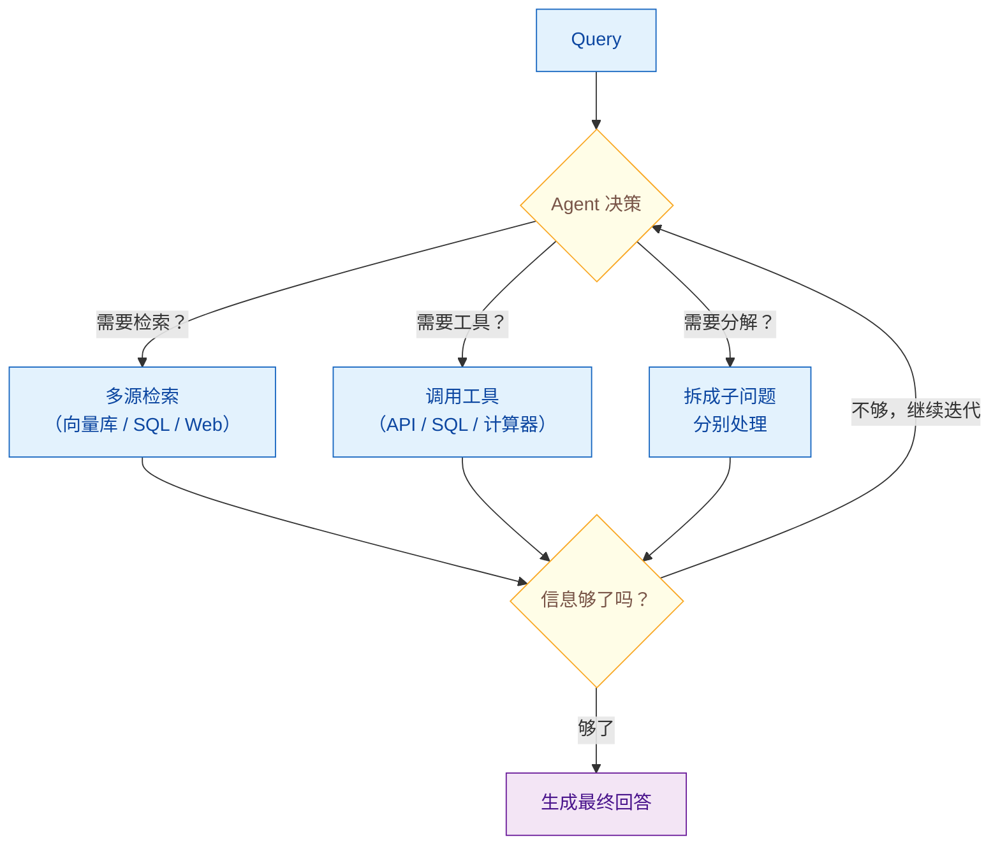

# 什么是 Agentic RAG？它与传统 RAG 有何不同？

> 难度：中级
> 分类：RAG

## 简短回答

Agentic RAG 在传统 RAG 的"检索→生成"流水线上增加了一个 AI Agent 控制循环。Agent 可以动态决定是否需要检索、从哪个数据源检索、是否需要多轮检索、以及是否需要调用外部工具（API、数据库、计算器）。核心区别：传统 RAG 是"单次检索、一发即忘"的流水线；Agentic RAG 是"多轮迭代、自主决策"的控制循环。

## 详细解析

### 传统 RAG 的局限

传统 RAG 是一条线性流水线：查询→检索→生成。关键限制：

1. **单数据源**：只从一个向量库中检索，无法跨多个知识源
2. **一次检索（One-shot）**：只检索一次，如果结果不够好没有纠错机制
3. **无工具使用**：只能检索静态文本，无法调用 API、执行 SQL 或做计算
4. **无推理**：不会判断检索结果的质量，也不会调整检索策略

### Agentic RAG 的核心升级

Agentic RAG 不是简单的 RAG 改进版，而是**在 RAG 上增加了控制循环**。这个循环可以：

传统 RAG：Query → Retrieve → Generate → Answer，线性流水线一发即忘。


*传统 RAG 是线性流水线一发即忘，Agentic RAG 把检索、工具、分解收进 Agent 控制循环，迭代到信息充分才生成回答。*

### 三种核心 Agent 类型

#### 1. 路由 Agent（Routing Agent）

最简单的 Agentic RAG 形式——Agent 分析查询后决定从哪个数据源检索。

```python
class RoutingAgent:
    def __init__(self):
        self.retrievers = {
            "technical_docs": vector_store_a,
            "customer_data": sql_database,
            "real_time_info": web_search,
        }

    def route(self, query: str) -> str:
        # LLM 分析查询，决定最佳数据源
        decision = llm.generate(
            f"用户问题：{query}\n"
            f"可用数据源：{list(self.retrievers.keys())}\n"
            f"选择最合适的数据源。"
        )
        return self.retrievers[decision].search(query)
```

**适用场景：** 多知识源系统（如客服系统同时有产品文档、订单数据库、FAQ）。

#### 2. 工具使用 Agent（Tool Use Agent）

在标准 RAG 基础上集成外部工具，能获取实时数据或执行计算。

```python
tools = [
    {"name": "vector_search", "desc": "搜索内部文档"},
    {"name": "web_search", "desc": "搜索互联网最新信息"},
    {"name": "sql_query", "desc": "查询数据库获取结构化数据"},
    {"name": "calculator", "desc": "执行数学计算"},
]

# Agent 决定使用哪些工具，按什么顺序
# 例如：先搜索文档获取定价规则，再查数据库获取客户数据，再计算折扣
```

#### 3. ReAct Agent（多步推理 + 状态保持）

结合路由、查询规划和工具使用，处理需要多步推理的复杂查询。

```python
# 复杂查询："比较我们公司和竞争对手的市场份额，预测明年趋势"
# Agent 的执行轨迹：
# Thought 1: 需要先获取我们公司的市场数据
# Action 1: sql_query("SELECT market_share FROM reports WHERE year=2025")
# Observation 1: 市场份额 23.5%
# Thought 2: 需要获取竞争对手数据
# Action 2: web_search("competitor X market share 2025")
# Observation 2: 竞争对手 X 市场份额 31.2%
# Thought 3: 需要找到行业趋势分析
# Action 3: vector_search("AI market growth prediction 2026")
# Observation 3: 分析师预计增长 45.8%
# Thought 4: 现在信息够了，可以综合分析
# Final Answer: ...
```

### 查询分解 Agent

处理复杂的多跳查询——将一个问题拆成多个独立子问题，分别检索后综合回答。

```python
class QueryDecomposer:
    def decompose(self, complex_query: str) -> list[str]:
        return llm.generate(
            f"将以下复杂问题分解为 2-4 个独立的子问题：\n{complex_query}"
        )

# 示例：
# 原始查询："我们的 RAG 系统延迟比竞品高，成本也更高，怎么优化？"
# 分解为：
# 1. "RAG 系统延迟优化有哪些方法？"
# 2. "RAG 系统成本优化策略有哪些？"
# 3. "竞品的典型延迟和成本指标是什么？"
# 分别检索后综合生成优化方案
```

### 务实策略：渐进式 Agentic RAG

Agent 带来灵活性，但也引入了延迟、成本和不可预测性。推荐的务实做法：

```python
def smart_rag(query: str) -> str:
    # 默认使用经典 RAG（快、便宜、可预测）
    result = classic_rag(query)

    # 检测失败信号
    if (result.confidence < 0.5 or
        result.has_contradiction or
        result.missing_citations):
        # 触发 Agentic RAG 二次处理
        result = agentic_rag(query)

    return result
```

大多数查询用经典 RAG 即可高效处理，仅在检测到失败信号时启用 Agentic RAG 做二次检索和验证。

### 对比总结

| 维度 | 传统 RAG | Agentic RAG |
|------|---------|-------------|
| 数据源 | 单个向量库 | 多源（向量库+数据库+API+Web） |
| 检索次数 | 1 次 | 多次（迭代优化） |
| 决策 | 固定流程 | LLM 自主决策 |
| 工具使用 | 无 | 支持（API、SQL、计算器等） |
| 纠错能力 | 无 | 有（检测+重试+验证） |
| 延迟 | 低 | 较高 |
| 成本 | 低 | 较高 |
| 可预测性 | 高 | 中 |

## 常见误区 / 面试追问

1. **误区："Agentic RAG 总是比传统 RAG 好"** — Agent 引入了延迟、成本和不可预测性。简单查询用传统 RAG 更快更可靠。不要因为 Agentic 听起来更先进就盲目采用。

2. **误区："Agentic RAG 就是 RAG + LangChain Agent"** — Agentic RAG 是一种架构模式，不绑定特定框架。核心是在 RAG 流水线中引入动态决策和控制循环。

3. **追问："Agentic RAG 的可靠性如何保证？"** — (1) 设置最大迭代次数防止无限循环；(2) 工具调用加超时和降级；(3) 对检索结果做质量检查（如 Corrective RAG 的评估器）；(4) 关键场景加 Human-in-the-Loop。

4. **追问："多 Agent RAG 是什么？"** — 多个专业化 Agent 协作：一个主 Agent 协调信息检索，多个子 Agent 各自负责不同数据源。例如：一个 Agent 查内部文档，一个 Agent 查数据库，主 Agent 综合结果。

## 参考资料

- [Traditional RAG vs. Agentic RAG (NVIDIA)](https://developer.nvidia.com/blog/traditional-rag-vs-agentic-rag-why-ai-agents-need-dynamic-knowledge-to-get-smarter/)
- [What Is Agentic RAG? (IBM)](https://www.ibm.com/think/topics/agentic-rag)
- [What Is Agentic RAG? From LLM RAG to AI Agents (Weaviate)](https://weaviate.io/blog/what-is-agentic-rag)
- [Agentic RAG vs Classic RAG: From Pipeline to Control Loop (TDS)](https://towardsdatascience.com/agentic-rag-vs-classic-rag-from-a-pipeline-to-a-control-loop/)
- [Agentic RAG: A Guide to Building Autonomous AI Systems (n8n)](https://blog.n8n.io/agentic-rag/)
