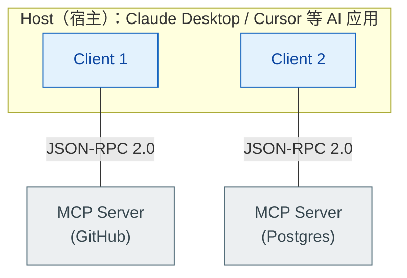
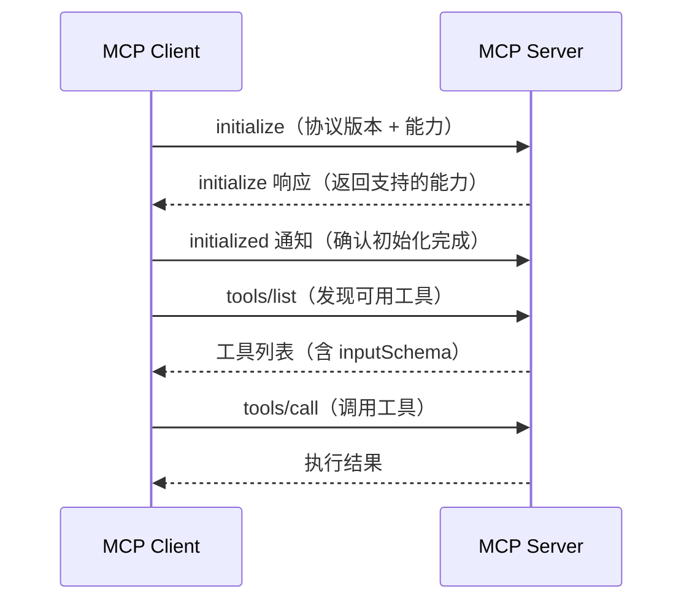

# MCP（Model Context Protocol）是什么？它如何标准化工具集成？

> 难度：中级
> 分类：Tool Use

## 简短回答

MCP（Model Context Protocol）是 Anthropic 于 2024 年 11 月推出的开放标准，用于标准化 AI 系统与外部工具、数据源的集成方式。类比"AI 界的 USB-C"——过去每个工具集成都需要定制连接器（N×M 问题），MCP 提供统一协议，让任何工具只需实现一次 MCP Server，就能被任何支持 MCP 的 AI 应用使用。协议基于 JSON-RPC 2.0，包含三个核心角色（Host、Client、Server）和三种核心能力（Tools、Resources、Prompts），支持动态工具发现和实时通知。

## 详细解析

### MCP 解决什么问题？

在 MCP 之前，每个 AI 应用与每个外部工具之间都需要定制集成：

```
没有 MCP（N×M 问题）：
Claude Desktop ──定制代码──→ GitHub API
Claude Desktop ──定制代码──→ Slack API
Claude Desktop ──定制代码──→ 数据库
Cursor         ──定制代码──→ GitHub API（又写一遍）
Cursor         ──定制代码──→ Slack API（又写一遍）

有了 MCP（N+M 方案）：
Claude Desktop ─┐              ┌─→ GitHub MCP Server
Cursor         ─┤── MCP 协议 ──┤─→ Slack MCP Server
VS Code        ─┘              └─→ 数据库 MCP Server
```

每个 AI 应用只需实现 MCP Client，每个工具只需实现 MCP Server。新增一个工具不需要修改任何 AI 应用。

### MCP 的三层架构


*Host 内嵌多个 Client，每个 Client 与一个 Server 一对一连接，JSON-RPC 2.0 是唯一通用语。*

**三个角色：**
- **Host**：AI 应用（如 Claude Desktop、Cursor IDE），接收用户请求
- **Client**：在 Host 内运行，将请求转换为 MCP 协议格式。每个 Client 与一个 Server 建立 1:1 连接
- **Server**：暴露外部系统的能力，将原生接口翻译为 MCP 标准协议

### 三种核心能力

```python
# 1. Tools（工具）—— 可执行的函数
# 客户端通过 tools/list 发现，通过 tools/call 调用
{
    "name": "create_issue",
    "description": "在 GitHub 仓库中创建 Issue",
    "inputSchema": {
        "type": "object",
        "properties": {
            "repo": {"type": "string"},
            "title": {"type": "string"},
            "body": {"type": "string"}
        },
        "required": ["repo", "title"]
    }
}

# 2. Resources（资源）—— 数据访问
# 类似 REST 的 GET，提供只读数据访问
# URI 格式：file:///path/to/file, postgres://db/table
{
    "uri": "file:///project/README.md",
    "name": "项目 README",
    "mimeType": "text/markdown"
}

# 3. Prompts（提示模板）—— 预定义的工作流
# 封装特定任务的最佳实践 prompt
{
    "name": "code_review",
    "description": "对代码进行审查",
    "arguments": [
        {"name": "code", "required": true}
    ]
}
```

### 通信协议

MCP 基于 JSON-RPC 2.0，支持两种传输方式：

```python
# 1. stdio（本地进程通信）—— 适合本地工具
# Host 启动 Server 进程，通过 stdin/stdout 通信

# 2. Streamable HTTP（远程通信）—— 适合远程服务
# MCP 2025-03-26 规范引入，使用单一 HTTP 端点（按 HTTP method 区分请求/通知/SSE 流）
# 可选择性使用 SSE 进行流式响应，也支持普通 HTTP 响应
# 注意：它取代了早期规范中"独立 HTTP POST + 单独 SSE GET 端点"的传输设计
```

**连接生命周期：**


*initialize 握手、tools/list 发现、tools/call 调用——工具是运行时发现的，不是启动时写死的。*

### 动态工具发现

MCP 的一个关键优势——工具可以在运行时动态变化：

```python
# Server 端：工具列表变更时发送通知
server.send_notification("notifications/tools/list_changed")

# Client 端：收到通知后重新获取工具列表
async def on_tools_changed():
    updated_tools = await client.call("tools/list")
    agent.update_available_tools(updated_tools)
```

这使得工具可以根据用户认证状态、权限级别或会话阶段动态暴露不同的工具集。

### MCP vs Function Calling

| 维度 | Function Calling | MCP |
|------|-----------------|-----|
| 定义方式 | 每次 API 调用传入工具定义 | 标准化协议，Server 独立定义 |
| 集成成本 | 每个工具 × 每个应用 = N×M | 每个工具一次，每个应用一次 = N+M |
| 工具发现 | 静态（开发时定义） | 动态（运行时发现） |
| 生态复用 | 无标准化，各自实现 | 社区共享 MCP Server |
| 适用场景 | 少量工具（<10）的简单应用 | 多工具、多应用的生态系统 |

### 实际使用示例

```python
# Python SDK 创建 MCP Server
from mcp.server import Server
from mcp.types import Tool, TextContent

server = Server("weather-server")

@server.list_tools()
async def list_tools():
    return [
        Tool(
            name="get_weather",
            description="获取指定城市的天气",
            inputSchema={
                "type": "object",
                "properties": {
                    "city": {"type": "string"}
                },
                "required": ["city"]
            }
        )
    ]

@server.call_tool()
async def call_tool(name: str, arguments: dict):
    if name == "get_weather":
        weather = await fetch_weather(arguments["city"])
        return [TextContent(type="text", text=f"温度: {weather.temp}°C")]
```

### 生态现状

MCP 已被主要 AI 平台采纳：OpenAI、Google DeepMind、Microsoft 均已支持。该协议由 Anthropic 主导，OpenAI / Google DeepMind / Microsoft 共同参与的 MCP Steering Committee 治理，规范文档在 [modelcontextprotocol.io](https://modelcontextprotocol.io/) 上维护。官方 SDK 覆盖 TypeScript、Python、C#、Kotlin、Go、Ruby 等语言，社区已有数千个开源 MCP Server 可直接使用。

### MCP 生产化：从协议到生产级工具生态

MCP 在 2025-2026 年完成了从"Anthropic 提议的开放标准"到"事实上的 AI-工具集成协议"的跃迁。这一节聚焦把 MCP 带入生产环境时必须回答的六个问题：生态规模、部署模式、认证授权、版本管理、安全沙箱、Server 选型。

#### 生态规模与采用

截至 2026 年初，PulseMCP 已收录超 **5500 个 MCP Server**，覆盖数据库、SaaS API、IDE、Git、文件系统等主流场景。据 Stacklok《State of MCP 2026》报告，约 **80% 的 Fortune 500 企业**已开始参与 MCP 生态（评估试点或内部部署）。官方 Roadmap 于 **2026-03-05 更新**，明确了下一阶段重点：认证增强、Elicitation（Server 向 Client 主动请求补充信息）、Registry（统一的 Server 注册与发现机制）。

但生态爆发也带来工程挑战。ACM 2026 学术研究（对开发者痛点的实证分析）揭示：**文件系统操作问题占开发者反馈的 21.32%**，居首位；其次是数据验证和类型问题。这说明社区 MCP Server 的工程质量参差不齐，选型时不能只看功能列表——后文「Server 选型清单」展开。

#### 生产部署模式：从本地 stdio 到远程托管

MCP 的两种传输方式对应两种部署形态，生产环境的选择直接影响安全边界与运维成本：

```
三种部署模式对比：

① 本地 stdio（开发 / 个人场景）
   Host ──stdin/stdout──→ 本地 MCP Server 进程
   优势：零网络开销，无需认证
   劣势：Server 跑在用户机器上，无集中管控，版本碎片化

② 远程 Streamable HTTP（生产 / 企业场景）
   Host ──HTTPS──→ 远程 MCP Server（自建 / 云托管）
   优势：集中管控、可观测、可弹性伸缩、统一认证
   劣势：引入网络延迟与认证开销

③ MCP Gateway / 托管平台（2026 趋势）
   Host ──→ MCP Gateway ──→ ┌─ Server A（GitHub）
                             ├─ Server B（Postgres）
                             └─ Server C（内部 API）
   优势：统一路由、认证、计费、限流、审计；Server 可动态挂载
   典型平台：Cloudflare、Smithery 等已提供 MCP Server 托管
```

生产环境推荐远程 Streamable HTTP 部署（参见上文「通信协议」中 2025-03-26 规范引入的传输方式）：Server 集中托管，通过 Gateway 统一管理。这避免了在每个用户机器上部署 Server 带来的版本碎片化和安全风险，也是 [Tool Gateway 模式](024-tool-gateway-permissions.md)（`#024`）在 MCP 语境下的自然延伸。

#### 认证授权：OAuth 2.1

早期 MCP 协议不在传输层定义认证——认证完全由 Server 内部处理（Server 持有 API 密钥，Agent 不接触凭证）。这在本地 stdio 场景可行，但远程部署时暴露了核心问题：Server 如何安全地验证调用者身份、如何将工具操作绑定到具体用户？

MCP 规范为 HTTP 传输引入了基于 **OAuth 2.1** 的授权框架，将 MCP Server 定位为 OAuth 中的 Resource Server：

```
MCP OAuth 授权流程（远程 Server）：

Agent (Host/Client)
  │
  │ 1. 首次访问 MCP Server（无 Token）
  │──→ 401 Unauthorized + WWW-Authenticate: Bearer
  │
  │ 2. 重定向到 Authorization Server（可由 Server 自托管或委托给 IdP）
  │──→ 用户登录 + 授权同意
  │←── Authorization Code
  │
  │ 3. 用 Code 换 Access Token
  │──→ Token Endpoint（含 PKCE 校验）
  │←── Access Token + Refresh Token
  │
  │ 4. 携带 Bearer Token 调用 MCP
  │──→ Authorization: Bearer <token>
  │←── 工具调用结果（权限受 Token scope 约束）
```

关键设计点：

- **PKCE 强制**：OAuth 2.1 要求所有授权码流程使用 PKCE（Proof Key for Code Exchange），防止授权码被中间人截获
- **动态客户端注册**：MCP 规范要求 Server 支持 RFC 7591 动态客户端注册，Client 无需预先硬编码 `client_id`，降低了首次连接的集成成本
- **Token 作用域**：Access Token 携带 scope 声明，Server 据此决定暴露哪些工具——例如只读 Token 看不到 `delete_repo` 工具
- **Server 身份验证**：规范引入资源标识（Resource Indicator）机制，Token 绑定到特定 Server，防止 Token 从一个 Server 窃取后在另一个 Server 重放

> 注意：MCP 的 OAuth 框架解决的是「Client ↔ Server」的身份与授权问题。Server 背后的外部系统（如 GitHub API、数据库）的认证仍由 Server 自行管理——Server 是凭证的唯一持有者。

#### 版本管理

MCP 的版本管理分三层，理解这三层是保障生产稳定性的前提：

| 层级 | 机制 | 变更影响 | 生产建议 |
|------|------|---------|---------|
| **协议版本** | `initialize` 握手时协商 | 不兼容版本会连接失败 | 升级 Server 前确认 Client 支持的目标版本 |
| **能力声明** | Server 的 `capabilities` 字段 | Client 依赖的能力可能消失 | 下线能力前发 deprecation 通知 |
| **工具 Schema** | `tools/list` 返回的 `inputSchema` | Agent 调用时参数不匹配 | **最常见破坏源**，需版本化处理 |

工具 Schema 变更是线上事故的高频来源。推荐做法：给工具加版本后缀（如 `create_issue_v2`），旧工具保留过渡期后再下线。**避免直接修改已有工具的参数结构**——Agent 在长会话中可能已"记住"旧签名，Schema 突变会导致调用失败或参数幻觉。Server 端可通过 `notifications/tools/list_changed` 通知 Client 重新拉取，但 Client 是否及时刷新取决于实现。

#### 安全沙箱与治理

MCP 的开放性——任何人都能发布 Server——使得 Server 治理成为生产化的核心议题。这与 [工具使用安全](030-tool-use-security.md)（`#030`）和 [权限最小化与沙箱执行](../09-safety-and-alignment/081-least-privilege-sandboxing.md)（`#081`）讨论的原则一脉相承，MCP 场景下的具体风险与对策如下：

**MCP Server 生产安全风险全景：**

| 风险 | 对策 |
|------|------|
| Tool Poisoning（恶意 Server 注册伪装工具） | Server 签名验证 + 来源白名单；只从可信 Registry 或内部仓库加载 |
| Confused Deputy（被 Prompt Injection 诱导越权） | 最小权限 + 高危操作 HITL 确认；删除/转账等操作需二次人工确认 |
| 凭证泄露（API Key 随 Server 分发流转） | OAuth 替代静态 API Key；Token 有 scope + 过期 + 可撤销 |
| 数据外泄（Server 偷偷外传敏感数据） | 出口网络白名单 + 审计日志；每个 Server 只允许访问必要域名 |

生产级部署应将每个 MCP Server 运行在独立沙箱中（容器或微 VM），限制其文件系统访问范围、网络出口和资源配额。沙箱选型可参考 [Agent Sandbox / Runtime 选型](../10-production-and-deployment/112-agent-sandbox-runtime.md)（`#112`）中的隔离强度对比。

对于企业级治理，官方 Roadmap 中的 **MCP Registry** 将提供 Server 的可信发布与签名验证，类似 npm / PyPI 的包管理机制。在 Registry 成熟前，企业应维护内部 Server 白名单并定期审计其权限范围。

#### Server 选型清单

面对 5500+ Server，选型时建议逐项评估以下维度：

| 维度 | 关键问题 | 红旗信号 |
|------|---------|---------|
| **来源可信度** | 是否来自官方或知名组织？有无代码签名？ | 个人匿名仓库、无文档、无测试 |
| **权限范围** | 请求了哪些权限？是否遵循最小化原则？ | 要求全盘文件系统访问、全局 admin token |
| **维护活跃度** | 最后更新时间？Issue 响应速度？ | 超 6 个月未更新、大量 Issue 无人回应 |
| **Token 成本** | 暴露多少工具？Schema 总体积多大？ | 单 Server >15 个工具（参见上文 Token 膨胀数据） |
| **传输安全** | 远程 Server 是否启用 TLS？有无认证？ | 明文 HTTP、无 OAuth、静态 Key 明传 |
| **可观测性** | 是否记录调用日志？是否支持 trace？ | 无日志、无可观测接口、黑盒运行 |

**选型原则**：优先选择官方维护或社区高信誉的 Server；涉及内部数据的场景应自建 Server 而非依赖第三方；同时连接的 Server 数量控制在 2-3 个以内——超过后工具选择准确率显著下降（参见上文「问题 3：工具选择混乱」）。动态工具发现（`#029`）和 MCP 的 `tools/list` 协议让运行时挂载变得容易，但"能挂"不等于"该挂"。

### MCP vs Claude Skills：连接性 vs 方法论

Anthropic 在 2025 年 10 月推出了 **Claude Skills**——这是一种与 MCP 互补但**架构哲学完全不同**的扩展机制。理解两者关系是 2025-2026 年 Agent 工程师的高频面试点。

**核心区别：what vs how**

```
厨师类比：
  MCP   = 食材 + 高端厨具（提供能力）
  Skill = 菜谱（教如何使用这些能力）

技术定义：
  MCP   = 连接层（Connectivity）—— 让 Claude 能访问外部工具/数据
  Skill = 程序性知识层（Procedural Knowledge）—— 教 Claude 如何完成特定任务
```

**Skill 的形态**：一个文件夹，包含 `SKILL.md`（指令）、可选脚本和资源。例如：
- 团队的 Git commit message 规范
- 公司品牌的 PPT 生成流程
- 一套数据校验工作流

**Progressive Disclosure：Skill 的关键创新**

```
Skill 三层加载（按需）：
  Level 1：metadata（~100 tokens）—— 启动时仅加载 name + description
  Level 2：SKILL.md 完整指令（<5k tokens）—— 判定相关时才加载
  Level 3：脚本/资源文件 —— 执行时才加载

MCP 的加载模式（启动即加载）：
  所有工具的完整 schema 在 initialize 时就进入 context
  → 实测：连接 2-3 个 MCP Server 后，工具调用准确率显著下降
  → 大型企业 MCP Server 经常占用整个 context window，导致 hallucination
```

**对比表：**

| 维度 | MCP | Claude Skills |
|------|-----|---------------|
| 解决的问题 | 跨应用的工具集成（连接） | 同一任务的一致性执行（方法） |
| 加载策略 | 启动时全量加载 | 渐进式按需加载 |
| Token 成本 | 每个会话固定开销 | 用多少付多少 |
| 分发方式 | 远程 MCP Server（网络可达） | 本地 zip 包（占用本地空间） |
| 工具发现 | 运行时 `tools/list` 协议 | 文件系统扫描 metadata |
| 跨平台 | 标准开放，OpenAI/Google 都支持 | Anthropic 特有 |
| 适合场景 | 数据库、SaaS、IDE、Git 等外部系统 | 团队规范、文档模板、固定工作流 |

**两者协同（Anthropic 官方推荐模式）：**

```python
# 真实场景：用 Claude 处理客户工单
# MCP 提供连接：从 Zendesk 拉工单、写回 Salesforce
mcp_servers = ["zendesk-mcp", "salesforce-mcp"]

# Skill 提供方法：教 Claude 如何分类工单、如何措辞回复
skills = [
    "ticket-triage-workflow.skill",   # 分类规则 + 优先级标准
    "customer-reply-template.skill",  # 公司标准措辞模板
]
# MCP 给 Claude "做什么的能力"，Skill 给 Claude "怎么做的指南"
```

**为什么 Skills 不能用 MCP 实现？** 把 Skill 包装成 MCP Server 在技术上可行，但会**破坏 Skill 的核心价值**——progressive disclosion 失效（MCP 协议要求 schema 全量返回），并引入额外的 RPC 开销，还原回了 MCP 的 token 浪费问题。两者是**正交**的设计，不应合并。

### MCP 实际使用中的问题与解决

MCP 在生产环境中面临一系列实际挑战，以下是高频问题和对应的解决思路。

#### 问题 1：Token 膨胀

这是 MCP 最突出的问题。工具定义本身会消耗大量 context 空间：

**实际 Token 消耗：**

| MCP Server | 工具数量 | Token 消耗 |
|-----------|---------|-----------|
| Linear | 23 | ~12,935 |
| JetBrains | 20 | ~12,252 |
| Playwright | 21 | ~9,804 |
| GitHub | 15 | ~8,500 |
| **总计（4个Server）** | ~79 | ~43,991 tokens |

→ 占 Claude 200k context 的 ~22%！

**Code Execution 模式**是最有效的解决方案——将工具暴露为代码 API 而非独立 tool schema，token 消耗可从 ~150k 降至 ~2k（节省 98%+）。此外还有**渐进式披露**（根据当前任务只加载最相关的工具）和**最小化 Schema**（去掉冗余描述，只保留核心信息）。

#### 问题 2：中间结果消耗 Context

工具调用的中间结果全部通过 model context，可能产生巨大开销：

```
场景：从 Google Drive 取会议记录后更新 Salesforce
传统模式：50,000 tokens 的会议记录 → 全部进入 context
Code Execution 模式：中间结果在执行环境内处理 → LLM 只看执行日志 ~500 tokens
节省：99%
```

#### 问题 3：工具选择混乱

工具超过 10-15 个时，LLM 选对工具的概率急剧下降。解决方案：使用**语义路由**（根据意图动态注入相关工具）、**子代理分工**（每个子代理只访问特定领域工具）、以及**工具层次结构**（先选类别再选具体工具）。

#### 问题 4：MCP Server 设计反模式

最常见的错误是直接将 REST API 1:1 包装为工具，未针对 Agent 工作流优化。正确做法是**意图驱动**设计：每个工具对应一个 Agent 常见意图，将多步 API 调用隐藏在单个工具后。

```python
# 反模式：直接包装 API
{"name": "api_get", "description": "Call REST API"}  # 太宽泛

# 正确：意图驱动
{"name": "find_active_users", "description": "查找活跃用户，可按部门筛选"}
```

#### 问题 5：调试困难

MCP 的 JSON-RPC over stdio 是黑盒。可以使用 `npx @modelcontextprotocol/inspector` 查看工具列表和测试调用，或自建 token 追踪中间件监控每次 tools/list 和 tools/call 的开销。

#### 问题 6：安全隐患

三大风险：(1) **敏感数据泄露**——中间结果默认进入 context，需要数据脱敏；(2) **Tool Poisoning**——恶意 MCP Server 注册伪装工具，需要 Server 签名验证和工具白名单；(3) **权限控制不足**——MCP 协议不强制权限验证，需要服务端自行实现访问控制和沙箱隔离。

## 常见误区 / 面试追问

1. **误区："MCP 是 Anthropic 的私有协议"** — MCP 是完全开源的标准，由 Anthropic 主导，OpenAI / Google DeepMind / Microsoft 共同参与治理（MCP Steering Committee）。它不绑定任何特定模型或平台。

2. **误区："MCP 替代了 Function Calling"** — 两者互补而非替代。MCP 标准化了工具的定义和发现方式，Function Calling 是 LLM 调用工具的底层机制。MCP Server 暴露工具，LLM 通过 Function Calling 机制调用它们。

3. **追问："MCP 的安全隐患是什么？"** — 主要风险包括：Tool Poisoning（恶意 Server 注册伪装工具）、Prompt Injection 通过工具结果注入、凭证通过 MCP 通道泄露。防御方法包括 Server 签名验证、工具白名单、输出清洗。

4. **追问："MCP 如何处理认证？"** — 协议规范层不强制定义认证（它是传输层协议），认证通常在 MCP Server 内部处理——Server 持有 API 密钥并负责与外部服务的认证，Agent 不直接接触凭证。但生产级远程实现普遍采用 OAuth 2.1（见上文『MCP 生产化』小节的认证授权部分）。

5. **追问："MCP 的 Token 膨胀问题如何解决？"** — 三种策略：最有效的是 Code Execution 模式（将工具暴露为代码 API，token 从 ~150k 降至 ~2k）；其次是渐进式披露（按需加载相关工具）和最小化 Schema（精简描述）。

6. **追问："MCP 最大的安全风险是什么？"** — Tool Poisoning：恶意 MCP Server 注册看似有用但实际执行恶意操作的工具。防御手段：Server 签名验证（只加载可信来源）、工具白名单（限制可调用工具集）、沙箱隔离（Server 运行在受限容器中）。

7. **追问："Skill 和 MCP 是什么关系？什么时候用哪个？"** — 一句话区分：**MCP 是连接（what），Skill 是方法（how）**。需要 Claude **访问外部系统**（数据库、Slack、GitHub、内部 API）→ MCP；需要 Claude **以特定方式完成某项任务**（团队代码规范、文档模板、固定工作流）→ Skill。两者最强的组合是协同使用：MCP 提供原始能力，Skill 提供使用这些能力的标准操作流程。Skill 的 progressive disclosure（按需加载）解决了 MCP 启动即全量加载导致的 context 膨胀和工具调用准确率下降问题——实测连接 2-3 个 MCP Server 后准确率就开始明显下降，而 Skills 可以挂载几十个而几乎不占 context。

8. **追问："Subagent 和 Skill 又有什么区别？"** — Subagent 是**独立的 Agent 进程**（有自己的 context、工具、模型），主 Agent 通过任务委派调用它，常用于隔离 context 或并行任务；Skill 是**注入主 Agent 的程序性指令**，不开新进程，只是按需加载到当前 context。简单说：Subagent = 派一个新员工去办，Skill = 给当前员工看一份操作手册。

## 参考资料

- [Model Context Protocol Specification](https://modelcontextprotocol.io/specification/2025-11-25)
- [What is Model Context Protocol (MCP)? (IBM)](https://www.ibm.com/think/topics/model-context-protocol)
- [Introducing the Model Context Protocol (Anthropic)](https://www.anthropic.com/news/model-context-protocol)
- [Model Context Protocol Introduction for Developers (Stytch)](https://stytch.com/blog/model-context-protocol-introduction/)
- [MCP 101: Understanding the Model Context Protocol (Itential)](https://www.itential.com/blog/company/itential-mcp/mcp-101-understanding-the-model-context-protocol/)
- [Claude Skills vs. MCP: A Technical Comparison (IntuitionLabs)](https://intuitionlabs.ai/articles/claude-skills-vs-mcp)
- [Claude Skills vs. MCP: Two AI Customization Philosophies (Subramanya N, 2025-10)](https://subramanya.ai/2025/10/30/claude-skills-vs-mcp-a-tale-of-two-ai-customization-philosophies/)
- [Skills explained: How Skills compares to prompts, Projects, MCP, and subagents (Anthropic)](https://claude.com/blog/skills-explained)
- [Progressive Disclosure Might Replace MCP (MCPJam)](https://www.mcpjam.com/blog/claude-agent-skills)
