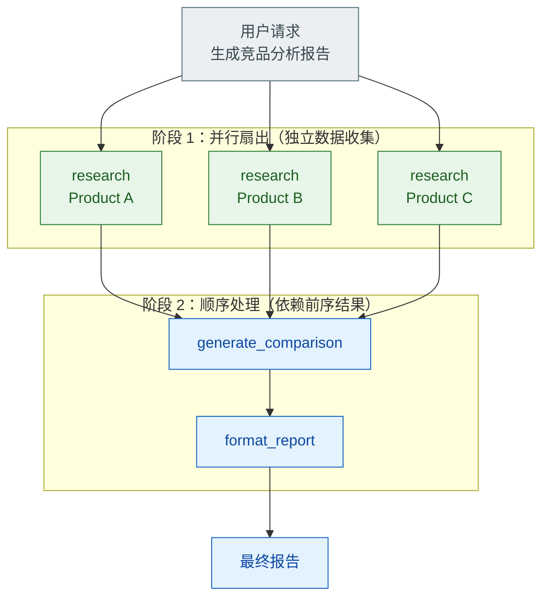

# 并行工具调用 vs 顺序工具调用的设计考量

> 难度：中级
> 分类：Tool Use

## 简短回答

并行工具调用允许 LLM 同时请求多个无依赖关系的工具执行，将总延迟从所有调用时间之和降低到最长单次调用时间。顺序调用则适用于工具间存在数据依赖的场景——后一个工具需要前一个的输出作为输入。生产环境通常采用**混合模式**：先并行执行独立的数据收集，再顺序执行依赖前序结果的处理步骤。设计时需要权衡延迟优化、速率限制、错误处理复杂度和共享状态管理。

## 详细解析

### 顺序调用（Sequential）

工具一个接一个执行，每个工具可以使用前一个的输出：

```python
# 顺序调用：后续工具依赖前序工具的输出
# 用户："查询订单 #123 的状态，然后给客户发物流提醒"

# Step 1: 查询订单
order = await get_order_status(order_id="123")
# → {"status": "shipped", "tracking": "SF1234", "customer_email": "user@example.com"}

# Step 2: 基于 Step 1 的结果发送邮件（有依赖）
result = await send_email(
    to=order["customer_email"],  # 依赖 Step 1 的输出
    subject=f"您的订单已发货",
    body=f"物流单号: {order['tracking']}"
)
```

**适用场景：**
- 工具 B 的输入参数依赖工具 A 的输出
- 需要根据前一步结果决定下一步操作（条件分支）
- 数据写入后需要验证结果

### 并行调用（Parallel）

多个无依赖关系的工具同时执行：

```python
# 并行调用：三个独立的数据获取
# 用户："比较北京、上海、深圳的天气"

import asyncio

# 三个调用互不依赖，并行执行
results = await asyncio.gather(
    get_weather(city="Beijing"),
    get_weather(city="Shanghai"),
    get_weather(city="Shenzhen")
)
# 延迟 = max(三次调用时间) ≈ 300ms
# 顺序执行则需要 ≈ 900ms
```

**性能对比：**

```
顺序执行（4 个 300ms 的调用）：
|── 300ms ──|── 300ms ──|── 300ms ──|── 300ms ──|  总计: 1200ms

并行执行（相同 4 个调用）：
|── 300ms ──|
|── 300ms ──|
|── 300ms ──|
|── 300ms ──|  总计: 300ms（最长的那个）
```

**适用场景：**
- 多源数据收集（"查看 A、B、C 三个产品的价格"）
- 比较分析（"对比 React 和 Vue 的优缺点"）
- 独立子任务（"生成三种不同风格的营销文案"）

### LLM 如何决定并行 vs 顺序？

模型通过分析工具描述和参数依赖关系来决定：

```python
# 模型返回多个 tool_use block → 表示并行
response.content = [
    ToolUse(name="get_weather", input={"city": "Beijing"}),
    ToolUse(name="get_weather", input={"city": "Shanghai"}),
]  # 两个独立调用，可并行执行

# 模型返回单个 tool_use → 顺序执行，等结果后再决定下一步
response.content = [
    ToolUse(name="get_order", input={"order_id": "123"}),
]  # 先获取订单，后续操作取决于结果
```

关键点：**模型生成调用请求，你的基础设施决定如何执行**。即使模型返回多个工具调用，开发者可以选择并行或顺序执行。

### 混合模式（Hybrid）—— 生产最佳实践


*混合模式：独立的数据收集并行扇出，依赖前序结果的处理顺序扇入，延迟从 N×T 降为 max(T)+串行段。*

```python
# 混合模式示例："为产品 A、B、C 生成竞品分析报告"

# 阶段 1：并行收集数据（无依赖）
product_data = await asyncio.gather(
    research_product("Product A"),
    research_product("Product B"),
    research_product("Product C"),
)

# 阶段 2：顺序处理（依赖阶段 1 的结果）
comparison = await generate_comparison(product_data)
report = await format_report(comparison)
```

### 关键设计考量

#### 1. 依赖分析

```python
# 自动检测依赖关系
def analyze_dependencies(tool_calls):
    """分析工具调用间的依赖"""
    independent = []
    dependent = []

    for call in tool_calls:
        # 检查参数是否引用了其他工具的输出
        if references_other_output(call.params):
            dependent.append(call)
        else:
            independent.append(call)

    return independent, dependent  # 独立的并行，依赖的顺序
```

#### 2. 速率限制

并行执行降低延迟，但增加瞬时并发：

```python
# 并行但受限的执行
semaphore = asyncio.Semaphore(5)  # 最多 5 个并发

async def rate_limited_call(tool, params):
    async with semaphore:
        return await tool.execute(params)

results = await asyncio.gather(
    *[rate_limited_call(tool, p) for p in params_list]
)
```

#### 3. 错误处理差异

```python
# 顺序模式：一个失败就停止，比较简单
try:
    step1 = await tool_a()
    step2 = await tool_b(step1)  # 如果 tool_a 失败，这里不会执行
except ToolError as e:
    return f"步骤失败: {e}"

# 并行模式：需要决定部分失败的处理策略
results = await asyncio.gather(
    tool_a(), tool_b(), tool_c(),
    return_exceptions=True  # 不让单个失败取消全部
)
# 检查哪些成功、哪些失败
successes = [r for r in results if not isinstance(r, Exception)]
failures = [r for r in results if isinstance(r, Exception)]
```

#### 4. 共享状态

并行工具不应修改共享状态：

```python
# 危险：并行工具修改同一个数据库记录
# 安全：并行工具只读取数据，写入操作顺序执行
```

### 编排框架中的实现

```python
# LangGraph：用 fan-out/fan-in 实现并行
from langgraph.graph import StateGraph

graph = StateGraph(State)

# 并行分支
graph.add_node("research_a", research_product_a)
graph.add_node("research_b", research_product_b)

# fan-out: 一个节点分发到多个并行节点
graph.add_edge("start", "research_a")
graph.add_edge("start", "research_b")

# fan-in: 多个并行节点汇聚到一个节点
graph.add_edge("research_a", "aggregate")
graph.add_edge("research_b", "aggregate")
```

### 决策框架

| 条件 | 选择 | 原因 |
|------|------|------|
| 工具间无数据依赖 | 并行 | 降低延迟 |
| 后续工具需要前序结果 | 顺序 | 数据依赖 |
| 需要根据结果做条件判断 | 顺序 | 逻辑依赖 |
| 多源数据收集 | 并行 | 最大化吞吐 |
| 写操作涉及同一资源 | 顺序 | 避免竞态 |
| 混合场景 | 混合 | DAG 调度 |

## 常见误区 / 面试追问

1. **误区："并行总是更好"** — 并行增加瞬时并发，可能触发 API 速率限制。并且并行的错误处理更复杂——需要决定部分失败时是全部回滚还是保留成功结果。

2. **误区："LLM 会自动优化并行/顺序"** — LLM 只负责生成工具调用请求。实际的执行策略（并行或顺序）由应用层的编排代码决定。开发者需要显式实现并行执行逻辑。

3. **追问："如何处理并行调用中的部分失败？"** — 两种策略：(1) 原子性——一个失败全部回滚（适合事务操作）；(2) 尽力执行——保留成功结果，将失败信息返回给 LLM 让它决定下一步（适合数据收集）。

4. **追问："Map-Reduce 模式和并行工具调用有什么关系？"** — Map-Reduce 是并行工具调用的一种特定模式：Map 阶段将任务分发到多个并行工具，Reduce 阶段汇聚结果。LangGraph 等框架原生支持这种 fan-out/fan-in 模式。

## 参考资料

- [Sequential and Parallel Tool Use (APXML)](https://apxml.com/courses/building-advanced-llm-agent-tools/chapter-3-llm-tool-selection-orchestration/sequential-parallel-tool-use)
- [Why Parallel Tool Calling Matters for LLM Agents (CodeAnt)](https://www.codeant.ai/blogs/parallel-tool-calling)
- [Parallelization — Agentic Design Pattern Series (DataLearningScience)](https://datalearningscience.com/p/3-parallelization-agentic-design)
- [Parallel Agents (Google ADK Docs)](https://google.github.io/adk-docs/agents/workflow-agents/parallel-agents/)
- [Scaling LangGraph Agents: Parallelization and Map-Reduce (AI Practitioner)](https://aipractitioner.substack.com/p/scaling-langgraph-agents-parallelization)
