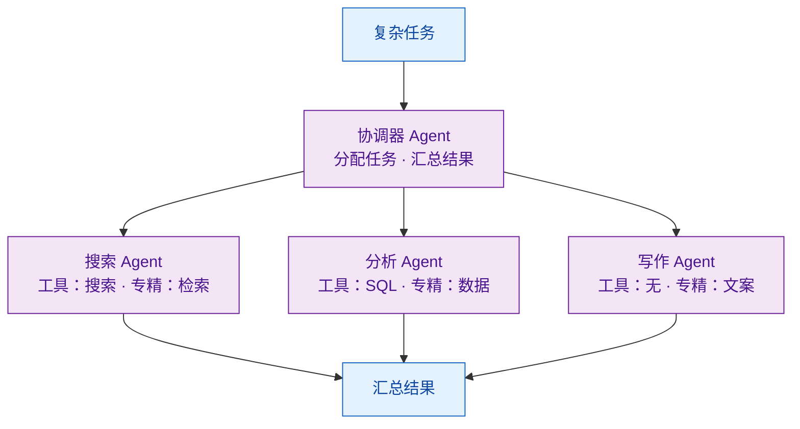

# 什么是多 Agent 系统？与单 Agent 相比有何优势？

> 难度：基础
> 分类：Multi-Agent

## 简短回答

多 Agent 系统（Multi-Agent System, MAS）是由多个各自拥有 LLM 驱动的 Agent 协同工作来解决复杂问题的架构。每个 Agent 专注于特定子任务，通过通信和协调完成单个 Agent 难以胜任的工作。相比单 Agent，MAS 的核心优势是：**任务专精化**（每个 Agent 只需擅长一个领域）、**并行处理**（多 Agent 同时工作，速度提升可达 33%）、**更好的上下文管理**（分散处理负载，突破单 Agent 上下文窗口限制）、**模块化**（独立开发、测试和替换单个 Agent）。代价是增加了通信开销和系统复杂度。

## 详细解析

### 什么是多 Agent 系统？


*分而治之：协调器拆解任务，专精 Agent 各带小工具集与独立上下文，汇总成最终结果。*

核心思想：**分而治之**——将复杂任务拆分为子任务，每个子任务由专精的 Agent 处理。

### 单 Agent 的局限性

```python
# 单 Agent 面临的问题
single_agent_problems = {
    "上下文过载": "50+ 工具定义 + 复杂指令 = 上下文窗口被占满",
    "角色冲突": "同时要求严谨分析和创意写作，风格矛盾",
    "工具选择困难": "工具越多，选错工具的概率越高",
    "单点故障": "一个 Agent 出错，整个任务失败",
    "不可并行": "所有步骤必须顺序执行",
}
```

当前 LLM 在面对超长、多目标的 prompt 时表现不佳，且不擅长从大量工具中选择正确的工具。将任务拆分到多个专精 Agent 是自然的解决方案。

### 多 Agent 的核心优势

#### 1. 任务专精化（Specialization）

```python
# 每个 Agent 有明确的角色和有限的工具集
agents = {
    "researcher": {
        "system_prompt": "你是研究分析师，专注于收集和验证信息",
        "tools": ["web_search", "arxiv_search"],
        "model": "claude-sonnet",  # 用性价比高的模型
    },
    "coder": {
        "system_prompt": "你是高级软件工程师，专注于编写代码",
        "tools": ["code_executor", "file_write"],
        "model": "claude-opus",    # 用最强模型
    },
    "reviewer": {
        "system_prompt": "你是代码审查专家，专注于发现 bug 和改进",
        "tools": ["code_analyzer"],
        "model": "claude-sonnet",
    },
}
```

#### 2. 并行处理

```python
import asyncio

# 多个 Agent 同时工作
async def parallel_research(topic):
    results = await asyncio.gather(
        researcher_agent.search_papers(topic),
        market_agent.analyze_market(topic),
        tech_agent.review_implementations(topic),
    )
    # 三个 Agent 并行，总时间 = max(单个 Agent 时间)
    return coordinator.synthesize(results)
```

研究显示，动态多 Agent 框架相比传统顺序系统，执行时间可减少 33%。

#### 3. 更好的上下文管理

单 Agent 处理长文档时容易丢失上下文。多 Agent 系统中，每个 Agent 只需处理自己负责的部分，通过 Agent 间通信维持整体上下文一致性，等效于扩展了上下文窗口。

#### 4. 模块化与可维护性

```python
# 独立开发、测试、替换单个 Agent
# 升级分析能力？只需替换分析 Agent
old_analyzer = AnalyzerAgent(model="gpt-4")
new_analyzer = AnalyzerAgent(model="claude-opus")  # 零影响替换

# 添加新能力？只需增加新 Agent
team.add_agent(TranslationAgent())  # 不修改现有代码
```

#### 5. 准确率提升

研究表明，Producer-Reflector 双 Agent 架构在代码生成任务中大幅提升了准确率。Meta 分析显示 MAS（如 Captain Agent）在编程、数据分析和科学推理任务中，准确率和成本效率均优于单 LLM。

#### 6. 降低人工监督成本

2024 年对 128 家企业的研究显示，使用多 Agent AI 的企业在验证和纠正输出上花费的时间减少了 61.2%，每年可节省约 194 万美元的人力成本。

### 多 Agent 系统的代价

| 挑战 | 说明 |
|------|------|
| 通信开销 | Agent 间信息共享可能引入延迟和冲突 |
| 不可预测性 | 多 Agent 交互可能产生意外行为 |
| 调试困难 | 问题追踪需要跨 Agent 跟踪 |
| 架构复杂度 | 需要设计通信协议、协调机制、错误处理 |
| Token 浪费 | Agent 间重复传递信息导致 token 冗余（研究显示 53-86%）|

### 何时选择多 Agent vs 单 Agent？

```python
decision_guide = {
    "选择单 Agent": [
        "任务简单、线性",
        "工具少于 10 个",
        "不需要并行处理",
        "快速原型验证",
    ],
    "选择多 Agent": [
        "任务需要多种专业技能",
        "子任务可以并行执行",
        "需要 checker/reviewer 验证质量",
        "系统需要模块化扩展",
        "工具数量超过 20 个",
    ],
}
```

## 常见误区 / 面试追问

1. **误区："多 Agent 总是优于单 Agent"** — 对于简单任务，多 Agent 的通信开销可能超过收益。不要为了用多 Agent 而用多 Agent。从单 Agent 开始，当遇到明确的瓶颈时再拆分。

2. **误区："每个 Agent 必须用不同的 LLM"** — Agent 的差异化来自 System Prompt、工具集和角色定义，不一定需要不同的模型。同一个模型配不同 prompt 就是不同的 Agent。

3. **追问："多 Agent 系统的 token 冗余问题如何解决？"** — 研究显示 token 重复率可达 53-86%。解决方案包括：共享记忆池（黑板模式）、消息摘要（传递摘要而非原始内容）、和 Instruction-Tool Retrieval（每步只加载必要信息）。

4. **追问："如何定义 'multi-agent'？两个 LLM 调用就算吗？"** — 真正的多 Agent 系统需要 Agent 间有自主决策和交互能力，而非简单的顺序调用链。关键特征是 Agent 能基于其他 Agent 的输出自主调整行为。

## 参考资料

- [Multi-Agent LLMs in 2025 (SuperAnnotate)](https://www.superannotate.com/blog/multi-agent-llms)
- [Single-Agent vs Multi-Agent Systems (DigitalOcean)](https://www.digitalocean.com/resources/articles/single-agent-vs-multi-agent)
- [LLM Multi-Agent Systems: Challenges and Open Problems (arXiv)](https://arxiv.org/html/2402.03578v2)
- [Multi-Agent AI Systems: Definition, Benefits, Limitations (Dynamiq)](https://www.getdynamiq.ai/post/multi-agent-ai-systems-definition-benefits-limitations-how-to-build)
- [What Makes Multi-Agent LLM Systems Multi-Agent? (Yoav Goldberg)](https://gist.github.com/yoavg/9142e5d974ab916462e8ec080407365b)
