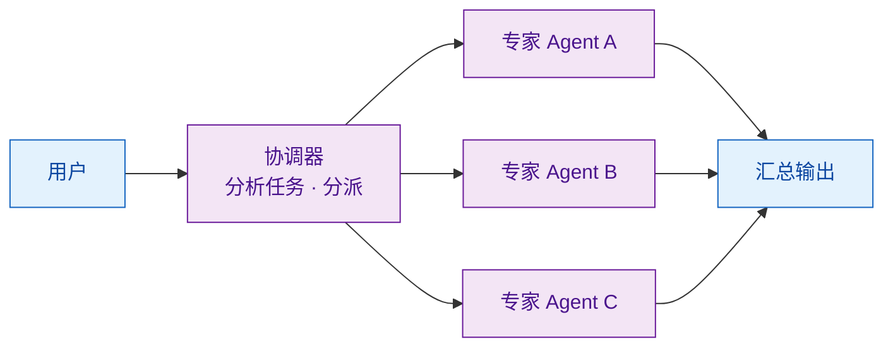
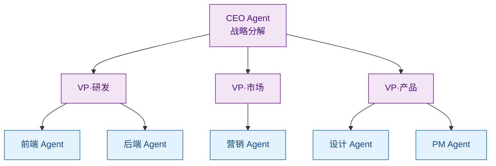

# Agent 编排模式：Hub-Spoke、Pipeline、Hierarchical

> 难度：中级
> 分类：Multi-Agent

## 简短回答

多 Agent 编排模式决定了 Agent 之间的控制流和协作结构。三种核心模式：**Pipeline（顺序流水线）**——Agent 按预定顺序链式执行，前一个的输出是后一个的输入，适合线性处理流程；**Hub-Spoke（中心辐射）**——一个中心协调 Agent 分配任务给专家 Agent 并汇总结果，适合任务分派场景；**Hierarchical（层级结构）**——多层管理 Agent 逐级分解和委派任务，适合复杂企业级工作流。此外还有 Parallel（扇出/扇入）和 Maker-Checker（循环校验）等补充模式。选择取决于任务的依赖关系、并行度和控制粒度需求。

## 详细解析

### 模式 1：Pipeline（顺序流水线）

```
Agent A → Agent B → Agent C → 最终输出
(研究)    (分析)    (写作)
```

每个 Agent 处理前一个 Agent 的输出，形成链式处理：

```python
# Pipeline 模式实现
class Pipeline:
    def __init__(self, agents: list):
        self.agents = agents  # 按执行顺序排列

    async def run(self, initial_input):
        result = initial_input
        for agent in self.agents:
            result = await agent.process(result)
        return result

# 使用示例：内容生产流水线
pipeline = Pipeline([
    ResearchAgent(),    # Step 1: 搜索资料
    OutlineAgent(),     # Step 2: 生成大纲
    WriterAgent(),      # Step 3: 撰写内容
    EditorAgent(),      # Step 4: 编辑润色
])
output = await pipeline.run("写一篇关于 AI Agent 的技术博客")
```

**适用场景：** 数据处理流水线、内容生产（研究→写作→审核）、ETL 工作流
**优势：** 简单可预测、易于调试、每步结果可检查
**劣势：** 无法并行、一步失败整个流水线停止、不适合需要迭代的任务

### 模式 2：Hub-Spoke（中心辐射 / Coordinator 模式）


*Hub-Spoke：协调器分派给专家、专家结果回到协调器汇总——集中控制，但协调器是单点瓶颈。*

```python
class HubSpokeOrchestrator:
    def __init__(self, coordinator, specialists: dict):
        self.coordinator = coordinator
        self.specialists = specialists  # name → agent

    async def run(self, task):
        # 协调器分析任务，决定分派给哪些专家
        plan = await self.coordinator.plan(task)

        results = {}
        for subtask in plan.subtasks:
            agent = self.specialists[subtask.assigned_to]
            results[subtask.id] = await agent.execute(subtask)

        # 协调器汇总所有专家的结果
        return await self.coordinator.synthesize(results)

# Google ADK 风格：Coordinator + sub_agents
coordinator = LlmAgent(
    name="coordinator",
    instruction="你是项目经理，分析用户需求并分配给合适的专家",
    sub_agents=[researcher, coder, designer],
    # LLM 驱动的委派：基于专家描述自动选择
)
```

**适用场景：** 客服路由、任务分发、专家咨询系统
**优势：** 集中控制、灵活分派、专家可独立扩展
**劣势：** 协调器是单点瓶颈、协调器需要理解所有专家的能力

### 模式 3：Hierarchical（层级结构）


*Hierarchical：CEO → VP → 专家 Agent 逐级分解、自底向上汇报。*

```python
class HierarchicalOrchestrator:
    """多层级管理结构"""

    async def run(self, task):
        # 顶层：CEO Agent 做战略分解
        strategy = await self.ceo.decompose(task)

        # 中层：VP Agent 做战术分解
        for department_task in strategy.department_tasks:
            vp = self.get_vp(department_task.department)
            tactical_plan = await vp.plan(department_task)

            # 底层：专家 Agent 执行具体任务
            for work_item in tactical_plan.work_items:
                worker = self.get_worker(work_item.skill)
                await worker.execute(work_item)

        # 自底向上汇报
        return await self.ceo.synthesize_reports()
```

**LangGraph 实现：**
```python
# LangGraph 的层级结构
from langgraph.graph import StateGraph

# 顶层图
top_graph = StateGraph(TopState)
top_graph.add_node("research_team", research_subgraph)  # 子图作为节点
top_graph.add_node("dev_team", dev_subgraph)
top_graph.add_node("manager", manager_node)

# 子图（研究团队）
research_subgraph = StateGraph(ResearchState)
research_subgraph.add_node("searcher", search_agent)
research_subgraph.add_node("analyzer", analysis_agent)
```

**适用场景：** 复杂企业级任务、需要多层审批的工作流、大型软件开发
**优势：** 可管理大规模 Agent、每层关注不同抽象级别
**劣势：** 层级过深会增加延迟、信息在层级间传递时可能失真

### 补充模式

#### Parallel（扇出/扇入）

```python
# 多个 Agent 并行执行，结果汇聚
async def fan_out_fan_in(task, agents):
    # Fan-out：并行分发
    results = await asyncio.gather(
        *[agent.execute(task) for agent in agents]
    )
    # Fan-in：汇聚结果
    return aggregate(results)  # 投票、合并或 LLM 综合
```

#### Maker-Checker（生成-校验循环）

```python
# 一个 Agent 生成，另一个 Agent 校验
async def maker_checker_loop(task, maker, checker, max_rounds=3):
    for round in range(max_rounds):
        output = await maker.generate(task)
        review = await checker.review(output)
        if review.approved:
            return output
        task = f"{task}\n\n上一轮反馈：{review.feedback}"
    return output  # 达到最大轮次
```

### 模式选择决策框架

| 场景 | 推荐模式 | 原因 |
|------|---------|------|
| 步骤固定、有先后依赖 | Pipeline | 简单可预测 |
| 一个任务需要多种专业能力 | Hub-Spoke | 灵活分派 |
| 大型复杂项目、需要多层管理 | Hierarchical | 分层治理 |
| 需要多角度分析同一问题 | Parallel | 速度 + 多样性 |
| 需要质量保证和迭代改进 | Maker-Checker | 内置质量循环 |
| 混合需求 | 组合多种模式 | 如 Hierarchical + Parallel |

### 主流框架对编排模式的支持

| 框架 | 支持的模式 |
|------|-----------|
| LangGraph | Pipeline、Hierarchical、Parallel、自定义图 |
| Google ADK | Hub-Spoke（sub_agents）、Sequential、Parallel、Loop |
| OpenAI Agents SDK | Hub-Spoke（Handoff）、Pipeline |
| CrewAI | Pipeline、Hierarchical |
| AutoGen | Group Chat（多种编排） |

## 常见误区 / 面试追问

1. **误区："选一种模式就够了"** — 实际生产系统通常混合使用多种模式。例如 Hierarchical 的每一层内部可能是 Pipeline 或 Parallel。Strands Agents 就采用了 ReWOO 的规划纪律 + ReAct 的步内灵活性的混合方法。

2. **误区："Hub-Spoke 中协调器必须是 LLM"** — 协调器可以是确定性代码（基于规则路由），而非 LLM。OpenAI 建议：当需要可预测性和速度时，用代码编排而非 LLM 编排。

3. **追问："如何在编排模式中加入 Human-in-the-Loop？"** — 多种模式都支持：Pipeline 中在关键步骤后插入人工审核节点；Hub-Spoke 中协调器可以将高风险任务路由给人类审批；Maker-Checker 中 Checker 可以是人类。

4. **追问："编排模式如何影响测试策略？"** — Pipeline 可以逐节点单元测试；Hub-Spoke 需要测试协调器的路由逻辑；Hierarchical 需要集成测试验证层间通信。因为 Agent 输出不确定性，建议用评分标准或 LLM-as-Judge 而非精确匹配断言。

## 参考资料

- [AI Agent Orchestration Patterns (Microsoft Azure)](https://learn.microsoft.com/en-us/azure/architecture/ai-ml/guide/ai-agent-design-patterns)
- [Multi-Agent Systems (Google ADK Docs)](https://google.github.io/adk-docs/agents/multi-agents/)
- [Agent Orchestration (OpenAI Agents SDK)](https://openai.github.io/openai-agents-python/multi_agent/)
- [What is AI Agent Orchestration? (IBM)](https://www.ibm.com/think/topics/ai-agent-orchestration)
- [Advanced Orchestration Techniques with Strands Agents (AWS)](https://aws.amazon.com/blogs/machine-learning/customize-agent-workflows-with-advanced-orchestration-techniques-using-strands-agents/)
