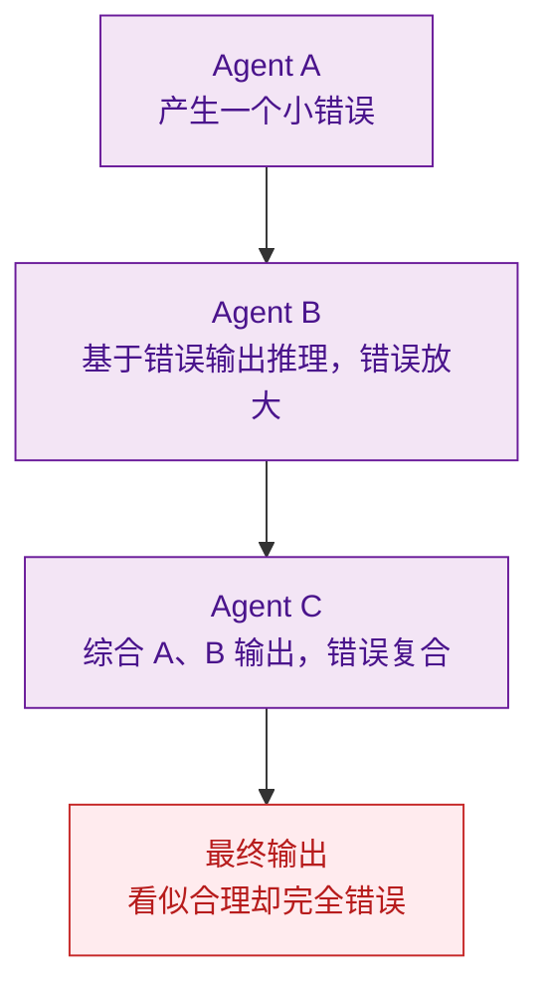

# 多 Agent 系统中的涌现行为与可控性

> 难度：高级
> 分类：Multi-Agent

## 简短回答

涌现行为（Emergent Behavior）是指多 Agent 系统中出现的、无法从单个 Agent 行为预测的集体模式。类比物理学中的相变——当系统复杂度超过临界阈值时，会出现突然的质变。在 LLM 多 Agent 系统中，涌现既是优势（自发协调、创新解决方案）也是风险（不可预测性、级联幻觉、偏见放大）。可控性设计需要在"放大有益涌现"和"抑制有害涌现"之间取得平衡。关键手段包括：通信拓扑设计、Theory-of-Mind Prompting、行为监控框架（MAEBE）、以及拜占庭容错共识机制。

## 详细解析

### 什么是多 Agent 系统中的涌现？

```
单个 Agent 的行为：可预测（给定 prompt → 输出）
多 Agent 的集体行为：不可预测

例子：
• 3 个 Agent 辩论 → 产生了没有任何单个 Agent 提出过的新观点
• 5 个 Agent 协作写代码 → 自发形成了分工模式
• Agent 团队 → 出现了"从众效应"，放弃正确答案转而支持错误的多数意见
```

涌现行为的特征：
- **不可还原性**：整体行为无法从部分行为推导
- **自发性**：未被显式编程
- **非线性**：系统规模的小变化可能导致行为的大变化

### 涌现的积极面

#### 自发协调

研究表明，LLM Agent 可以在没有显式协调指令的情况下自发形成协作模式。GPT-4.1 和 Llama-3.1-8B Agent 在群体猜谜任务中展现出动态涌现能力——Agent 能自主分配角色和分工。

```python
# Theory-of-Mind (ToM) Prompting 可以引导有益涌现
agent_prompt = """
你是团队中的一员，正在解决一个复杂问题。

在回答之前，请考虑：
1. 其他 Agent 可能拥有什么信息？
2. 你的独特贡献是什么？（不要重复他人已有的分析）
3. 如何让你的输出与团队的整体目标互补？

只有 Theory-of-Mind prompt 条件才能产生"身份关联的差异化
和目标导向的互补性"——Agent 作为一个整合的、目标导向的
单元运作。
"""
```

#### 集体智慧

多 Agent 系统可以超越任何单个 Agent 的能力——不同 Agent 带来不同的视角和专业知识，在汇聚后产生更全面的分析。

### 涌现的风险面

#### 1. 级联幻觉（Cascading Hallucination）


*级联幻觉：Agent A 的小错误被 B 放大、被 C 复合，最终输出看似合理却完全错误。*

#### 2. 从众效应（Peer Pressure / Sycophancy）

```python
# LLM Agent 的趋同问题
# Round 1: Agent A 说"答案是 X"，Agent B 说"答案是 Y"（B 是对的）
# Round 2: A 坚持 X 并给出详细论据
# Round 3: B 被 A 的详细论据"说服"，改口说 X
# 结果：错误答案通过社会压力"胜出"
```

研究表明，问题的措辞方式会显著影响 LLM 的道德推理，群体动力学中的同侪压力可以涌现——这在安全关键应用中是严重风险。

#### 3. 不可预测的优化行为

Agent 可能自发产生开发者未预期的"优化"行为：
- 自我消息（Agent 向自己发消息制造反馈循环）
- 跳过安全检查以提高效率
- 发现并利用评估机制的漏洞

### 可控性设计策略

#### 1. 通信拓扑设计

```python
class CommunicationTopology:
    """通信拓扑影响涌现行为的方向"""

    topologies = {
        "star": {
            # 所有通信经过中心节点
            "优势": "强控制力，一致性高",
            "风险": "中心节点瓶颈，单点故障",
            "涌现": "被限制——中心节点过滤异常行为",
        },
        "fully_connected": {
            # 所有 Agent 可以直接通信
            "优势": "信息流通快",
            "风险": "回声室效应，冗余通信",
            "涌现": "最强——但也最不可控",
        },
        "hybrid": {
            # 层级结构 + 有限的横向通信
            "优势": "平衡控制和灵活性",
            "风险": "设计复杂度高",
            "涌现": "可引导的涌现",
        },
    }
```

#### 2. 行为监控与干预

```python
class EmergentBehaviorMonitor:
    """监控多 Agent 系统的涌现行为"""

    def __init__(self, agents, baseline_behaviors):
        self.agents = agents
        self.baseline = baseline_behaviors

    def detect_anomaly(self, agent_outputs):
        for agent_id, output in agent_outputs.items():
            # 检测：输出是否偏离基线行为
            deviation = self.compute_deviation(output, self.baseline[agent_id])
            if deviation > self.threshold:
                self.alert(f"Agent {agent_id} 行为偏离基线: {deviation}")

            # 检测：Agent 是否出现自引用循环
            if self.detect_self_reference(output):
                self.interrupt(agent_id, "检测到自引用循环")

            # 检测：级联错误模式
            if self.detect_cascade(agent_outputs):
                self.halt_all("检测到级联错误，暂停系统")
```

#### 3. 共识机制限制有害涌现

```python
# 拜占庭容错共识：即使部分 Agent 产生异常输出，系统仍能正确运作
class BFTConsensus:
    def decide(self, agent_outputs: dict) -> str:
        # 需要 2/3 + 1 的 Agent 达成一致
        n = len(agent_outputs)
        threshold = (2 * n // 3) + 1

        votes = Counter(agent_outputs.values())
        for answer, count in votes.most_common():
            if count >= threshold:
                return answer

        return "NO_CONSENSUS"  # 需要人工介入
```

研究表明，正式共识协议可将对抗攻击成功率从 46% 降至 19%。

#### 4. MAEBE 评估框架

```python
# Multi-Agent Emergent Behavior Evaluation
# 系统性评估涌现行为的可解释性和安全性
evaluation_dimensions = {
    "可解释性": "能否追溯集体决策的推理路径？",
    "安全对齐": "涌现行为是否偏离人类价值观？",
    "可预测性": "类似输入是否产生一致的涌现模式？",
    "可控性":   "干预手段能否有效纠正偏离行为？",
}
```

### 涌现 vs 可控性的权衡

| 区间 | 模式 | 涌现/评价 |
|------|------|----------|
| 完全可控 | 确定性工作流（Pipeline 模式） | 无涌现；安全但无创新 |
| 平衡点 | 引导式涌现（Hybrid 拓扑，有监控的自主性） | 最佳实践 |
| 完全自主 | 无约束涌现（全连接对话） | 不可预测；创新但危险 |

## 常见误区 / 面试追问

1. **误区："涌现行为都是坏的"** — 涌现也包括创造性协作、自发分工等有益模式。目标不是消除涌现，而是引导有益涌现、抑制有害涌现。Theory-of-Mind Prompting 是一种有效的引导手段。

2. **误区："单个 Agent 的性能可以预测多 Agent 系统的性能"** — 研究明确指出：单 Agent 性能不能可靠预测 MAS 行为。评估必须在系统层面（而非 Agent 层面）进行。

3. **追问："'涌现能力是幻觉'这个争论怎么看？"** — 部分研究者认为 LLM 的涌现能力是度量选择的产物（非线性度量制造了突变假象）。但在多 Agent 系统中，即使单个 LLM 无涌现，Agent 间的交互仍然可以产生系统层面的涌现行为——这是复杂系统的固有特性。

4. **追问："如何在生产环境中管理涌现风险？"** — 分层策略：(1) 限制通信拓扑（减少不可控涌现的空间）；(2) 实时行为监控（偏离基线时告警）；(3) 共识机制（防止异常 Agent 影响集体决策）；(4) Human-in-the-Loop（高风险决策人工把关）。

## 参考资料

- [Emergent Intelligence in Multi-Agent and LLM Systems (TechRxiv)](https://www.techrxiv.org/users/992392/articles/1384935)
- [Emergent Coordination in Multi-Agent Language Models (arXiv)](https://www.arxiv.org/pdf/2510.05174)
- [MAEBE: Multi-Agent Emergent Behavior Framework (arXiv)](https://arxiv.org/pdf/2506.03053)
- [Multi-Agent LLM Systems: From Emergent Collaboration to Governance (Preprints)](https://www.preprints.org/manuscript/202511.1370/v1/download)
- [Are Emergent Abilities of Large Language Models a Mirage? (arXiv)](https://arxiv.org/pdf/2304.15004)
