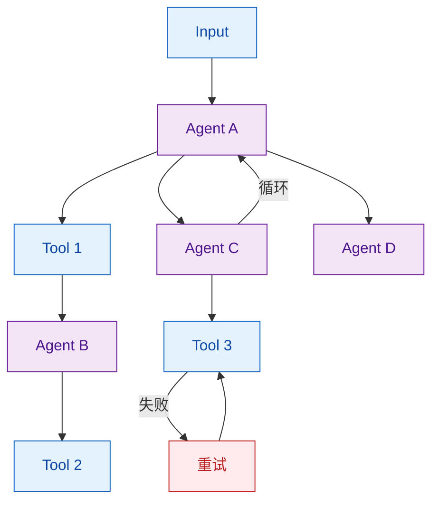
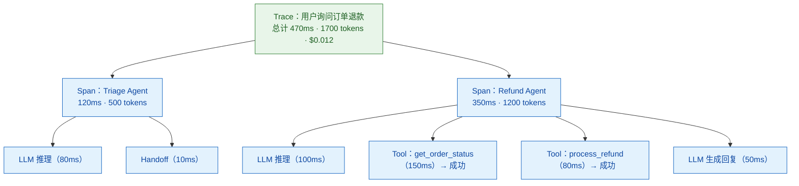

# 如何调试和监控多 Agent 系统？

> 难度：高级
> 分类：Multi-Agent

## 简短回答

多 Agent 系统的调试和监控比单 Agent 困难得多——非确定性输出、跨 Agent 交互、隐式依赖和涌现行为使得问题难以复现和定位。核心方法是**分布式追踪（Distributed Tracing）**：用 Trace 和 Span 记录每个 Agent 的每一步操作，形成可视化的执行图。行业正在收敛到 **OpenTelemetry (OTEL)** 作为标准遥测协议。主流工具包括 Langfuse（开源）、LangSmith（LangChain 生态）、Arize AI、Braintrust、Maxim AI 等。关键指标包括：延迟、token 用量/成本、工具调用成功率、Handoff 成功率、以及输出质量评分。

## 详细解析

### 多 Agent 调试的独特挑战


*单 Agent 是链，多 Agent 是有环、有分流、还有失败重试的图——调试复杂度指数级上升。*

| 挑战 | 说明 |
|------|------|
| 非确定性 | 同样的输入可能产生不同的执行路径 |
| 跨 Agent 交互 | 问题可能源于 Agent A 但表现在 Agent C |
| 隐式依赖 | Agent 间通过共享状态产生的隐式耦合 |
| 延迟叠加 | 多个 LLM 调用串联，延迟难以定位 |
| 上下文丢失 | Handoff 过程中关键信息可能丢失 |

### 核心方法：Trace 和 Span


*Trace 记录一次完整请求，Span 嵌套成执行树，还原每个 Agent 每一步的耗时与 token。*

### 实现追踪

```python
# 方式 1：使用 OpenTelemetry（行业标准）
from opentelemetry import trace
from opentelemetry.sdk.trace import TracerProvider

tracer = trace.get_tracer("multi-agent-system")

async def agent_execute(agent_name, task):
    with tracer.start_as_current_span(f"agent.{agent_name}") as span:
        span.set_attribute("agent.name", agent_name)
        span.set_attribute("task", task)

        # LLM 调用
        with tracer.start_as_current_span("llm.invoke") as llm_span:
            response = await llm.invoke(task)
            llm_span.set_attribute("tokens.input", response.input_tokens)
            llm_span.set_attribute("tokens.output", response.output_tokens)
            llm_span.set_attribute("model", response.model)

        # 工具调用
        for tool_call in response.tool_calls:
            with tracer.start_as_current_span(f"tool.{tool_call.name}") as tool_span:
                result = await execute_tool(tool_call)
                tool_span.set_attribute("tool.success", result.success)

        span.set_attribute("agent.status", "completed")
        return response
```

```python
# 方式 2：使用 Langfuse（开源 LLM 可观测性平台）
from langfuse import Langfuse
from langfuse.decorators import observe

langfuse = Langfuse()

@observe(name="triage-agent")
async def triage_agent(user_message):
    # 自动记录输入/输出/延迟/token
    response = await llm.invoke(user_message)

    if response.needs_handoff:
        # 嵌套 Span：Handoff
        with langfuse.span(name="handoff", metadata={"to": response.target_agent}):
            return await handoff(response.target_agent, response.context)

    return response

@observe(name="refund-agent")
async def refund_agent(context):
    # 嵌套 Span 自动形成调用树
    order = await get_order(context["order_id"])
    refund = await process_refund(order)
    return refund
```

### 关键监控指标

```python
monitoring_metrics = {
    # 性能指标
    "latency": {
        "per_agent": "每个 Agent 的处理时间",
        "end_to_end": "用户请求到最终响应的总时间",
        "tool_calls": "每次工具调用的延迟",
    },
    # 成本指标
    "tokens": {
        "input_tokens": "每个 Agent 的输入 token 数",
        "output_tokens": "每个 Agent 的输出 token 数",
        "total_cost": "按模型定价计算的总成本",
    },
    # 质量指标
    "quality": {
        "tool_call_success_rate": "工具调用成功率",
        "handoff_success_rate": "Handoff 成功率（无上下文丢失）",
        "task_completion_rate": "任务完成率",
        "output_quality_score": "LLM-as-Judge 质量评分",
    },
    # 健康指标
    "health": {
        "error_rate": "各 Agent 的错误率",
        "retry_count": "重试次数",
        "circuit_breaker_trips": "断路器触发次数",
    },
}
```

### 调试工作流

```
1. 问题发现
   └→ 告警触发（延迟飙升/错误率上升/成本异常）

2. 问题定位
   └→ 查看 Trace 列表，筛选异常 Trace
      └→ 展开 Trace 的 Span 树
         └→ 定位到具体的 Agent/工具/LLM 调用

3. 根因分析
   └→ 检查该 Span 的输入/输出/prompt
      └→ 是 LLM 选错了工具？参数错误？工具超时？

4. 修复验证
   └→ 调整 prompt/工具描述/超时设置
      └→ 在 Playground 中用原始输入重放
         └→ 确认修复后部署
```

### 多 Agent 特有的调试技巧

```python
# 技巧 1：Handoff 断点——在每次 Handoff 时记录完整上下文
class HandoffDebugger:
    def on_handoff(self, from_agent, to_agent, context):
        self.logger.info(
            f"Handoff: {from_agent} → {to_agent}",
            extra={
                "context_size": len(json.dumps(context)),
                "context_keys": list(context.keys()),
                "messages_count": len(context.get("messages", [])),
            }
        )

# 技巧 2：Agent 决策日志——记录 LLM 的推理过程
class DecisionLogger:
    def log_decision(self, agent_name, prompt, response, chosen_tool):
        self.store({
            "agent": agent_name,
            "input_summary": summarize(prompt),
            "tool_chosen": chosen_tool,
            "confidence": response.confidence,
            "alternatives_considered": response.alternatives,
        })

# 技巧 3：回放调试——保存完整 Trace 后离线回放
class TraceReplayer:
    def replay(self, trace_id):
        trace = self.load_trace(trace_id)
        for span in trace.spans:
            print(f"[{span.agent}] {span.operation}: {span.input[:100]}...")
            print(f"  → {span.output[:100]}...")
            print(f"  ⏱ {span.duration_ms}ms, 💰 {span.cost}")
```

### 主流工具对比

| 工具 | 类型 | 最适合 | 特色 |
|------|------|--------|------|
| Langfuse | 开源 | 自托管 + 全面可观测性 | Prompt 管理 + 追踪 + 评估一体 |
| LangSmith | SaaS | LangChain/LangGraph 生态 | 与 LangGraph 深度集成 |
| Arize AI | SaaS | 企业级 | 统一 LLM + Agent 评估 |
| Braintrust | SaaS | 多步骤链调试 | 嵌套 Trace 可视化 |
| Maxim AI | SaaS | 多 Agent 专项 | Agent 交互分析 |
| Datadog LLM | SaaS | 已有 Datadog 的团队 | 与 APM 统一监控 |

## 常见误区 / 面试追问

1. **误区："用 print/log 就够了"** — 多 Agent 系统的日志是分散的，无法从日志中重建 Agent 间的因果关系。需要结构化的 Trace + Span 来保留操作间的父子和时序关系。

2. **误区："只监控最终输出质量"** — 最终输出正确不代表过程正确。Agent 可能通过错误的推理路径得到了正确结果（运气好），这类问题只有通过过程追踪才能发现。

3. **追问："OpenTelemetry 在 LLM 领域的角色是什么？"** — OTEL 正在成为 Agent 遥测的标准协议。多个框架（Pydantic AI、smolagents、Strands Agents）已原生支持 OTEL 导出。这避免了厂商锁定，允许用同一套基础设施监控不同框架的 Agent。

4. **追问："如何测试多 Agent 系统？"** — 因为 Agent 输出非确定性，不能用精确匹配断言。推荐：(1) 用评分标准（Rubric）评估输出质量；(2) 用 LLM-as-Judge 自动评估；(3) 构建场景级集成测试而非单元测试；(4) 用 Trace 回放做回归测试。

5. **场景追问："你的多 Agent 系统在高峰期 P99 延迟突然从 2 秒飙升到 15 秒，但各 Agent 单独测试都很正常。如何定位？"** — 这是多 Agent 系统特有的性能问题。定位路径：(1) 检查 Trace 中的跨 Agent 通信延迟 → 可能是消息队列或网络瓶颈；(2) 分析 Agent 间的依赖关系 → 找出是否存在串行化的热点路径；(3) 检查共享资源（如数据库、向量库）在高峰期的表现 → 可能需要添加缓存或读写分离；(4) 查看是否有 Agent 触发了过多的重试 → 重试风暴会指数级放大延迟；(5) 实施 Agent 级别的熔断 → 某个 Agent 响应慢时快速失败而非等待。

6. **场景追问："你的多 Agent 系统中出现'幽灵 Agent'现象——某个 Agent 偶尔会执行完全不在预期范围内的操作，导致系统状态不一致。如何排查？"** — 这是多 Agent 系统中最难调试的问题。排查路径：(1) 立即启用全量 Trace 记录，捕获完整执行路径；(2) 检查 Agent 的 System Prompt 是否有模糊指令 → 可能导致 Agent 自行扩展行为；(3) 分析 Agent 间的消息传递 → 可能存在上下文污染或消息篡改；(4) 检查是否有未记录的配置漂移 → 生产环境和开发环境的 Prompt 版本不一致；(5) 实施 Agent 白名单机制 → 明确列出每个 Agent 允许执行的操作，超出范围自动告警。

7. **场景追问："你的多 Agent 系统中 Agent A 传递给 Agent B 的数据偶尔丢失关键字段，Agent B 因此做出错误决策。如何解决？"** — 这是 Handoff 数据一致性问题。解决路径：(1) 在 Handoff 接口上实施 Schema 验证 → Agent B 收到数据前先校验完整性；(2) 设计标准化的 Handoff 协议 → 明确定义每个 Agent 期望的输入输出格式；(3) 在 Handoff 点记录日志，对比发送和接收的数据；(4) 加入数据补全机制 → Agent B 检测到缺失字段时主动向 Agent A 请求；(5) 实施 Handoff 测试 → 构建专门测试各种 Handoff 场景的测试集。

## 参考资料

- [Agent Tracing for Debugging Multi-Agent AI Systems (Maxim AI)](https://www.getmaxim.ai/articles/agent-tracing-for-debugging-multi-agent-ai-systems/)
- [AI Agent Observability with Langfuse (Langfuse Blog)](https://langfuse.com/blog/2024-07-ai-agent-observability-with-langfuse)
- [LangSmith: AI Agent Observability Platform (LangChain)](https://www.langchain.com/langsmith/observability)
- [8 LLM Observability Tools to Monitor AI Agents (LangChain)](https://www.langchain.com/articles/llm-observability-tools)
- [5 Best Tools for Monitoring LLM Applications in 2026 (Braintrust)](https://www.braintrust.dev/articles/best-llm-monitoring-tools-2026)
