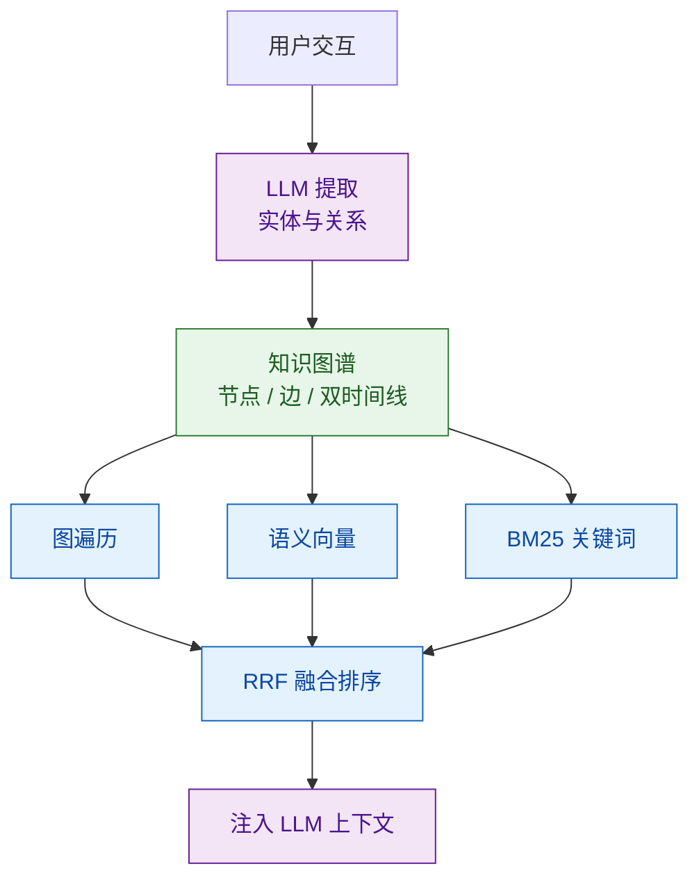
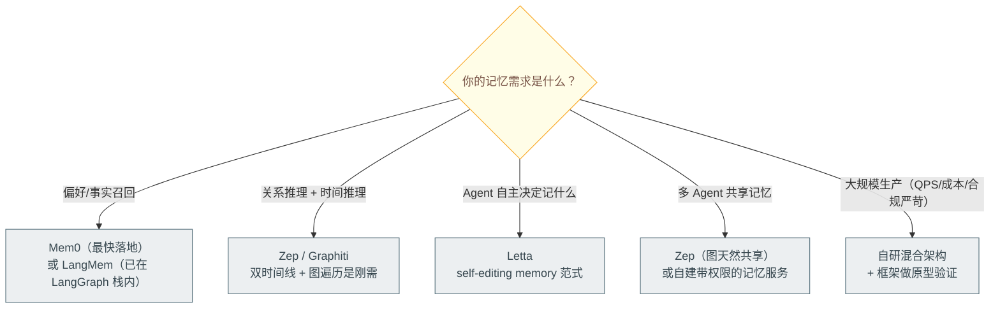

# 长期记忆存储介质选型：向量 / 结构化 / 图谱

> 难度：中级
> 分类：Memory & State

## 简短回答

Agent 长期记忆有三种主要存储介质，各擅其长：(1) **向量记忆**（Embedding + 向量数据库）擅长**语义相似度检索**，基于"意思相近"找到相关记忆，适合非结构化文本和模糊查询；(2) **结构化记忆**（SQL / NoSQL）擅长**精确属性查询**，适合用户画像、偏好、配置等键值化数据；(3) **知识图谱**（Neo4j + Graphiti 等）擅长**关系推理与时间推理**——支持多跳推理（A→B→C）、时间有效性追踪（事实何时变更）、实体关系网络，回答"A 的上级是谁？""这个信息何时变化？"等结构化问题。代表性的 **Graphiti**（Zep 出品）采用**双时间线模型**（事件时间 + 入库时间）+ **混合检索**（语义 Embedding + 关键词 BM25 + 图遍历）。生产系统推荐**混合架构**——向量存对话历史和非结构化内容，图谱存事实、实体和关系，结构化存属性配置。Mem0 的混合方案实现了 26% 准确率提升和 90%+ token 成本降低。

## 详细解析

### 三种介质的核心区别

| 介质 | 数据结构 | 查询能力 | 典型场景 |
|------|---------|---------|---------|
| **向量** | 高维浮点向量 | 语义相似度 | 对话历史、文档检索 |
| **结构化（SQL/NoSQL）** | 表/键值/文档 | 精确字段查询 | 用户画像、偏好、配置 |
| **知识图谱** | 节点 + 边 + 属性 | 多跳推理 + 时间推理 | 实体关系、事实追踪 |

### 向量记忆（Vector / Embedding-based）

```python
# 向量记忆的工作原理
class VectorMemory:
    def store(self, text: str):
        embedding = embed_model.encode(text)  # 文本 → 向量
        self.index.add(embedding, metadata={"text": text})

    def retrieve(self, query: str, top_k=5):
        query_vec = embed_model.encode(query)
        # 基于余弦相似度找最近邻
        results = self.index.search(query_vec, top_k)
        return results

# 示例
memory.store("用户是 Python 开发者，偏好 FastAPI")
memory.store("上次讨论了数据库优化，使用了 PostgreSQL")
results = memory.retrieve("推荐一个 Web 框架")
# → 返回语义相似的记忆条目
```

**优势：**
- 语义理解：基于含义而非关键词匹配
- 灵活性：不需要预定义 Schema
- 对数级延迟：HNSW 索引在百万级数据上仍保持毫秒级检索

**劣势：**
- 基于相似度而非真正理解——语义相近但含义不同的内容可能被错误检索
- 不支持关系推理（"A 的上级是 B，B 的上级是谁？"）
- 不支持时间推理（"上周和这周的偏好有什么变化？"）

### 结构化记忆（SQL / NoSQL）

```python
# 结构化记忆：直接用关系数据库或键值存储
class StructuredMemory:
    """适合用户画像、偏好等键值化数据"""

    def __init__(self, db):
        self.db = db  # PostgreSQL / DynamoDB / Redis

    def update_profile(self, user_id, updates: dict):
        # 例如：{"language": "Python", "framework": "FastAPI"}
        self.db.upsert("user_profile", user_id, updates)

    def get_profile(self, user_id):
        return self.db.get("user_profile", user_id)

    def query_by_attribute(self, attr, value):
        # 精确字段查询
        return self.db.query(f"SELECT * FROM users WHERE {attr} = ?", value)
```

**优势：**
- 精确查询：按字段名直接获取
- 强一致性：ACID 事务支持
- 低延迟：主键查询 ms 级
- 易于审计和迁移

**劣势：**
- 不支持模糊匹配（"偏好类似 FastAPI 的框架" 无法用 SQL 直接表达）
- Schema 演化成本高
- 不擅长关系推理

### 知识图谱记忆（Knowledge Graph）

#### 为什么用知识图谱做记忆？

```
向量记忆的局限：
  "张三在公司A工作" → embedding → 存入向量数据库
  "张三跳槽到公司B" → embedding → 存入向量数据库
  查询"张三在哪工作？" → 两条记忆都被检索出来，LLM 无法判断哪个是最新的

知识图谱的优势：
  (张三) --[works_at, valid: 2024-01 ~ 2025-05]--> (公司A)
  (张三) --[works_at, valid: 2025-06 ~ now]-------> (公司B)
  查询"张三现在在哪？" → 图遍历直接找到当前有效的边 → 公司B
```

#### 知识图谱记忆架构



*图谱记忆：交互抽取入图（节点/边/双时间线），查询走图遍历 + 语义 + BM25 三路合流回灌上下文。*

#### 基础三元组接口

```python
# 知识图谱记忆
class GraphMemory:
    def store(self, subject, predicate, object, valid_from=None, valid_to=None):
        # 存储三元组 + 时间有效性
        self.graph.add_edge(
            subject, object,
            relation=predicate,
            valid_from=valid_from or datetime.now(),
            valid_to=valid_to  # None = 当前有效
        )

    def query(self, query: str):
        # 支持图遍历和多跳查询
        return self.graph.traverse(query)

# 示例
graph.store("张三", "works_at", "公司A", valid_from="2024-01")
graph.store("张三", "works_at", "公司B", valid_from="2025-06")
# 可以查询："张三现在在哪家公司？" → 公司B
# 可以查询："张三之前在哪？" → 公司A（已过期但保留历史）
```

#### Graphiti 框架详解

```python
from graphiti_core import Graphiti
from graphiti_core.nodes import EpisodeType

# 初始化 Graphiti（连接 Neo4j）
graphiti = Graphiti(
    neo4j_uri="bolt://localhost:7687",
    neo4j_user="neo4j",
    neo4j_password="password"
)

# 1. 摄入信息（自动提取实体和关系）
await graphiti.add_episode(
    name="用户对话",
    episode_body="张三说他刚从公司A跳槽到公司B，担任技术总监",
    source=EpisodeType.message,
    reference_time=datetime.now()
)
# Graphiti 自动：
# - 提取实体：张三、公司A、公司B
# - 提取关系：works_at、role_is
# - 设置旧关系(张三→公司A)的 valid_to = now
# - 创建新关系(张三→公司B)的 valid_from = now

# 2. 查询（混合检索）
results = await graphiti.search(
    query="张三现在在哪家公司？",
    num_results=5
)
# 返回当前有效的事实：张三 → works_at → 公司B（技术总监）
```

#### 双时间线模型（Bi-temporal）

```python
# 时间线 T：事件实际发生的时间
# 时间线 T'：数据被系统记录的时间

class BiTemporalFact:
    subject: str        # 主体
    predicate: str      # 关系
    object: str         # 客体
    event_time: datetime      # T: 事件发生时间
    ingestion_time: datetime  # T': 系统记录时间
    valid_from: datetime      # 生效时间
    valid_to: datetime | None # 失效时间（None=当前有效）

# 示例
fact1 = BiTemporalFact(
    subject="张三", predicate="works_at", object="公司A",
    event_time="2024-01-15",   # 实际入职时间
    ingestion_time="2024-03-01",  # 我们获知这个信息的时间
    valid_from="2024-01-15", valid_to="2025-05-31"
)

# 支持的查询：
# "张三 2024 年 6 月在哪工作？" → 时间旅行查询
# "我们什么时候得知张三跳槽的？" → 数据溯源
```

#### 混合检索（Hybrid Retrieval）

Graphiti 的检索结合三路信号：

```python
class HybridRetriever:
    """三路混合检索"""

    async def search(self, query: str, top_k: int = 10):
        # 路径 1：语义向量搜索
        semantic_results = await self.vector_index.search(
            embed(query), top_k=top_k
        )

        # 路径 2：关键词 BM25 搜索
        keyword_results = await self.bm25_index.search(
            query, top_k=top_k
        )

        # 路径 3：图遍历（实体 → 相关节点）
        entities = extract_entities(query)
        graph_results = []
        for entity in entities:
            neighbors = await self.graph.get_neighbors(
                entity, max_hops=2
            )
            graph_results.extend(neighbors)

        # 融合排序（RRF - Reciprocal Rank Fusion）
        return self.reciprocal_rank_fusion(
            semantic_results, keyword_results, graph_results
        )
```

> ⚠️ **延迟实测**：Graphiti 检索阶段不调用 LLM，但实测**中位数延迟 2-3 秒**（受图查询深度、Neo4j 网络开销影响），并非常被引用的 "300ms" 数字。生产中需要做延迟测试并设置 SLA。

#### 多 Agent 共享图谱

```python
# 知识图谱作为多 Agent 的共享记忆
class SharedKGMemory:
    """多 Agent 共享的知识图谱"""

    def __init__(self, graph_db):
        self.graph = graph_db

    async def agent_update(self, agent_id, fact):
        """任何 Agent 的更新对所有 Agent 可见"""
        fact["updated_by"] = agent_id
        fact["updated_at"] = datetime.now()

        # 检查冲突
        existing = await self.graph.find_conflicting(fact)
        if existing:
            # 标记旧事实失效
            await self.graph.invalidate(existing, reason=f"被 {agent_id} 更新")

        await self.graph.add(fact)
        # 所有 Agent 下次查询时自动看到最新事实
```

### 何时选择哪种？

| 需求场景 | 推荐方案 | 原因 |
|---------|---------|------|
| 语义搜索非结构化文本 | 向量 | 模糊匹配是强项 |
| 简单事实召回 | 向量 | 够用且简单 |
| RAG / 知识检索 | 向量 | 标准方案 |
| 用户偏好/属性 | 结构化 | 精确字段查询 |
| 实体关系追踪 | 知识图谱 | 关系推理是强项 |
| 时间推理 | 知识图谱 | 支持时间有效性 |
| 多跳推理 | 知识图谱 | 图遍历天然支持 |
| 用户画像 + 偏好 | 混合 | 结构化属性 + 语义历史 |
| 生产级个性化 | 混合 | 三者互补 |

### 混合架构（推荐）

```python
class HybridMemory:
    def __init__(self):
        self.vector_store = ChromaDB()       # 语义检索
        self.knowledge_graph = Neo4j()       # 关系推理
        self.profile_store = PostgreSQL()    # 结构化属性

    async def store(self, interaction):
        # 1. 对话历史 → 向量存储
        self.vector_store.add(interaction["text"])

        # 2. 提取实体和关系 → 知识图谱
        entities = extract_entities(interaction["text"])
        for entity in entities:
            self.knowledge_graph.upsert(entity)

        # 3. 用户属性 → 结构化存储
        profile_updates = extract_profile(interaction["text"])
        self.profile_store.update(interaction["user_id"], profile_updates)

    async def retrieve(self, query, user_id):
        # 三路检索 + 合并
        # 路径 1：语义检索
        semantic_results = self.vector_store.search(query, top_k=5)

        # 路径 2：图谱查询
        entities = extract_entities(query)
        graph_results = self.knowledge_graph.query(entities)

        # 路径 3：用户属性
        profile = self.profile_store.get(user_id)

        return merge(semantic_results, graph_results, profile)
```

Mem0 的混合方案正是这个思路：用向量存储做语义记忆，用图数据库做关系追踪，统一的 API 对上层透明。

### 性能对比数据

```
Mem0 混合方案 vs 纯全上下文方案：
- 准确率：+26%
- P95 延迟：-91%
- Token 成本：-90%+
```

### Agent Memory 框架横评（2026）

上文讨论的向量 / 结构化 / 图谱是**存储介质**层面的选型。到了 2026 年——业界称之为"Agent Memory 元年"——记忆从一个"附属功能"升级为**独立的工程学科**，涌现出专门做记忆管理的框架层产品。理解这些框架的本质，是把上文介质选型"产品化封装"的结果。四大主流框架：**Mem0 / Zep / LangMem / Letta**。

#### 四大框架速览

| 框架 | 出身 | 核心思路 | 记忆底座 |
|------|------|---------|---------|
| **Mem0** | 独立记忆层产品 | LLM 抽取原子事实 → 混合存储 | 向量库 + 图数据库 |
| **Zep** | Graphiti 作者团队 | 时序知识图谱（双时间线） | Neo4j + 混合检索（Graphiti 引擎） |
| **LangMem** | LangChain 官方 | LangGraph 之上的记忆原语 | 可插拔 Store（后端无关） |
| **Letta** | 基于 MemGPT 研究 | 类 OS 的分页式自管理记忆 | 块存储（core）+ 向量（archival） |

#### 记忆抽象：类型与结构

四个框架对"记忆是什么"有截然不同的抽象——这是理解它们差异的钥匙：

```
Mem0：扁平事实卡片（最细粒度，最易上手）
  {user_id, memory: "用户偏好 FastAPI"} → 向量 + 图

Zep：时序知识图谱（最强时间/关系推理）
  (实体) --[关系, valid_from, valid_to]--> (实体)  → 双时间线

LangMem：认知科学三分类（强调分类走不同策略）
  · semantic    事实/知识（"用户用 Python"）
  · episodic    事件/对话（"上周聊过部署"）
  · procedural  规则/技能（"回复用中文"）

Letta：类 OS 的三级记忆（MemGPT 范式，Agent 自主翻页）
  · core memory     常驻上下文（人设 + 关键事实）
  · recall memory   近期对话日志（可检索）
  · archival memory 长期归档（向量检索）
```

**一句话区分**：
- **Mem0** 把记忆抽象成"原子事实"，粒度最细，接入最快
- **Zep** 把记忆抽象成"带时间戳的图结构"，最强于关系推理与时间推理（见上文 Graphiti 详解）
- **LangMem** 借鉴认知科学的三分类，强调"不同类型的记忆走不同的写入/检索策略"
- **Letta** 把记忆抽象成"计算机内存层级"，核心是 **Agent 自己通过 function call 翻页（page in/out）管理记忆**

#### 抽取 - 更新 - 检索：机制横评

记忆系统有三个核心环节，四个框架做法迥异。

**1. 写入时抽取（Extract）**

```python
# Mem0：LLM 驱动的事实抽取（用户无感）
m.add("我之前用 Django，最近切到 FastAPI 了", user_id="alice")
# 内部：LLM 提取"用户从 Django 切到 FastAPI"
#       → 与旧记忆比对 → 判定为冲突 → 覆盖旧事实

# Zep：LLM 驱动的实体/关系抽取 + 双时间线
await graphiti.add_episode(episode_body="张三跳槽到公司B", ...)
# 内部：提取实体(张三/公司B) + 关系(works_at)
#       → 旧边(张三→公司A) valid_to=now → 新边 valid_from=now

# LangMem：抽取策略由开发者在 LangGraph 节点里定义（最灵活）
# Letta：Agent 自主抽取（self-edit）
#   Agent 调用 core_memory_append / core_memory_replace 工具自己维护
```

**2. 冲突与更新（Update）**

| 框架 | 更新机制 | 冲突处理 |
|------|---------|---------|
| Mem0 | LLM 判定新事实与旧事实的关系 | 四态决策：ADD / UPDATE / DELETE / NOOP |
| Zep | 双时间线：旧边自动失效，新边生效 | 保留全部历史，按 valid_from/to 过滤 |
| LangMem | 由开发者在 graph 节点定义更新逻辑 | 灵活但需自建 |
| Letta | Agent 调用 replace 工具改写 core memory | Agent 自决，需 guardrail 兜底 |

**3. 检索（Retrieve）**

```
Mem0：   向量相似度 + 图遍历（混合） → 返回扁平事实列表
Zep：    向量 + BM25 + 图遍历 → RRF 融合 → 返回带时间的事实
LangMem：可插拔 Store，检索策略由开发者定（语义/关键词/元数据过滤）
Letta：  core memory 常驻 → 需要时 Agent 主动调 archival_memory_search 拉取
```

> 💡 **最重要的范式差异**：Mem0 / Zep / LangMem 都是**系统在用户无感的情况下自动管理记忆**（更像数据库）；而 Letta 走 **Agent 自主管理（self-editing memory）** 路线——记忆操作本身是 Agent 可调用的工具，Agent 像人一样"决定记什么、忘什么"（更像大脑）。关于记忆的遗忘与更新机制，详见 [#048 — 记忆的遗忘与更新机制](048-memory-forgetting-updating.md)。

#### 自研 vs 框架：取舍清单

| 维度 | 用框架 | 自研 |
|------|--------|------|
| **冷启动速度** | 几行代码接入，立即可用 | 从头实现抽取/冲突/检索 |
| **数据主权 / 隐私** | 托管版数据出域；自托管需运维 | 数据全部留在自家基础设施 |
| **定制灵活性** | 受框架抽象约束（如 Mem0 的事实粒度） | 记忆类型、更新策略完全可控 |
| **生产成熟度** | 框架已踩过冲突/一致性/延迟的坑 | 需自己踩坑（双时间线、实体消歧、图谱膨胀） |
| **依赖耦合** | 引入一个依赖（及它的后端如 Neo4j） | 栈更轻，但代码量更大 |

经验法则：
- **MVP / 中小流量** → 直接上框架（Mem0 最快，Zep 最强推理，LangMem 最贴合 LangGraph 栈，Letta 适合需要 Agent 自治的场景）
- **大流量 / 强数据主权 / 特殊记忆结构** → 自研，借鉴框架的设计（双时间线、三分类、self-edit）；框架可用来做原型验证

> 这一取舍逻辑与框架选型的通用判断一致，参见 [#043 — 持久化记忆](043-persistent-memory.md) 中"何时该上专用记忆层"的讨论。

#### 对接生产级记忆系统的选型建议



*记忆框架按需求五路选型：召回选 Mem0，关系/时间推理选 Zep，Agent 自治选 Letta，共享选 Zep，严苛生产自研。*

> 🔗 **与本文存储介质选型的关系**：本节的框架，本质是把上文"向量 + 结构化 + 图谱"的混合架构**产品化封装**——Mem0 = 向量 + 图；Zep = 图谱 + 混合检索；LangMem = 可插拔后端；Letta = 块存储 + 向量。选框架 = 选一套预先组装好的存储介质组合 + 抽取/检索策略。理解了上文的介质取舍（参见 [记忆类型总览 #040](040-memory-types.md)），框架选型就是"买现成组装车还是自己攒"的问题。

### A-MEM：Zettelkasten 方法的记忆系统

```python
# A-MEM 将 Zettelkasten 卡片笔记法应用于 Agent 记忆
class AMemNote:
    """结构化记忆笔记"""
    content: str           # 原子化的知识点
    context: str           # 上下文描述
    keywords: list[str]    # 关键词标签
    links: list[str]       # 与其他笔记的关联
    created_at: datetime
    access_count: int

# 记忆笔记之间形成互联的知识网络
# 类似人脑的联想记忆——从一个记忆可以"联想"到相关记忆
```

### 设计挑战与解决方案

| 挑战 | 解决方案 |
|------|---------|
| 实体消歧（同名不同人） | 上下文感知的实体链接 + 唯一 ID |
| Schema 进化 | Graphiti 支持 prescribed + learned ontology |
| 图谱膨胀 | 时间失效 + 定期清理低价值节点 |
| 提取质量 | LLM 提取 + 人工审核关键事实 |
| 查询延迟 | 混合索引（向量 + BM25 + 图遍历） + 缓存 |
| 混合架构一致性 | 事务性写入 / 最终一致性 + 删除同步 |

## 常见误区 / 面试追问

1. **误区："向量数据库能解决所有记忆需求"** — 向量检索基于相似度，不是真正的"理解"。它无法回答"A 和 B 是什么关系？"或"这个信息是什么时候变的？"等需要结构化推理的问题。

2. **误区："知识图谱太复杂，不值得用"** — 对于简单应用确实如此。但当 Agent 需要追踪实体间关系、处理矛盾信息、或做时间推理时，知识图谱的价值会迅速超过构建成本。Graphiti 等框架已大幅降低了使用门槛。

3. **误区："知识图谱就是把所有信息都存成三元组"** — 不是所有信息都适合图谱。对话历史、非结构化文档适合向量存储；用户属性配置适合结构化存储。图谱应该只存储实体、关系和关键事实。混合架构是最佳实践。

4. **误区："构建知识图谱必须预定义完整 Schema"** — Graphiti 等现代框架支持 learned ontology——从数据中自动学习 Schema，同时支持预定义的 prescribed ontology 约束关键关系。

5. **追问："向量检索返回了语义相似但实际无关的内容怎么办？"** — 两层解决：(1) 加 Reranker 对检索结果做精排；(2) 结合结构化元数据过滤（如按用户 ID、时间范围、类别筛选后再做语义检索）。

6. **追问："混合架构的一致性如何保证？"** — 同一条信息在向量存储和图谱中需要同步更新。实践中用事务性写入或最终一致性。删除操作尤其要注意——向量存储和图谱中都要清理。

7. **追问："图谱记忆的实体提取准确率不够怎么办？"** — 三层保障：(1) 用专门的 NER 模型做初步提取；(2) LLM 做上下文理解和关系推理；(3) 对关键事实做人工审核或交叉验证。

8. **追问："图谱和 RAG 的关系是什么？"** — GraphRAG 是两者的结合——用知识图谱增强 RAG 检索。传统 RAG 只做文档级语义检索，GraphRAG 可以在检索后利用图结构做关系推理和多跳问答，提供更准确和完整的答案。

## 参考资料

- [Comparing Memory Systems for LLM Agents: Vector, Graph, and Event Logs (MarkTechPost)](https://www.marktechpost.com/2025/11/10/comparing-memory-systems-for-llm-agents-vector-graph-and-event-logs/)
- [Mem0 Research: 26% Accuracy Boost for LLMs](https://mem0.ai/research)
- [How AI Agents Remember Things: Vector Stores in LLM Memory (freeCodeCamp)](https://www.freecodecamp.org/news/how-ai-agents-remember-things-vector-stores-in-llm-memory/)
- [A-MEM: Agentic Memory for LLM Agents (arXiv)](https://arxiv.org/pdf/2502.12110)
- [Beyond Short-term Memory: 3 Types of Long-term Memory (ML Mastery)](https://machinelearningmastery.com/beyond-short-term-memory-the-3-types-of-long-term-memory-ai-agents-need/)
- [Graphiti: Build Real-Time Knowledge Graphs for AI Agents (GitHub)](https://github.com/getzep/graphiti)
- [Graphiti: Knowledge Graph Memory for an Agentic World (Neo4j Blog)](https://neo4j.com/blog/developer/graphiti-knowledge-graph-memory/)
- [Zep: Temporal Knowledge Graph Architecture for Agent Memory](https://blog.getzep.com/content/files/2025/01/ZEP__USING_KNOWLEDGE_GRAPHS_TO_POWER_LLM_AGENT_MEMORY_2025011700.pdf)

---

> 📎 本题由原 #046（向量 vs 结构化记忆）与 #047（知识图谱记忆）合并而来（2026-05-23 重构）
