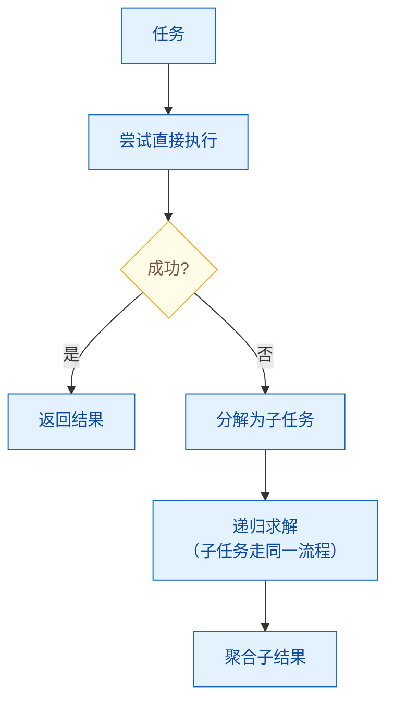

# 任务分解（Task Decomposition）的基本方法

> 难度：基础
> 分类：Planning & Reasoning

## 简短回答

任务分解是将复杂目标拆分为更小、可执行的子任务的过程，是 Agent 规划能力的基础。主要方法包括：**LLM 驱动分解**（用 Prompt 让 LLM 自行拆分任务，最灵活但可能不稳定）、**程序化分解**（用代码预定义拆分规则，最可靠但不灵活）、**层级分解（HTN）**（递归拆分直到每个子任务可直接执行）、**自适应分解（ADaPT）**（只在 LLM 无法直接执行时才拆分，按需递归）。ADaPT 在多个基准上比固定分解提升 27-33%。关键权衡：拆分粒度——太粗则 LLM 处理不了，太细则协调开销过大。

## 详细解析

### 为什么需要任务分解？

```
LLM 擅长：聚焦、范围明确的任务
LLM 不擅长：模糊、多步骤、长依赖链的复杂任务

复杂任务："帮我做一份竞品分析报告"
  ↓ 分解
子任务 1: 确定要分析的竞品列表
子任务 2: 收集每个竞品的产品特性
子任务 3: 收集市场数据和定价信息
子任务 4: 对比分析优劣势
子任务 5: 生成报告和可视化图表
```

### 方法 1：LLM 驱动分解

```python
async def llm_decompose(task: str) -> list[dict]:
    prompt = f"""
    将以下任务分解为可独立执行的子任务列表。

    任务：{task}

    要求：
    1. 每个子任务应该足够小，可以用一次 LLM 调用或一次工具调用完成
    2. 明确标注子任务间的依赖关系
    3. 标注每个子任务需要的工具

    输出 JSON 格式：
    [
        {{"id": 1, "task": "...", "depends_on": [], "tools": ["search"]}},
        {{"id": 2, "task": "...", "depends_on": [1], "tools": ["analyze"]}}
    ]
    """
    return await llm.invoke(prompt, response_format="json")

# 示例输出
subtasks = [
    {"id": 1, "task": "搜索竞品列表", "depends_on": [], "tools": ["web_search"]},
    {"id": 2, "task": "收集竞品A的数据", "depends_on": [1], "tools": ["web_search"]},
    {"id": 3, "task": "收集竞品B的数据", "depends_on": [1], "tools": ["web_search"]},
    {"id": 4, "task": "对比分析", "depends_on": [2, 3], "tools": []},
    {"id": 5, "task": "生成报告", "depends_on": [4], "tools": ["write_file"]},
]
# 注意：2 和 3 可以并行执行（都只依赖 1）
```

### 方法 2：程序化分解

```python
# 预定义的分解模板——确定性、可靠
class ReportGenerationPipeline:
    """程序化分解：代码定义固定步骤"""

    steps = [
        {"name": "data_collection", "agent": "researcher", "parallel": True},
        {"name": "data_analysis", "agent": "analyst", "parallel": False},
        {"name": "draft_writing", "agent": "writer", "parallel": False},
        {"name": "review", "agent": "reviewer", "parallel": False},
    ]

    async def execute(self, task):
        context = {"task": task}
        for step in self.steps:
            agent = self.get_agent(step["agent"])
            context[step["name"]] = await agent.execute(context)
        return context
```

### 方法 3：层级分解（HTN）

```python
class HierarchicalDecomposition:
    """递归分解：直到每个子任务可直接执行"""

    async def decompose(self, task, depth=0, max_depth=3):
        if depth >= max_depth:
            return [task]  # 达到最大深度，不再分解

        # 判断任务是否足够简单可以直接执行
        if await self.is_primitive(task):
            return [task]

        # 分解为子任务
        subtasks = await self.llm_decompose(task)

        # 递归分解每个子任务
        all_tasks = []
        for subtask in subtasks:
            decomposed = await self.decompose(subtask, depth + 1)
            all_tasks.extend(decomposed)

        return all_tasks

    async def is_primitive(self, task):
        """判断任务是否可以用一次工具调用完成"""
        response = await self.llm.invoke(
            f"这个任务能否用一次搜索/代码执行/API调用完成？"
            f"任务：{task}\n回答 yes 或 no"
        )
        return response.strip().lower() == "yes"
```

### 方法 4：自适应分解（ADaPT）

```python
class ADaPT:
    """As-Needed Decomposition and Planning with LLMs"""

    async def solve(self, task):
        # 先尝试直接执行
        result = await self.attempt(task)

        if result.success:
            return result
        else:
            # 执行失败 → 分解后重试
            subtasks = await self.decompose(task)
            results = []
            for subtask in subtasks:
                # 递归：每个子任务也先尝试直接执行
                sub_result = await self.solve(subtask)
                results.append(sub_result)
            return self.aggregate(results)

    async def attempt(self, task):
        """尝试直接用 LLM 执行任务"""
        try:
            result = await self.llm.invoke(task)
            if self.validate(result):
                return Success(result)
            else:
                return Failure("输出质量不达标")
        except Exception as e:
            return Failure(str(e))
```


*ADaPT 按需分解：先尝试直接执行，失败才分解，子任务递归走同一流程。*

**ADaPT 的优势：** 只在必要时分解，避免过度分解。在 ALFWorld 上提升 28.3%，WebShop 提升 27%，TextCraft 提升 33%。

### 子任务表示方式

```python
# 方式 1：线性序列（最简单）
linear = ["搜索", "分析", "写作", "审核"]

# 方式 2：DAG（有向无环图，支持并行）
dag = {
    "搜索A": {"depends_on": []},
    "搜索B": {"depends_on": []},       # 与搜索A并行
    "分析": {"depends_on": ["搜索A", "搜索B"]},  # 等两个搜索完成
    "报告": {"depends_on": ["分析"]},
}

# 方式 3：树形层级
tree = {
    "竞品分析": {
        "数据收集": {
            "搜索竞品A": {},
            "搜索竞品B": {},
        },
        "分析对比": {},
        "生成报告": {},
    }
}
```

### 分解粒度的权衡

```
太粗（少步骤）：
  "做一份完整的竞品分析报告"
  → LLM 无法一次完成，输出质量差

太细（多步骤）：
  "搜索关键词'竞品A产品特性'"
  "提取搜索结果第一条的标题"
  "提取搜索结果第一条的内容"
  → 100 个微步骤，协调开销巨大

适中：
  "收集竞品A的核心产品特性和定价"
  → 一次搜索 + 一次分析可完成
```

### 方法选择指南

| 方法 | 适用场景 | 可靠性 | 灵活性 |
|------|---------|--------|--------|
| LLM 驱动 | 未知/多变的任务 | 中 | 最高 |
| 程序化 | 固定流程的业务逻辑 | 最高 | 最低 |
| 层级(HTN) | 复杂但有结构的任务 | 高 | 中 |
| ADaPT | 复杂度不确定的任务 | 高 | 高 |
| TDAG | 多 Agent + 动态环境 | 中 | 高 |

## 常见误区 / 面试追问

1. **误区："LLM 分解总是最好的"** — LLM 分解灵活但不稳定，可能产生逻辑错误或遗漏关键步骤。对于成熟的业务流程，程序化分解更可靠。最佳实践是混合：程序化定义主流程，LLM 处理需要判断力的子步骤。

2. **误区："分解越细越好"** — 过度分解增加 LLM 调用次数和协调复杂度。研究指出，小模型+精细分解可能损失大模型整体推理产生的创造性洞见。找到合适的粒度是关键。

3. **追问："如何验证分解结果的质量？"** — 检查三个方面：(1) 完整性——子任务是否覆盖了原始目标的所有方面；(2) 独立性——子任务间是否有不必要的耦合；(3) 可执行性——每个子任务是否足够具体可以执行。

4. **追问："任务分解和 Agent 编排的关系？"** — 分解产生子任务图（DAG），编排决定执行策略（顺序/并行/条件）。分解是"做什么"，编排是"怎么做"。LangGraph 等框架将两者统一：分解结果直接映射为图的节点和边。

## 参考资料

- [LLM Agent Task Decomposition Strategies (APXML)](https://apxml.com/courses/agentic-llm-memory-architectures/chapter-4-complex-planning-tool-integration/task-decomposition-strategies)
- [ADaPT: As-Needed Decomposition and Planning with LLMs (Allen AI)](https://allenai.github.io/adaptllm/)
- [How Task Decomposition Makes AI More Affordable (Amazon Science)](https://www.amazon.science/blog/how-task-decomposition-and-smaller-llms-can-make-ai-more-affordable)
- [Systematic Decomposition of Complex LLM Tasks (arXiv)](https://arxiv.org/html/2510.07772v1)
- [Task Decomposition for Coding Agents (MGX)](https://mgx.dev/insights/task-decomposition-for-coding-agents-architectures-advancements-and-future-directions/a95f933f2c6541fc9e1fb352b429da15)
