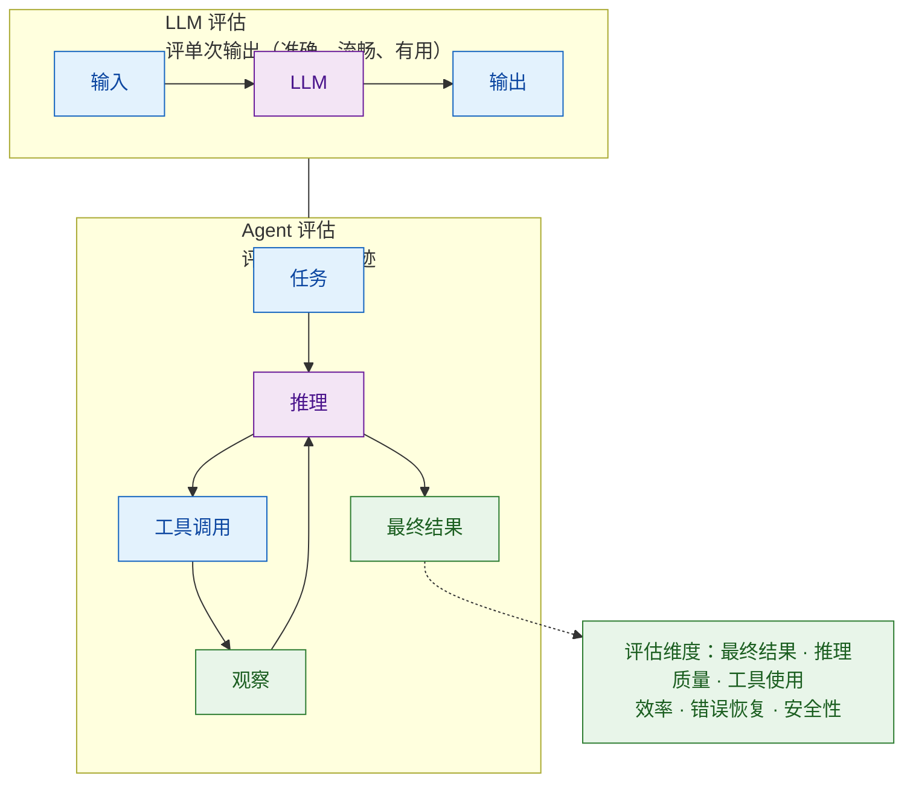

# 评估方法论：从 LLM 评估到 Agent 评估

> 难度：基础
> 分类：Evaluation

## 简短回答

LLM 评估分为三大类：(1) **自动指标评估**——用算法计算的确定性指标（如 BLEU、ROUGE、精确匹配），速度快、成本低，但只能衡量表面特征；(2) **人工评估**——由人类标注者评判输出质量，是"金标准"但成本高、难以规模化；(3) **LLM-as-Judge**——用强 LLM 评估其他 LLM 的输出，顶级 Judge（GPT-4o / Claude Opus）与人工评估的 **Cohen's Kappa ≈ 0.78-0.84**，逼近人类-人类一致性（κ≈0.80），是近年主流趋势。⚠️ 注意 percent agreement 容易虚高（κ=0.62 也能 >80% 一致率），学术界（"Judging the Judges" arXiv:2406.12624）建议用 Cohen's Kappa 才是 Judge 可靠性的正确指标。生产环境推荐**混合方案**：自动指标做初筛，LLM-as-Judge 做质量评估，人工评估做最终校准。

然而，当评估对象从 LLM 升级为 Agent，评估方法论需要根本性扩展。LLM 评估关注**单次输入输出的质量**，而 Agent 评估关注**多步决策轨迹的整体表现**——不仅看最终结果，还要评估推理过程、工具使用、规划质量和错误恢复能力。核心差异在于：Agent 涉及 LLM + 工具 + 环境的交互链，非确定性更强（同一任务可能有多条正确路径），评估维度也从文本质量扩展到任务完成能力、轨迹效率和行为安全。

## 详细解析

### 一、LLM 评估方法全景

```
┌──────────────────────────────────────────────────────┐
│                LLM 评估方法全景                       │
├──────────────────────────────────────────────────────┤
│                                                      │
│  自动指标        LLM-as-Judge       人工评估          │
│  ─────────      ──────────────     ─────────         │
│  BLEU/ROUGE     GPT-4 打分         专家评审          │
│  精确匹配       多维度评估          众包标注          │
│  F1 Score       Pairwise 对比      用户反馈          │
│  Perplexity     Rubric 评分        A/B 测试          │
│                                                      │
│  速度: 最快      速度: 中等         速度: 最慢        │
│  成本: 最低      成本: 中等         成本: 最高        │
│  质量: 有限      质量: 较好         质量: 最好        │
│  规模: 无限      规模: 大           规模: 小          │
└──────────────────────────────────────────────────────┘
```

Sebastian Raschka 将 LLM 评估总结为四种方法：多选基准、人类偏好、自动化 LLM 评估、和编程基准。

### 二、自动指标评估

```python
# 常见自动评估指标

# 1. 精确匹配（Exact Match）
def exact_match(prediction, reference):
    return prediction.strip() == reference.strip()
# 适用：数学题答案、事实性问题、代码输出

# 2. BLEU（机器翻译质量）
from nltk.translate.bleu_score import sentence_bleu
score = sentence_bleu([reference.split()], prediction.split())
# 衡量 n-gram 重叠度，0-1 分

# 3. ROUGE（摘要质量，recall-oriented；与 precision-oriented 的 BLEU 互补）
from rouge_score import rouge_scorer
scorer = rouge_scorer.RougeScorer(['rouge1', 'rougeL'])
scores = scorer.score(reference, prediction)
# ROUGE-1: unigram 召回率（reference 中有多少出现在 prediction）
# ROUGE-L: 最长公共子序列（衡量句子级流畅度）
# 对比 BLEU：BLEU 是 precision-oriented（prediction 中有多少匹配 reference）
# 摘要任务用 ROUGE，翻译任务用 BLEU 是因为这两类任务对漏掉信息 vs 多说信息的容忍度不同

# 4. F1 Score（信息提取）
def token_f1(prediction, reference):
    pred_tokens = set(prediction.split())
    ref_tokens = set(reference.split())
    common = pred_tokens & ref_tokens
    precision = len(common) / len(pred_tokens) if pred_tokens else 0
    recall = len(common) / len(ref_tokens) if ref_tokens else 0
    f1 = 2 * precision * recall / (precision + recall) if (precision + recall) else 0
    return f1

# 自动指标的局限：
# "北京是中国的首都" vs "中国的首都是北京"
# → 语义完全相同，但 BLEU/ROUGE 可能不是满分
# → 无法评估回答的有用性、创造性、安全性
```

### 三、LLM-as-Judge

```python
async def llm_as_judge(question, answer, reference=None):
    """用 LLM 评估回答质量"""

    # 方式 1：直接评分（Pointwise）
    pointwise_prompt = f"""
    请评估以下回答的质量（1-5分）：

    问题：{question}
    回答：{answer}
    {"参考答案：" + reference if reference else ""}

    评分维度：
    - 准确性 (1-5)：事实是否正确？
    - 完整性 (1-5)：是否全面回答了问题？
    - 有用性 (1-5)：对提问者是否有帮助？
    - 清晰度 (1-5)：表达是否清楚？

    请给出每个维度的分数和简要理由，最后给出总分。
    """

    # 方式 2：对比评分（Pairwise）
    pairwise_prompt = f"""
    问题：{question}

    回答 A：{answer_a}
    回答 B：{answer_b}

    哪个回答更好？请从准确性、完整性和清晰度三个维度比较。
    输出：A 更好 / B 更好 / 差不多
    """

    return await judge_llm.invoke(pointwise_prompt)

# LLM-as-Judge 的已知偏差：
biases = {
    "位置偏差": "倾向于给排在前面的回答更高分",
    "冗长偏差": "倾向于给更长的回答更高分",
    "自我偏好": "GPT-4 作为 Judge 倾向于给 GPT-4 的输出更高分",
    "格式偏差": "倾向于给格式更好看的回答更高分",
}

# 缓解偏差：
# - 交换 A/B 位置做两次评估取平均
# - 使用与被评估模型不同的 Judge 模型
# - 提供明确的评分 Rubric
```

### 四、人工评估

```python
human_evaluation_methods = {
    "专家评审": {
        "方法": "领域专家按预定标准打分",
        "优势": "质量最高，能评估专业领域的细微差别",
        "劣势": "成本高，速度慢，难规模化",
        "适用": "高风险场景（医疗、法律、金融）",
    },
    "众包标注": {
        "方法": "通过 Scale AI、Toloka 等平台招募标注者",
        "优势": "可规模化，成本相对可控",
        "劣势": "标注者质量参差不齐，需要质量控制",
        "适用": "大规模偏好数据收集",
    },
    "用户反馈": {
        "方法": "收集真实用户的点赞/点踩/投诉",
        "优势": "最真实的质量信号",
        "劣势": "反馈稀疏（大部分用户不反馈），有偏差",
        "适用": "生产环境的持续监控",
    },
}
```

### 五、混合评估框架（推荐）

```python
class HybridEvaluator:
    """混合评估：自动指标 + LLM Judge + 人工抽检"""

    async def evaluate(self, test_set):
        results = []

        for example in test_set:
            prediction = await self.model.invoke(example.input)
            scores = {}

            # Layer 1: 自动指标（全量，毫秒级）
            scores["exact_match"] = exact_match(prediction, example.reference)
            scores["f1"] = token_f1(prediction, example.reference)

            # Layer 2: LLM-as-Judge（全量或采样，秒级）
            scores["llm_judge"] = await llm_as_judge(
                example.input, prediction, example.reference
            )

            # Layer 3: 标记需要人工审核的案例
            if scores["llm_judge"]["total"] < 3 or scores["f1"] < 0.5:
                scores["needs_human_review"] = True

            results.append(scores)

        # Layer 3 继续：人工审核低分和边界案例
        flagged = [r for r in results if r.get("needs_human_review")]
        # 送人工审核队列...

        return results
```

### 六、评估指标选择指南

| 任务类型 | 推荐指标 | 评估方式 |
| --- | --- | --- |
| 事实性问答 | 精确匹配/F1 | 自动 |
| 文本摘要 | ROUGE + LLM | 自动 + LLM Judge |
| 翻译 | BLEU + 人工 | 自动 + 人工 |
| 创意写作 | 人工 + LLM | LLM Judge + 人工 |
| 对话质量 | LLM 多维评分 | LLM Judge |
| 代码生成 | Pass@k | 自动（运行测试） |
| Agent 任务 | 任务完成率 | 自动 + 轨迹评估 |
| 安全性 | 拒绝率/攻击成功 | 自动 + 红队测试 |

### 七、从 LLM 评估到 Agent 评估——核心差异

LLM 评估的三大方法（自动指标、人工评估、LLM-as-Judge）仍然适用于 Agent，但 Agent 的评估需要根本性扩展。


*LLM 评估评的是单次输出，Agent 评估评的是「推理 ⇄ 工具 ⇄ 观察」整条循环轨迹。*

| 维度 | LLM 评估 | Agent 评估 |
| --- | --- | --- |
| 评估对象 | 单次生成 | 多步决策轨迹 |
| 评估范围 | 输出文本质量 | 任务完成 + 过程 |
| 确定性 | 较高 | 低（多路径可行） |
| 关键指标 | 准确率、BLEU | 任务完成率、效率 |
| 工具使用 | 无 | 核心评估维度 |
| 安全性 | 输出安全 | 行为安全（操作） |
| 评估复杂度 | 低 | 高 |
| 基准测试 | MMLU、GSM8K | SWE-bench、GAIA |

ACL 2025 的 Agent 评估综述提出二维分类法：评估"什么能力"（推理、规划、工具使用等） x "用什么方法"（基准测试、人工评估、LLM Judge 等）。

### 八、Agent 评估的四层模型

```python
agent_evaluation_layers = {
    "Layer 1 - 结果评估（What）": {
        "问题": "Agent 是否完成了任务？",
        "指标": ["任务完成率", "答案准确率", "部分完成度"],
        "方法": "自动化检查最终状态",
        "示例": "SWE-bench: 代码修改后测试是否通过",
    },
    "Layer 2 - 轨迹评估（How）": {
        "问题": "Agent 的决策路径是否合理？",
        "指标": ["步骤合理性", "是否有冗余步骤", "是否走了弯路"],
        "方法": "LLM-as-Judge 或人工评估 Trace",
        "示例": "10 步完成 vs 3 步完成，效率差异巨大",
    },
    "Layer 3 - 工具评估（With What）": {
        "问题": "Agent 是否正确使用了工具？",
        "指标": ["工具选择准确率", "参数正确率", "调用次数"],
        "方法": "与最优工具使用序列对比",
        "示例": "搜索 vs 计算——应该用计算器时却去搜索",
    },
    "Layer 4 - 鲁棒性评估（What If）": {
        "问题": "Agent 面对异常情况如何表现？",
        "指标": ["错误恢复率", "幻觉率", "安全违规率"],
        "方法": "注入故障和对抗样本",
        "示例": "工具返回错误时是否能换策略重试",
    },
}
```

### 九、轨迹评估（Trajectory Evaluation）

```python
class TrajectoryEvaluator:
    """评估 Agent 的完整执行轨迹"""

    async def evaluate_trajectory(self, task, trajectory):
        scores = {}

        # 1. 步骤级评估：每一步是否合理
        step_scores = []
        for i, step in enumerate(trajectory.steps):
            step_score = await self.evaluate_step(
                task=task,
                step=step,
                context=trajectory.steps[:i],  # 前序上下文
            )
            step_scores.append(step_score)
        scores["step_quality"] = np.mean(step_scores)

        # 2. 轨迹效率：是否有冗余步骤
        scores["efficiency"] = self.compute_efficiency(
            actual_steps=len(trajectory.steps),
            optimal_steps=self.get_optimal_length(task),
        )

        # 3. 目标达成度
        scores["goal_achieved"] = await self.check_goal(
            task=task,
            final_state=trajectory.final_state,
        )

        # 4. 错误恢复：遇到错误后的处理
        errors = [s for s in trajectory.steps if s.is_error]
        if errors:
            recovery_rate = sum(1 for e in errors if e.was_recovered) / len(errors)
            scores["error_recovery"] = recovery_rate

        return scores

    async def evaluate_step(self, task, step, context):
        """用 LLM 评估单步决策"""
        return await self.judge_llm.invoke(f"""
        任务：{task}
        已执行步骤：{context}
        当前步骤：{step}

        评估这一步是否合理（1-5分）：
        - 是否推进了任务目标？
        - 工具选择是否正确？
        - 参数是否合理？
        """)
```

### 十、主要 Agent 基准测试

```python
agent_benchmarks = {
    "代码 Agent": {
        "SWE-bench": "修复真实 GitHub Issue（Resolved Rate）",
        "HumanEval": "生成函数代码（Pass@k）",
        "MBPP": "Python 编程任务（Pass@k）",
    },
    "Web Agent": {
        "WebArena": "在真实网站完成复杂任务",
        "Mind2Web": "跨网站的通用网页操作",
        "VisualWebArena": "需要视觉理解的网页任务",
    },
    "通用推理 Agent": {
        "ALFWorld": "文本版家庭环境中的任务执行",
        "WebShop": "模拟电商购物任务",
        "GAIA": "通用 AI 助手评估（需要多工具组合）",
    },
    "工具使用 Agent": {
        "ToolBench": "评估 API 工具的选择和使用",
        "API-Bank": "评估 API 调用的正确性",
        "TaskBench": "多工具组合任务",
    },
}
```

### 十一、生产环境 Agent 评估框架

```python
class ProductionAgentEvaluator:
    """生产环境中的 Agent 评估"""

    def __init__(self):
        self.metrics = {
            # 核心指标
            "task_success_rate": "任务完成率",
            "avg_steps": "平均步骤数",
            "avg_latency": "平均延迟",
            "avg_cost": "平均成本",

            # 质量指标
            "trajectory_quality": "轨迹质量（LLM Judge）",
            "tool_accuracy": "工具使用准确率",
            "hallucination_rate": "幻觉率",

            # 安全指标
            "safety_violation_rate": "安全违规率",
            "unauthorized_action_rate": "越权操作率",
        }

    async def run_eval_suite(self, agent, test_cases):
        results = []
        for case in test_cases:
            # 执行并记录完整轨迹
            trajectory = await agent.execute_with_trace(case.task)

            # 多维评估
            eval_result = {
                "task_success": self.check_success(trajectory, case.expected),
                "steps": len(trajectory.steps),
                "cost": trajectory.total_cost,
                "latency": trajectory.total_time,
                "trajectory_score": await self.judge_trajectory(trajectory),
                "tool_accuracy": self.check_tool_usage(trajectory),
                "safety": self.check_safety(trajectory),
            }
            results.append(eval_result)

        return self.aggregate(results)
```

### 十二、推理过程评估（Reasoning Process Evaluation）

前面的章节主要评估「Agent 做了什么」（结果、轨迹、工具），这一节深入「Agent 是怎么想的」——即**推理过程本身的质量**。这部分内容整合自 #057（#057 原文已并入本节），聚焦四个进阶问题：过程 vs 结果奖励、推理忠实性、推理质量的层次、基于 Trace 的自动诊断规则。

#### 1. 推理质量的层次模型

与第八节「Agent 评估的四层模型」（按评估对象横向划分为结果/轨迹/工具/鲁棒性）互补，这里给出一个**自下而上的推理深度层次**——从单步逻辑一直到任务完成：

```
Level 4: 任务完成度        "Agent 是否完成了用户的请求？"
    ↑
Level 3: 推理路径质量      "推理过程是否高效、合理、有无弯路？"
    ↑
Level 2: 工具使用合理性    "是否选对了工具？参数是否正确？"
    ↑
Level 1: 单步推理正确性    "每一步推理是否逻辑正确？"
```

关键认知：**结果正确 ≠ 过程正确**。一个 Agent 可能因为错误的推理偶然得到正确答案（right answer, wrong reason），只看 Level 4 会高估其推理能力。只有 Level 1–3 同时成立，结果才可靠、可复现。这也解释了为什么纯结果评估（ORM）会漏掉「答案对但推理错」的案例——必须配合过程评估。

#### 2. PRM vs ORM：过程奖励 vs 结果奖励

这是「过程评估 vs 结果评估」在打分与训练层面的核心范式之争。

| 维度 | ORM（Outcome Reward Model） | PRM（Process Reward Model） |
|------|-----------------------------|------------------------------|
| 评估对象 | 只看最终答案是否正确 | 对推理过程的**每一步**打分 |
| 错误定位 | 无法定位错误在哪一步 | 精确定位**第一个**出错的步骤 |
| 实现成本 | 低（一次打分） | 高（每步都要打分，需逐步标注） |
| 适合场景 | 大规模自动评估、初筛 | 训练奖励信号、调试、争议案例深挖 |
| 典型盲区 | right-answer-wrong-reason 被漏掉 | 标注成本高，难以全量铺开 |

```python
class ProcessRewardModel:
    """对推理过程的每一步打分（PRM）"""

    def evaluate_reasoning(self, problem, reasoning_steps):
        step_scores = []
        for i, step in enumerate(reasoning_steps):
            score = self.prm_model.score(
                problem=problem,
                previous_steps=reasoning_steps[:i],
                current_step=step,
            )
            step_scores.append({"step": i + 1, "score": score, "ok": score > 0.5})
        return step_scores

    # 示例：一道算术题的逐步打分
    # Step 1: "总共有 15 × 20 = 300 个苹果"  → score 0.95 ✓
    # Step 2: "卖掉了 120 个"                → score 0.90 ✓
    # Step 3: "剩余 300 + 120 = 420 个"      → score 0.05 ✗（应为减法）
    # ORM 只看到最终答案 420 错 → 知道错，但不知道错在哪步
    # PRM 能精确定位 Step 3 的运算符号错误
```

实践建议：**两者结合**——ORM 做初筛（便宜、全量），PRM 对失败或争议案例做深入分析（贵、精准）。在 Agentic-RL 训练中，PRM 提供的逐步奖励信号比 ORM 更能稳定提升推理能力（参见 [#103](../06-planning-and-reasoning/103-agentic-rl-grpo.md)）。

#### 3. Faithfulness：推理忠实性评估

**忠实性（Faithfulness）** 指推理链是否**真实反映了模型的决策过程**，而非事后合理化（rationalization）——即模型可能先得出答案，再编造一条看似合理的推理链来「解释」这个答案。这样的推理链是「装饰性」的而非「功能性的」，会让评估者误以为模型具备它实际上并不具备的推理能力。

核心检测思路是**干预法（intervention）**：篡改推理链中的某个关键步骤，看最终答案是否随之改变。

```python
def check_faithfulness(model, problem, original_reasoning):
    """忠实性检测：改掉关键步骤，看答案是否真的依赖它"""
    # 1. 原始推理链及其答案
    original_answer = model.solve(problem, reasoning_hint=original_reasoning)

    # 2. 篡改中间某个关键步骤（如把中间计算结果改错）
    tampered = tamper_step(original_reasoning, step_idx=3, new_value="999")

    # 3. 答案若不变 → 模型并未真正依赖这条推理链 → 不忠实
    tampered_answer = model.solve(problem, reasoning_hint=tampered)
    is_faithful = original_answer != tampered_answer
    return is_faithful
```

判定逻辑：**篡改关键步骤后答案若不变，说明模型没有真正「使用」这条推理链**——它是装饰性的。OpenAI 的 CoT Monitorability 研究正系统性地探索思维链在多大程度上能被忠实监控；这与推理模型（[#055](../06-planning-and-reasoning/055-reasoning-models.md)）的可解释性直接相关——如果一个推理模型的 CoT 不可忠实监控，那么基于 CoT 的安全审查就形同虚设。

#### 4. 基于 Trace 的生产诊断规则

生产环境里不可能逐条人工审推理，通常把推理与工具调用记录成 Trace（Span 级别，参见 [#074](074-traces-and-spans.md)），再用一组**启发式规则**自动标红异常轨迹。这组规则是对第十一节「生产环境指标」的补充——前者回答「指标是多少」，这里回答「什么模式说明出了问题」：

```python
# Trace 自动评估规则：命中即标记为可疑轨迹
trace_alert_rules = {
    "循环推理": "推理步骤数 > 阈值 → 可能陷入循环 / 来回兜圈",
    "工具滥用": "同一工具连续调用 > 3 次 → 可能在重试无效操作",
    "策略失误": "工具调用失败率 > 30% → 工具选择策略有问题",
    "效率异常": "总 token 消耗远超同类任务均值 → 推理效率低",
}

# 典型工具栈：Langfuse / LangSmith / Arize Phoenix
# 这些平台原生支持 Span 属性（输入/输出/延迟/token）与父子关系，
# 上述规则可配置为告警阈值，无需手写轮询逻辑。
```

这四条规则分别对应推理过程的四类隐患——循环、重试、选型、开销——它们在生产监控中往往比「最终答案对不对」更早暴露问题，也更适合接入持续评估流水线（[#077](077-continuous-evaluation-pipeline.md)）。

## 常见误区 / 面试追问

1. **误区："BLEU/ROUGE 分数高就说明质量好"** — 这些指标只衡量表面词汇重叠，无法评估语义正确性、逻辑合理性和实用性。两个语义相同但措辞不同的回答可能得到很不同的 BLEU 分数。LLM 时代这些传统指标的参考价值有限。

2. **误区："LLM-as-Judge 完全可以替代人工"** — LLM Judge 有系统性偏差（冗长偏好、位置偏差、自我偏好），且在专业领域（医学、法律）的判断可能不可靠。生产中应该定期用人工评估校准 LLM Judge 的准确性。

3. **误区："Agent 评估只看最终结果就够了"** — 最终结果正确但过程不合理的 Agent 同样有问题——可能走了弯路浪费资源，可能碰巧得到正确结果但推理错误（不可靠），可能使用了不安全的操作。轨迹评估和结果评估同等重要。

4. **误区："用 LLM 基准测试就能评估 Agent"** — LLM 基准（如 MMLU）测试的是知识和推理能力，无法反映 Agent 的工具使用、规划和错误恢复能力。Agent 需要专用基准（如 SWE-bench、WebArena、GAIA）。

5. **追问："如何提高 LLM-as-Judge 的可靠性？"** — (1) 提供详细的评分 Rubric（标准）而非让 Judge 自由打分；(2) 交换位置做两次评估取平均（消除位置偏差）；(3) 用多个 Judge 模型投票；(4) 定期用人工标注校准。

6. **追问："评估数据集从哪里来？"** — 三个来源：(1) 从生产日志中采样真实问题；(2) 人工构造边界案例和对抗样本；(3) 使用公开基准（MMLU、GSM8K 等）。最佳实践是三者结合——公开基准评估通用能力，私有数据集评估业务场景。

7. **追问："如何评估 Agent 的效率？"** — 三个维度：(1) 步骤效率——完成任务用了多少步（vs 最优步数）；(2) 成本效率——消耗了多少 token/金钱；(3) 时间效率——端到端延迟。权衡是：更多步骤可能提升准确率但增加成本。

8. **追问："Agent 评估的最大难点是什么？"** — 非确定性。同一任务可能有多条正确路径，无法用固定的"标准答案"对比。解决方案：(1) 评估最终状态而非中间步骤；(2) 用 LLM Judge 评估轨迹的合理性；(3) 多次运行取统计指标。

## 参考资料

- [Understanding the 4 Main Approaches to LLM Evaluation (Sebastian Raschka)](https://magazine.sebastianraschka.com/p/llm-evaluation-4-approaches)
- [LLM Evaluation Metrics: The Ultimate Guide (Confident AI)](https://www.confident-ai.com/blog/llm-evaluation-metrics-everything-you-need-for-llm-evaluation)
- [LLM Evaluation: Benchmarks vs. Human Judgment (Medium)](https://medium.com/@lmpo/llm-evaluation-benchmarks-vs-human-judgment-f1cdd16098c0)
- [LLM Evaluation Metrics and Methods, Explained Simply (Evidently AI)](https://www.evidentlyai.com/llm-guide/llm-evaluation-metrics)
- [An Analysis of Automated, Human, and LLM-Based Approaches (arXiv)](https://arxiv.org/pdf/2406.03339)
- [Agent Evaluation vs Model Evaluation: What's the Difference (Maxim)](https://www.getmaxim.ai/articles/agent-evaluation-vs-model-evaluation-whats-the-difference-and-why-it-matters/)
- [Evaluation and Benchmarking of LLM Agents: A Survey (ACL 2025)](https://arxiv.org/html/2507.21504v1)
- [LLM Agent Evaluation: Assessing Tool Use, Task Completion (Confident AI)](https://www.confident-ai.com/blog/llm-agent-evaluation-complete-guide)
- [The Complete Guide to LLM & AI Agent Evaluation in 2026 (Adaline)](https://www.adaline.ai/blog/complete-guide-llm-ai-agent-evaluation-2026)
- [Understanding How AI Agent Trajectories Guide Agent Evaluation (Objectways)](https://objectways.com/blog/understanding-how-ai-agent-trajectories-guide-agent-evaluation/)
