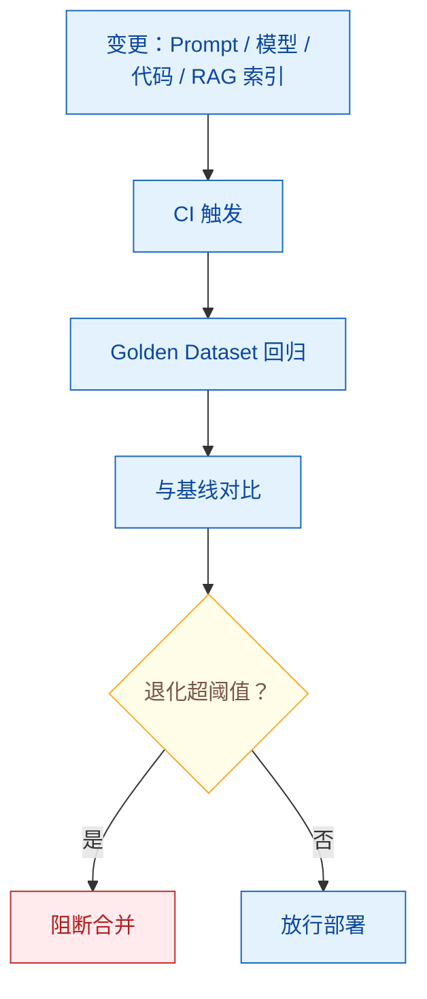

# 回归测试：如何检测 Agent 性能退化？

> 难度：中级
> 分类：Evaluation

## 简短回答

LLM/Agent 回归测试是在每次变更（Prompt 修改、模型升级、代码更新）后自动运行测试套件，检测性能是否退化的工程实践。与传统软件回归测试的关键区别：LLM 输出是**非确定性**的——同一输入可能产生不同输出，不能用简单的"输出相等"判断。核心方法：(1) **Golden Dataset**——维护一组标注好的输入-期望输出对，每次变更后自动评估；(2) **质量指标监控**——追踪准确率、延迟、成本等指标的变化趋势；(3) **LLM-as-Judge 自动评分**——用 LLM 对比变更前后的输出质量；(4) **CI/CD 集成**——在部署管道中自动运行回归测试，不通过则阻止部署。Braintrust、LangSmith 等工具提供了开箱即用的回归测试集成。关键原则：**每次 Prompt 或模型变更都必须有回归测试保障**。

## 详细解析

### 为什么 LLM 需要回归测试？

```
导致性能退化的变更类型：

1. Prompt 修改
   修改了 System Prompt 的一个词 → 安全护栏失效
   添加了新规则 → 与旧规则冲突导致输出混乱

2. 模型升级
   API 提供商更新了模型版本 → 行为微妙变化
   GPT-4-0613 → GPT-4-turbo → 某些任务准确率下降

3. 工具/环境变更
   API 返回格式变化 → Agent 解析失败
   新增工具 → 干扰了原有的工具选择策略

4. 数据变更
   RAG 索引更新 → 检索结果变化 → 回答质量变化
   Few-shot 示例修改 → 输出风格/质量变化
```

### 回归测试框架


*Prompt 和代码一样过 CI：变更触发 Golden Dataset 基线对比，退化超阈值就阻断合并。*

```python
class LLMRegressionTester:
    """LLM/Agent 回归测试框架"""

    def __init__(self, golden_dataset, metrics, threshold):
        self.dataset = golden_dataset   # 标注好的测试集
        self.metrics = metrics          # 评估指标
        self.threshold = threshold      # 退化阈值

    async def run_regression(self, current_version, baseline_version=None):
        """运行回归测试，对比当前版本与基线"""

        # 1. 在测试集上运行当前版本
        current_results = []
        for case in self.dataset:
            output = await current_version.invoke(case.input)
            scores = await self.evaluate(case, output)
            current_results.append(scores)

        # 2. 加载基线结果（或运行基线版本）
        if baseline_version:
            baseline_results = await self.run_baseline(baseline_version)
        else:
            baseline_results = self.load_baseline()

        # 3. 对比
        comparison = self.compare(current_results, baseline_results)

        # 4. 判断是否退化
        regressions = []
        for metric_name, delta in comparison.items():
            if delta < -self.threshold[metric_name]:
                regressions.append({
                    "metric": metric_name,
                    "baseline": baseline_results[metric_name],
                    "current": current_results[metric_name],
                    "delta": delta,
                })

        return {
            "passed": len(regressions) == 0,
            "regressions": regressions,
            "details": comparison,
        }

    async def evaluate(self, case, output):
        """多维度评估单个测试用例"""
        scores = {}

        # 精确匹配（如果有标准答案）
        if case.expected_output:
            scores["exact_match"] = output.strip() == case.expected_output.strip()

        # LLM Judge 评分
        scores["quality"] = await self.llm_judge(case.input, output, case.rubric)

        # 格式合规性
        if case.expected_format:
            scores["format_valid"] = self.check_format(output, case.expected_format)

        return scores
```

### Golden Dataset 的设计

```python
class GoldenDataset:
    """维护回归测试的黄金数据集"""

    def __init__(self):
        self.cases = []

    def add_case(self, input_text, expected_output=None,
                 rubric=None, category=None, priority="normal"):
        self.cases.append({
            "input": input_text,
            "expected_output": expected_output,
            "rubric": rubric,             # LLM Judge 评分标准
            "category": category,          # 分类（便于按类分析）
            "priority": priority,          # critical/normal/low
            "created_at": datetime.now(),
        })

    # 数据集应该覆盖：
    coverage = {
        "核心功能": "Agent 的主要使用场景（占 50%）",
        "边界情况": "极端输入、特殊字符、长文本（占 20%）",
        "安全测试": "Prompt Injection、敏感话题（占 15%）",
        "格式测试": "输出格式一致性（占 10%）",
        "性能基准": "延迟和成本的基准用例（占 5%）",
    }
```

### CI/CD 集成

```python
# GitHub Actions 集成示例
ci_cd_config = """
# .github/workflows/llm-regression.yml
name: LLM Regression Test

on:
  pull_request:
    paths:
      - 'prompts/**'        # Prompt 文件变更触发
      - 'config/model.yaml'  # 模型配置变更触发
      - 'src/agent/**'       # Agent 代码变更触发

jobs:
  regression-test:
    runs-on: ubuntu-latest
    steps:
      - uses: actions/checkout@v4

      - name: Run regression tests
        run: python -m pytest tests/regression/ -v
        env:
          OPENAI_API_KEY: ${{ secrets.OPENAI_API_KEY }}

      - name: Check quality threshold
        run: |
          python scripts/check_regression.py \\
            --baseline results/baseline.json \\
            --current results/current.json \\
            --threshold 0.05  # 允许最多 5% 的退化
"""

# 关键：Prompt 变更和代码变更一样需要通过 CI
```

### 非确定性输出的处理

```python
class NonDeterministicTester:
    """处理 LLM 输出的非确定性"""

    async def robust_test(self, case, n_runs=5):
        """多次运行取统计结果"""
        scores = []
        for _ in range(n_runs):
            output = await self.agent.invoke(case.input)
            score = await self.evaluate(case, output)
            scores.append(score)

        return {
            "mean": np.mean(scores),
            "std": np.std(scores),
            "min": np.min(scores),
            "max": np.max(scores),
            "pass_rate": sum(1 for s in scores if s >= case.threshold) / n_runs,
        }

    def compare_distributions(self, baseline_scores, current_scores):
        """用统计检验比较两个版本的得分分布"""
        from scipy.stats import mannwhitneyu

        stat, p_value = mannwhitneyu(baseline_scores, current_scores)
        return {
            "significant_difference": p_value < 0.05,
            "p_value": p_value,
            "baseline_mean": np.mean(baseline_scores),
            "current_mean": np.mean(current_scores),
        }
```

### 监控仪表盘

```
回归测试监控看板：

┌─────────────────────────────────────────────┐
│ Agent v2.3 回归测试报告                      │
├─────────────────────────────────────────────┤
│ 总体通过率：94% (47/50)     vs 基线: 96%    │
│                                             │
│ ⚠ 退化的指标：                              │
│   - 代码生成准确率：72% → 68% (-4%)         │
│   - 平均延迟：2.1s → 2.8s (+33%)           │
│                                             │
│ ✓ 改进的指标：                              │
│   - 对话质量评分：4.2 → 4.5 (+7%)          │
│   - 工具选择准确率：88% → 91% (+3%)        │
│                                             │
│ 建议：检查代码生成 Prompt 的变更            │
└─────────────────────────────────────────────┘
```

## 常见误区 / 面试追问

1. **误区："LLM 输出不确定，没法做回归测试"** — 非确定性不是不能测试的理由。用多次运行取统计指标（均值、方差、通过率），用 LLM-as-Judge 评估语义质量而非精确匹配，用统计检验判断是否有显著退化。

2. **误区："回归测试只需要在大更新时做"** — Prompt 的微小修改也可能导致显著的行为变化。最佳实践是将回归测试集成到 CI/CD，每次 Prompt 或配置变更都自动触发。这在初期投入大，但长期节省大量排错时间。

3. **追问："Golden Dataset 多大合适？"** — 取决于 Agent 的复杂度。建议最少 50 个测试用例覆盖核心场景，理想情况 200-500 个。每个用例应标注优先级——高优先级的用例（如安全相关）必须 100% 通过。

4. **追问："如何维护 Golden Dataset 的时效性？"** — (1) 从生产中发现的 bug 转化为测试用例（增长策略）；(2) 定期审查和淘汰过时的用例；(3) 随着功能迭代补充新场景的用例。Golden Dataset 应该是活的，随产品演进。

## 参考资料

- [LLM Evaluation: A Practical Guide (Braintrust)](https://www.braintrust.dev/articles/llm-evaluation-guide)
- [Automated Prompt Regression Testing with LLM-as-a-Judge and CI/CD (Traceloop)](https://www.traceloop.com/blog/automated-prompt-regression-testing-with-llm-as-a-judge-and-ci-cd)
- [Prompt Versioning, Testing, and CI/CD (Medium)](https://medium.com/@mrhotfix/prompt-versioning-testing-and-ci-cd-why-your-llm-system-is-more-fragile-than-you-think-000441e57f61)
- [ReCatcher: Towards LLMs Regression Testing for Code Generation (arXiv)](https://arxiv.org/html/2507.19390v1)
- [LLM Testing: A Complete Guide (Comet)](https://www.comet.com/site/blog/llm-testing/)
