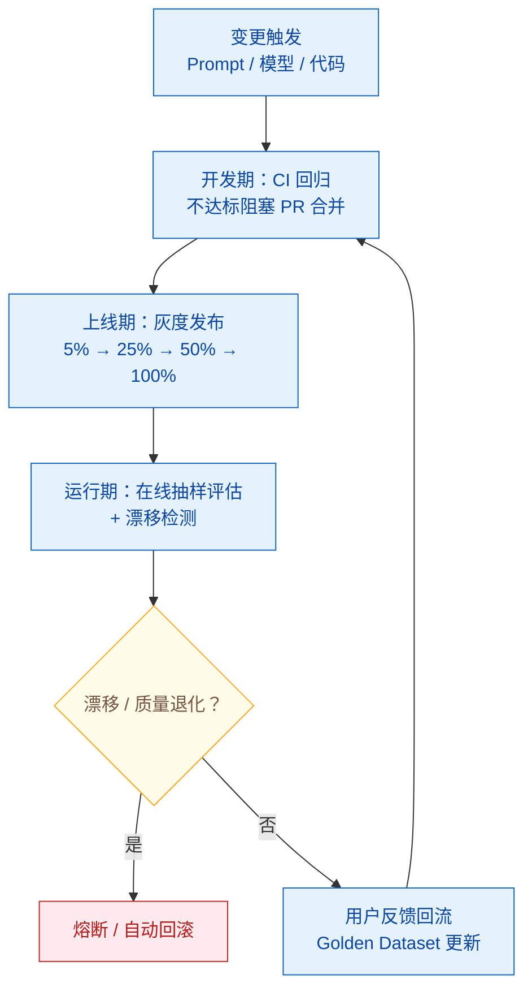

# 如何构建持续评估（Continuous Evaluation）流水线？

> 难度：高级
> 分类：Evaluation

## 简短回答

持续评估流水线是将 LLM/Agent 评估从"一次性测试"升级为"持续运行的质量保障系统"的工程实践。核心理念：**评估不是发布前的关卡，而是贯穿整个生命周期的闭环**。流水线包含三个阶段：(1) **开发期评估**——在 CI/CD 中运行回归测试，Prompt 或模型变更触发自动评估；(2) **上线期评估**——灰度发布 + A/B 测试 + 实时质量监控；(3) **运行期评估**——对生产流量持续抽样评估，检测性能漂移（drift），自动告警。关键组件包括：Golden Dataset 定期更新、LLM-as-Judge 自动评分、用户反馈闭环、成本和延迟监控、熔断机制（Circuit Breaker）。工具链：CI/CD（GitHub Actions）+ 评估框架（DeepEval/Ragas）+ 观测平台（Langfuse/Braintrust）+ 告警（PagerDuty/Slack）。采用结构化评估的团队报告准确率提升 35-40%、迭代速度提升 5-10x。

## 详细解析

### 持续评估 vs 一次性评估

```
一次性评估的问题：
├── 评估一次后就"永远有效"的假设是错误的
├── 模型 API 版本更新 → 行为悄悄变化
├── 用户行为演化 → 原有测试集不再代表真实场景
├── Prompt 小修改 → 可能引入意想不到的退化
└── 数据变更（RAG 索引更新）→ 回答质量漂移

持续评估的理念：
├── 评估是 always-on 的，不是 one-shot 的
├── 每次变更自动触发评估（CI/CD 集成）
├── 生产流量持续被抽样评估（在线评估）
├── 指标趋势可视化 + 自动告警
└── 用户反馈回流到评估数据集（闭环）
```

### 三阶段流水线架构


*持续评估是闭环而非关卡：三阶段各设门，用户反馈回流 Golden Dataset 让测试集活着。*

```python
class ContinuousEvalPipeline:
    """持续评估流水线的三阶段架构"""

    # 阶段 1：开发期评估（CI/CD 集成）
    dev_stage = {
        "触发条件": [
            "Prompt 文件变更（prompts/**）",
            "模型配置变更（config/model.yaml）",
            "Agent 代码变更（src/agent/**）",
            "RAG 索引更新",
        ],
        "评估内容": {
            "回归测试": "在 Golden Dataset 上运行，对比基线",
            "安全测试": "Prompt Injection、越权操作等",
            "格式测试": "输出格式是否符合预期",
        },
        "阻塞条件": "关键指标低于阈值 → 阻止 PR 合并",
        "工具": "GitHub Actions + DeepEval/Ragas",
    }

    # 阶段 2：上线期评估（灰度发布）
    release_stage = {
        "流程": [
            "1. 新版本部署到 Canary 环境（5% 流量）",
            "2. 自动对比 Canary vs Production 的质量指标",
            "3. 如果质量达标 → 逐步扩大流量（25% → 50% → 100%）",
            "4. 如果质量退化 → 自动回滚",
        ],
        "关键指标": [
            "回答质量评分（LLM Judge）",
            "用户满意度（反馈率）",
            "延迟 P95",
            "成本/请求",
        ],
        "工具": "Feature Flags + A/B 测试框架",
    }

    # 阶段 3：运行期评估（持续监控）
    production_stage = {
        "抽样评估": "对 10% 的生产请求进行 LLM Judge 评分",
        "漂移检测": "监控指标趋势，检测渐进退化",
        "用户反馈": "收集显式反馈（👍👎）和隐式信号（重试率）",
        "熔断机制": "质量分 < 阈值 or 成本 > 预算 → 自动降级",
        "工具": "Langfuse/Braintrust + Prometheus + PagerDuty",
    }
```

### CI/CD 集成实现

```yaml
# .github/workflows/llm-continuous-eval.yml
name: LLM Continuous Evaluation

on:
  pull_request:
    paths:
      - 'prompts/**'
      - 'config/model.yaml'
      - 'src/agent/**'
  schedule:
    - cron: '0 2 * * *'  # 每天凌晨 2 点定时运行

jobs:
  regression-test:
    runs-on: ubuntu-latest
    steps:
      - uses: actions/checkout@v4

      - name: Run core regression tests
        run: |
          python -m pytest tests/eval/regression/ \
            --golden-dataset data/golden_v3.json \
            --baseline results/baseline.json \
            --output results/current.json

      - name: Run safety tests
        run: |
          python -m pytest tests/eval/safety/ \
            --injection-dataset data/injection_tests.json

      - name: Compare with baseline
        run: |
          python scripts/compare_eval.py \
            --baseline results/baseline.json \
            --current results/current.json \
            --max-regression 0.05 \
            --critical-metrics accuracy,safety_pass_rate

      - name: Post results to PR
        if: github.event_name == 'pull_request'
        run: |
          python scripts/post_eval_comment.py \
            --results results/current.json \
            --pr ${{ github.event.pull_request.number }}
```

### 在线评估系统

```python
class OnlineEvaluator:
    """生产流量的持续在线评估"""

    def __init__(self, sample_rate=0.1, judge_model="gpt-4o"):
        self.sample_rate = sample_rate
        self.judge = LLMJudge(model=judge_model)
        self.metrics_store = MetricsStore()

    async def evaluate_request(self, request, response, metadata):
        """对单个请求进行在线评估"""
        # 按采样率决定是否评估
        if random.random() > self.sample_rate:
            return

        # LLM Judge 自动评分
        scores = await self.judge.evaluate(
            question=request.input,
            answer=response.output,
            rubric=self.get_rubric(request.category),
        )

        # 记录指标
        self.metrics_store.record({
            "timestamp": datetime.now(),
            "request_id": request.id,
            "category": request.category,
            "quality_score": scores["quality"],
            "relevance_score": scores["relevance"],
            "safety_score": scores["safety"],
            "latency_ms": metadata["latency_ms"],
            "cost_usd": metadata["cost"],
            "model": metadata["model"],
        })

    def detect_drift(self, window_hours=24):
        """检测质量漂移"""
        current = self.metrics_store.get_recent(hours=window_hours)
        baseline = self.metrics_store.get_baseline()

        for metric in ["quality_score", "relevance_score"]:
            current_mean = np.mean(current[metric])
            baseline_mean = baseline[metric]
            drift = (current_mean - baseline_mean) / baseline_mean

            if drift < -0.1:  # 退化超过 10%
                self.alert(
                    level="critical",
                    message=f"{metric} 下降 {abs(drift)*100:.1f}%",
                )

    def circuit_breaker(self, recent_scores):
        """熔断机制——质量过低时自动降级"""
        avg_quality = np.mean(recent_scores[-100:])
        if avg_quality < 0.5:  # 最近 100 个请求质量过低
            self.switch_to_fallback()
            self.alert(level="critical", message="触发熔断，已切换到降级模式")
```

### 用户反馈闭环

```python
class FeedbackLoop:
    """将用户反馈转化为评估数据"""

    def collect_feedback(self, request_id, feedback_type, value):
        """收集两类反馈"""
        # 显式反馈：用户点击 👍👎、评分、投诉
        # 隐式反馈：重试率、编辑率、会话放弃率

        self.store.save({
            "request_id": request_id,
            "type": feedback_type,   # explicit / implicit
            "value": value,
            "timestamp": datetime.now(),
        })

    def update_golden_dataset(self):
        """定期将用户反馈转化为新的测试用例"""
        # 1. 找出负面反馈的请求
        negative = self.store.query(
            feedback_type="explicit",
            value="negative",
            last_days=30,
        )

        # 2. 人工审核后加入 Golden Dataset
        for case in negative:
            if self.human_review(case):
                self.golden_dataset.add(
                    input=case.request_input,
                    expected=case.corrected_output,  # 人工修正的期望输出
                    category=case.category,
                    source="user_feedback",
                )

    # 闭环：用户反馈 → 新测试用例 → CI 检测 → 修复 → 用户体验提升
```

### 监控仪表盘设计

```
┌──────────────────────────────────────────────────┐
│ Agent 持续评估仪表盘                              │
├──────────────────────────────────────────────────┤
│                                                  │
│ 📊 质量趋势（近 7 天）                           │
│ Quality: ████████████████░░ 4.2/5 (↓0.1)       │
│ Safety:  ██████████████████ 98.5%  (→)          │
│ Latency: ████████████████░░ P95=2.3s (↑0.2s)   │
│                                                  │
│ 🔔 告警                                         │
│ ⚠ 代码生成质量下降 8%（最近 24h）               │
│ ⚠ 成本/请求上升 15%（模型切换导致）              │
│                                                  │
│ 📈 按类别分析                                    │
│ 问答:   4.5/5  ████████████████████             │
│ 代码:   3.8/5  ██████████████░░░░░░  ← 关注    │
│ 分析:   4.3/5  █████████████████░░░             │
│                                                  │
│ 🔄 CI/CD 评估记录                               │
│ PR #234: ✅ 通过（quality=4.3, safety=99%）     │
│ PR #233: ❌ 失败（quality=3.1 < 阈值 3.5）     │
│                                                  │
└──────────────────────────────────────────────────┘
```

### 实施路线图

```
Month 1: 基础设施
├── 接入 Langfuse/LangSmith，所有请求记录 Trace
├── 定义核心评估指标（质量、安全、延迟、成本）
└── 构建初始 Golden Dataset（50-100 条）

Month 2: CI/CD 集成
├── 回归测试集成到 GitHub Actions
├── Prompt 变更触发自动评估
└── PR 中自动 post 评估报告

Month 3: 在线评估
├── 部署 LLM Judge 对生产流量抽样评估
├── 搭建监控仪表盘
├── 配置告警规则
└── 用户反馈收集机制

Month 4-6: 闭环优化
├── 用户反馈 → Golden Dataset 更新
├── 漂移检测 + 自动熔断
├── A/B 测试框架
└── 定期评估审查会议
```

## 常见误区 / 面试追问

1. **误区："评估一次就够了，模型又没变"** — 即使不主动更换模型，API 提供商也可能更新版本（如 GPT-4 的 0613 → turbo 迁移）。RAG 索引更新、用户行为变化都会导致质量漂移。持续评估是发现这些隐性退化的唯一方式。

2. **误区："在线评估太贵了"** — 抽样评估 10% 的请求，用 GPT-4o-mini 做 Judge（成本约 $0.001/评估），1 万请求/天只需约 $1/天。相比质量问题导致的用户流失，这个成本微不足道。

3. **追问："如何处理评估指标之间的冲突？"** — 例如质量提升但成本翻倍。建议：(1) 定义各指标的优先级和阈值；(2) 用加权综合得分（如 quality×0.5 + cost×0.2 + latency×0.2 + safety×0.1）；(3) 设置硬性底线（如安全分 < 95% 一票否决）。

4. **追问："小团队如何低成本起步？"** — 最小可行方案：(1) 用 Langfuse（免费开源）记录所有请求；(2) 维护 50 条 Golden Dataset，用 pytest 在 CI 中跑；(3) 生产环境收集 👍👎 反馈。这三步花一周就能搭好，之后逐步迭代。

## 参考资料

- [LLMOps for AI Agents: Monitoring, Testing & Iteration in Production (OneReach)](https://onereach.ai/blog/llmops-for-ai-agents-in-production/)
- [What 1,200 Production Deployments Reveal About LLMOps in 2025 (ZenML)](https://www.zenml.io/blog/what-1200-production-deployments-reveal-about-llmops-in-2025)
- [Building an LLM Evaluation Framework: Best Practices (Datadog)](https://www.datadoghq.com/blog/llm-evaluation-framework-best-practices/)
- [Agent Evaluation in 2025: Complete Guide (Orq.ai)](https://orq.ai/blog/agent-evaluation)
- [5 Best Tools for Monitoring LLM Applications in 2026 (Braintrust)](https://www.braintrust.dev/articles/best-llm-monitoring-tools-2026)
