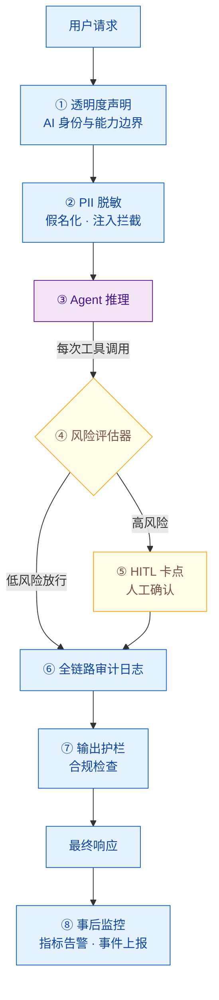

# Agent 产品如何做合规设计？EU AI Act 对 Agent 有何影响？

> 难度：中级
> 分类：Safety & Alignment

## 简短回答

Agent 产品的合规设计，本质是把「法律要求的可追溯、可解释、可干预」翻译成工程上的强制卡点。**EU AI Act** 是全球首部全面的 AI 立法，采用**风险分级（risk-based）思路**——把 AI 系统按危害程度分为四档：禁止、高风险、有限风险、最小风险，风险越高，义务越重。其中**高风险 AI 系统的核心义务**（透明度、人工监督、自动记录日志、数据治理、稳健性与网络安全）将于 **2026 年 8 月 2 日全面生效**，最高罚款 €35M 或全球年营收 7%。

Agent 相比传统软件有两类**特有合规难题**：一是 **自主决策链路长、可解释性差**——一个看似无害的购物 Agent 可能自主决定调用支付工具、读取用户通讯录、修改收货地址，每一步都需要独立审计；二是 **工具调用和记忆天然与隐私法规交叉**——Agent 的 long-term memory 会持续积累 PII，tool call 会触达外部系统，这使得 EU AI Act 与 GDPR（通用数据保护条例）必须联合考虑。

务实的做法不是「等法规落地再合规」，而是从 Day 1 把**合规作为架构的一层**来设计：透明度声明、Human-in-the-Loop（HITL）卡点、全链路审计日志、PII 脱敏管线。这些不只是合规成本，同时也是提升 Agent 可靠性与用户信任的工程收益。对中国出海 Agent 产品，还需同时对照《生成式人工智能服务管理暂行办法》与美国各州法规，做**多法域合规矩阵**。

## 详细解析

### EU AI Act 风险分级体系

EU AI Act 的核心设计是「**风险越高，义务越重**」，把 AI 系统分为四个层级：

```
                    ┌─────────────┐
                    │  禁止使用    │  不可接受风险 → 全面禁止
                    │ Prohibited  │  （社会评分、实时生物识别、
                    └──────┬──────┘   潜意识操纵、剥削弱势群体）
                           │
                    ┌──────▼──────┐
                    │   高风险     │  高风险 → 严格义务
                    │ High-Risk   │  （招聘、信贷、医疗、执法、
                    └──────┬──────┘   教育、关键基础设施等）
                           │
                    ┌──────▼──────┐
                    │  有限风险    │  有限风险 → 透明度义务
                    │  Limited    │  （聊天机器人、Deepfake、
                    └──────┬──────┘   情感识别——须告知用户）
                           │
                    ┌──────▼──────┐
                    │  最小风险    │  最小风险 → 无额外义务
                    │  Minimal    │  （垃圾邮件过滤、游戏 AI、
                    └─────────────┘   库存预测——自由部署）

    义务递增 ▼                             义务递减 ▲
    禁止 > 严格合规 > 透明告知 > 无要求
```

对 Agent 产品来说，判定所属层级是最关键的一步——它直接决定了你需要投入多少合规资源。**多数通用对话 Agent / Coding Agent 落在「有限风险」或「最小风险」**，而一旦进入招聘筛选、信用评估、保险定价、医疗诊断、教育评估等领域，立刻被划入「高风险」，触发全套义务。

> **时效关键点**：高风险系统义务的全面生效日是 **2026 年 8 月 2 日**（EU AI Act 生效满 24 个月）。禁止性条款已于 2025 年 2 月 2 日适用，通用型 AI 模型（GPAI）条款已于 2025 年 8 月 2 日适用。Agent 产品若面向欧盟市场，必须在 2026.8.2 前完成高风险合规或证明自己不属于高风险。

### 高风险 AI 系统的核心义务

一旦被判定为高风险，EU AI Act 要求系统满足以下维度的义务，每一项都对应具体的工程实现：

| 义务维度 | 法规要求 | 工程落地 |
|---------|---------|---------|
| **风险管理体系** | 全生命周期建立持续的风险识别与缓解流程（Art.9） | 每次 Agent 架构变更后跑风险评估流水线 |
| **数据与数据治理** | 训练/验证/测试数据须相关、无错、完整（Art.10） | 数据血缘记录、偏见检测、数据卡片（datasheet） |
| **技术文档** | 系统上线前完成并持续维护技术文档（Art.11） | 自动生成模型卡片、系统架构文档、变更日志 |
| **记录与日志** | 自动记录事件（logging），确保可追溯（Art.12） | 结构化 trace，保留 tool call 全量日志 |
| **透明度与信息** | 向部署者提供清晰的使用说明（Art.13） | Agent 能力边界文档、已知失败模式披露 |
| **人工监督** | 允许自然人在使用期间有效监督（Art.14） | HITL 卡点、人工中断/覆盖机制 |
| **稳健性、准确性与网络安全** | 具适当韧性，能抵御错误与恶意攻击（Art.15） | Red Team 测试、对抗性鲁棒性、Prompt Injection 防御 |
| **事后监控** | 上线后持续监控性能与风险（Art.72） | 生产环境可观测性 + 异常告警 |
| **合格评定与 CE 标志** | 通过合格评定，加贴 CE 标志（Art.43-48） | 第三方审计 / 自我声明（视类别） |

这些义务看起来繁重，但从工程角度看，**多数是成熟工程实践的法律化**——可观测性、文档化、人工审核、安全测试本就是生产级 Agent 的标配。合规的增量成本主要是「把已有实践文档化、制度化、可审计化」。

### GPAI 条款：Agent 底层模型的额外约束

Agent 通常构建在通用大模型（GPAI）之上。EU AI Act 对 **GPAI 模型提供者**（如 Anthropic、OpenAI、Google）单独设定了义务：

- **所有 GPAI 提供者**：须维护技术文档、训练数据摘要、版权合规、向下游部署者传递信息。
- **系统性风险 GPAI**（训练算力超过 **10²⁵ FLOPS** 阈值的模型）：额外要求模型评估、对抗性测试（Red Teaming）、严重事件上报、网络安全保护。

对 Agent 团队的影响：**你通常是「部署者」而非「提供者」**，主要义务在自己这层；但你有权要求模型提供者传递必要的技术文档与能力边界信息。如果你对底层模型做了显著微调（fine-tuning）使其进入新用途，责任边界会向你偏移。

### Agent 特有的三大合规挑战

传统软件合规的对象是「确定性的代码逻辑」，Agent 合规面对的则是「概率性的自主决策链」，这带来三个独有难题：

**挑战一：自主决策的可解释性**

传统软件的决策路径由代码硬编码，审计就是读代码。Agent 的决策由 LLM 在运行时动态生成——同一次输入可能走完全不同的工具调用序列。EU AI Act 高风险义务要求决策可解释、可追溯，但 Agent 的 reasoning 过程往往是黑盒。

| 传统软件审计 | Agent 审计 |
| --- | --- |
| `if score>80 → 通过`<br>`else → 拒绝` | LLM 生成的 reasoning：<br>`"用户信用良好，建议批准"`<br>`→ tool: check_credit()`<br>`→ tool: calc_risk()`<br>`→ tool: approve_loan()` |
| ← 可读，规则确定，审计简单 | 路径动态，需记录每步 reasoning |

**挑战二：工具调用的全链路审计**

Agent 的危害往往不在「说了什么」，而在「做了什么」——一个购物 Agent 自主下单、一个 IT Agent 修改生产配置、一个邮件 Agent 对外发送内容。EU AI Act 的 logging 义务要求记录「相关事件」，对 Agent 而言这意味着**每一次 tool call 的入参、出参、时间戳、触发 reasoning 都必须结构化留存**，且日志本身要防篡改。

**挑战三：记忆系统与 GDPR 的交叉**

Agent 的 long-term memory 会持续积累用户数据：对话历史、偏好画像、执行过的操作。这与 **GDPR** 的数据最小化、目的限制、删除权（Right to Erasure）、数据可携带权产生直接冲突。一个合规的 Agent memory 系统必须支持：按用户粒度隔离、可导出、可彻底删除、有保留期限策略。这是纯技术合规（EU AI Act）与隐私合规（GDPR）的交汇点，也是面试中常被深挖的点。

### 合规设计清单与参考架构

把上述义务落地为一套「合规中间层」，嵌入 Agent 的执行循环中：


*合规是架构的一层：透明度、PII 脱敏、风险评估、HITL、审计日志、输出护栏、事后监控串成强制卡点。*

对应的**合规设计清单**：

| 合规要素 | 设计动作 | 对应法规义务 |
|---------|---------|-------------|
| 透明度声明 | 交互入口展示「AI 生成 / 自主操作」告知 | 透明度义务（Art.13 / 有限风险告知） |
| PII 处理 | 输入端假名化（pseudonymization），memory 按用户隔离、可删除 | GDPR 数据最小化、删除权 |
| HITL 卡点 | 不可逆操作（支付、删除、外发）前强制人工确认 | 人工监督（Art.14） |
| 全链路日志 | 结构化 trace：reasoning + tool call 入参出参 + 时间戳 | 记录与日志（Art.12） |
| 风险评估器 | 按操作类型 + 影响面打分，高风险自动升级 | 风险管理体系（Art.9） |
| 模型/系统卡片 | 自动生成能力边界、已知失败模式、训练数据摘要 | 技术文档（Art.11） |
| 事后监控 | 生产可观测性 + 异常检测 + 严重事件上报通道 | 事后监控（Art.72） |
| 对抗性测试 | 定期 Red Team，覆盖 Prompt Injection、越狱 | 稳健性与网络安全（Art.15） |

下面是一个**合规中间件的伪代码实现**，展示如何在不侵入业务逻辑的前提下嵌入审计、HITL 和 PII 处理：

```python
import time
import hashlib
import json
from dataclasses import dataclass, field
from enum import Enum

# ── 风险分级：哪些 tool call 需要人工确认 ──────────────────
RISK_LEVELS = {
    "search_web": "low",
    "read_file": "low",
    "write_file": "medium",
    "send_email": "high",        # 外发通信 → HITL
    "make_payment": "critical",  # 金融交易 → HITL
    "delete_record": "critical", # 不可逆操作 → HITL
}

@dataclass
class AuditEntry:
    """单条审计日志——满足 EU AI Act Art.12 记录义务"""
    trace_id: str
    timestamp: float
    tool_name: str
    input_hash: str       # 存哈希而非原文，兼顾审计与隐私
    output_hash: str
    reasoning: str        # Agent 决策依据（可解释性）
    risk_level: str
    approved_by: str = ""  # HITL 审批人
    metadata: dict = field(default_factory=dict)

class ComplianceMiddleware:
    """Agent 合规中间件：审计 + HITL + PII 脱敏"""

    def __init__(self):
        self.audit_log: list[AuditEntry] = []
        self.high_risk_threshold = {"high", "critical"}

    # ① PII 脱敏：进入 Agent 前处理
    def redact_pii(self, text: str) -> str:
        """假名化——满足 GDPR 数据最小化原则"""
        # 实际场景用 NER 模型或正则识别邮箱/电话/身份证号
        return text.replace("@", "[at]")  # 简化示例

    # ② 工具调用前：风险评估 + HITL 卡点
    def before_tool_call(self, tool_name: str, params: dict,
                         reasoning: str, trace_id: str) -> dict:
        risk = RISK_LEVELS.get(tool_name, "medium")

        if risk in self.high_risk_threshold:
            # 高风险操作：升级人工确认（对应 Art.14 人工监督）
            return {
                "needs_approval": True,
                "risk_level": risk,
                "tool": tool_name,
                "reasoning": reasoning,
                "message": f"高风险操作 {tool_name}，等待人工确认",
            }
        return {"needs_approval": False, "risk_level": risk}

    # ③ 工具调用后：写审计日志
    def after_tool_call(self, tool_name: str, params: dict,
                        result: dict, reasoning: str,
                        trace_id: str, approved_by: str = "") -> None:
        entry = AuditEntry(
            trace_id=trace_id,
            timestamp=time.time(),
            tool_name=tool_name,
            input_hash=hashlib.sha256(
                json.dumps(params, sort_keys=True).encode()).hexdigest()[:16],
            output_hash=hashlib.sha256(
                json.dumps(result, sort_keys=True).encode()).hexdigest()[:16],
            reasoning=reasoning,
            risk_level=RISK_LEVELS.get(tool_name, "medium"),
            approved_by=approved_by,
        )
        self.audit_log.append(entry)

    # ④ GDPR 删除权：按用户清除记忆
    def purge_user_data(self, user_id: str) -> int:
        """Right to Erasure——彻底删除某用户的所有 trace"""
        before = len(self.audit_log)
        self.audit_log = [
            e for e in self.audit_log
            if e.metadata.get("user_id") != user_id
        ]
        return before - len(self.audit_log)

    # ⑤ 导出某次会话的完整审计链（供监管检查）
    def export_trace(self, trace_id: str) -> list[dict]:
        return [
            {
                "step": i, "tool": e.tool_name, "ts": e.timestamp,
                "reasoning": e.reasoning, "risk": e.risk_level,
                "approved_by": e.approved_by,
            }
            for i, e in enumerate(
                [x for x in self.audit_log if x.trace_id == trace_id])
        ]
```

这套中间件的关键设计：**审计日志只存哈希而非原始数据**，既满足可追溯（能证明某次调用发生过），又降低隐私泄露面（日志本身不含 PII）；**HITL 卡点按风险等级自动触发**，不依赖开发者手动加确认逻辑。

### 多法域对比：EU / 中国 / 美国

Agent 产品若面向多市场，需同时满足多个法域。三大法域的监管思路差异显著：

| 维度 | EU AI Act | 中国《生成式 AI 服务管理暂行办法》 | 美国（联邦无统一法 + 州级） |
|------|-----------|----------------------------------|--------------------------|
| **立法思路** | 横向风险分级，统一立法 | 按服务类型垂直监管，备案制 | 无联邦统一法，州级碎片化 + 行业指导 |
| **核心机制** | 四级风险分级 + 合格评定 | 算法备案 + 安全评估 + 内容合规 | 高风险场景的事前影响评估（州级） |
| **适用对象** | 在欧盟市场的所有 AI 系统（含域外提供者） | 面向中国公众提供生成式 AI 服务 | 各州管辖范围内的 AI 系统 |
| **关键要求** | 透明度、人工监督、日志、数据治理 | 训练数据合法、内容真实准确、标识 AI 生成 | 透明度、影响评估、反歧视 |
| **内容监管** | 较少涉及具体内容 | **严格**：须符合核心价值观，禁止生成违法内容 | 主要关注歧视、深度伪造 |
| **生效状态** | 高风险义务 2026.8.2 全面生效 | 2023.8.15 已生效 | Colorado AI Act 2026.2.1 生效 |
| **罚款上限** | €35M 或全球营收 7% | 警告、罚款、暂停服务 | 各州不同 |

实践建议：**以最严法域（通常是 EU）为基线设计合规架构**，再叠加各市场的特殊要求（如中国的内容合规与备案、美国部分州的算法审计）。这种「最高水位线」策略能避免为每个市场维护独立合规版本的高昂成本。

> **注意**：美国加州 SB-1047（前沿 AI 模型安全法案）已于 2024 年被州长否决，未成为法律；但 Colorado SB 24-205（消费者 AI 保护法）已签署，2026 年 2 月 1 日生效，是美国首部全面性州级 AI 法。联邦层面目前主要靠部门指引（如 NIST AI RMF 自愿框架），尚无统一立法。

## 常见误区 / 面试追问

1. **追问：「我的 Agent 算不算高风险？判定标准是什么？」** — 这是面试最高频的合规问题。判定分两条路径：路径一是**用途清单**（EU AI Act Annex III），列举了天然高风险的场景——招聘筛选、信贷评估、保险定价、教育评分、医疗诊断、执法辅助、关键基础设施管理、民主程序中的投票辅助等；路径二是**产品安全法规附件**（Annex I）下的 AI 组件，如医疗器械、机械、航空器中的 AI。如果你的 Agent 侵入这些场景，就是高风险。一个通用客服 Agent 不是高风险，但同样代码一旦用于筛选简历，立刻变成高风险。**判定不看技术，看用途**。

2. **误区：「合规和快速迭代不可兼得」** — 合规并非要求冻结架构，而是要求**变更可控可追溯**。关键是建立「合规即代码」（Compliance as Code）流水线：把透明度声明、风险评估、日志规范沉淀为 CI/CD 中的自动检查项，而非人工 review。这样每次迭代自动通过合规门禁，迭代速度不受显著影响。真正的成本在初次搭建合规基础设施，后续边际成本很低。

3. **追问：「开源 Agent 的责任归属是谁？」** — EU AI Act 区分「提供者（provider）」和「部署者（deployer）」。开源模型在「非服务化分发」下享有一定豁免，但**一旦你把开源 Agent 包装成服务对外提供，你就是 provider，承担全套义务**。如果你只是用别人的开源 Agent 做内部工具且不对外，义务较轻。微调（fine-tuning）开源模型用于新用途的团队，可能从「部署者」升级为「提供者」，责任加重——这是开源生态中的灰色地带，面试常被追问。

4. **追问：「Agent 的记忆系统怎么同时满足 EU AI Act 和 GDPR？」** — 两条法规关注点不同但交叉：EU AI Act 关注决策可审计（要求保留日志），GDPR 关注隐私保护（要求最小化、可删除）。冲突点在于「日志保留」与「删除权」。解法是**日志只存哈希和结构化元数据，不存 PII 原文**；memory 系统按用户隔离，支持粒度化删除和保留期限；对必须保留的决策证据做假名化处理，使数据主体不可直接识别。这是「合规即架构」的典型设计。

5. **追问：「Agent 发生误操作致损，谁担责？」** — EU AI Act 下责任链条大致是：提供者保证系统本身合规（技术文档、风险体系）；部署者负责正确使用（人工监督、事后监控）；若因部署者未执行 HITL 导致事故，部署者担主责。但实际诉讼中，用户往往同时起诉提供者和部署者。**工程上能做的，是确保每次高风险操作都有明确的人工确认记录**，把责任边界留痕。

## 参考资料

- [EU AI Act 官方门户（全文、时间线、常见问题）](https://artificialintelligenceact.eu/)
- [EU AI Act 全文（EUR-Lex）](https://eur-lex.europa.eu/eli/reg/2024/1689/oj)
- [Holland & Knight：US Companies Face EU AI Act's August 2026 Compliance Deadline](https://www.hklaw.com/en/insights/publications/2026/04/us-companies-face-eu-ai-acts-possible-august-2026-compliance-deadline)
- [Modulos：2026 AI Compliance Guide](https://modulos.ai/ai-compliance-guide/)
- [CACM：加州 SB-1047 否决分析（The Defeat of California's SB 1047）](https://dl.acm.org/doi/full/10.1145/3710808)
- [国家网信办：《生成式人工智能服务管理暂行办法》](http://www.cac.gov.cn/2023-07/13/c_1690898327029107.htm)
- [NIST AI Risk Management Framework (AI RMF 1.0)](https://www.nist.gov/it/ai-risk-management-framework)
- [European Commission：AI Act 指南与实施问答](https://digital-strategy.ec.europa.eu/en/policies/regulatory-framework-ai)

---

### 延伸思考 / 交叉引用

- **#078 Agent 安全风险**：合规是安全风险的「法律外壳」——理解 Agent 有哪些攻击面（Prompt Injection、越权工具调用），是判断合规义务轻重的前提。
- **#079 Guardrails**：输入/输出护栏是合规中间件的核心组件，护栏拦截率直接对应「稳健性与网络安全」义务的落地证据。
- **#080 Human-in-the-Loop**：HITL 卡点是满足「人工监督」（Art.14）义务的标准工程模式；本文的合规中间件本质上是 HITL 的风险分级自动化。
- **#081 最小权限与沙箱**：最小权限原则既是安全最佳实践，也是合规审计中「数据治理」与「网络安全」义务的直接证据。
- **#076 静态 Benchmark 陷阱**：合规要求「稳健性」证据，但静态 benchmark 高分 ≠ 生产可靠——合规审计需要的是真实环境的事后监控数据，而非榜单分数。
- **#104 / #010 生产部署**：合规架构（日志、监控、HITL）应作为生产部署基础设施的一部分，从架构评审阶段就纳入，而非上线后补救。
