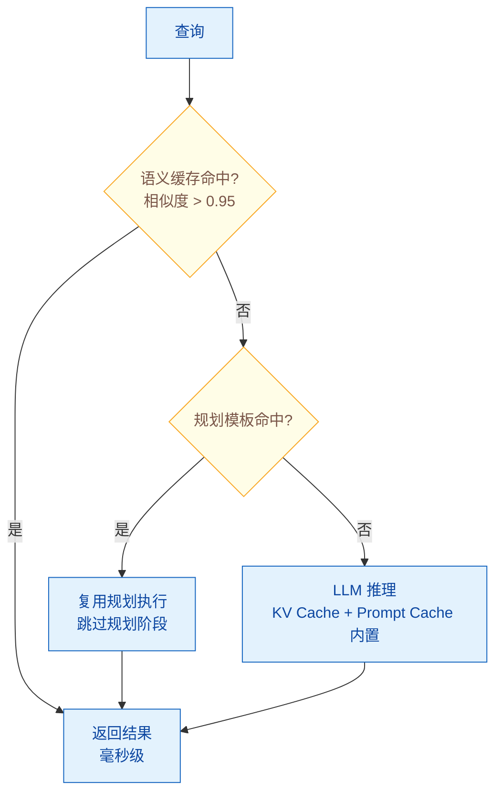

# Agent 系统的延迟优化：Streaming、缓存、批处理

> 难度：中级
> 分类：Production & Deployment

## 简短回答

Agent 系统的延迟优化是生产部署的核心挑战——多步 Agent 工作流经常超过 15 秒，而用户在 3 秒后就开始流失（Nielsen Norman Group 研究）。三大核心优化手段：(1) **Streaming（流式输出）**——Token 级别实时推送，将"感知延迟"从等待完整回答的数秒降低到首个 Token 的几百毫秒（TTFT）；(2) **缓存**——多层缓存策略（KV Cache 加速推理、Prompt Cache 复用前缀处理、Semantic Cache 复用相似请求、**Agentic Plan Cache** 复用 Agent 规划模板），可实现 27-73% 的延迟降低；(3) **批处理**——将多个请求合并处理提高 GPU 利用率，Continuous Batching 相比 Static Batching 可提升吞吐量 23 倍。此外还有：**模型路由**（简单任务用快模型）、**并行工具调用**（独立工具同时执行）、**预计算**（提前生成常见回答）。2025 年前沿研究 **Agentic Plan Caching (APC)**（NeurIPS 2025）专门针对 Agent 场景，通过缓存和复用规划模板平均减少 27.28% 延迟和 50.31% 成本。

## 详细解析

### 延迟的构成分析

```
Agent 一次请求的延迟分解（典型 5-15 秒）：

网络延迟          ~50ms   ████
Prompt 处理       ~200ms  ████████
LLM 推理（首 Token）~500ms ████████████████████
LLM 推理（生成）  ~2000ms ████████████████████████████████████████
工具调用          ~1000ms ████████████████████████████
第二轮 LLM 推理   ~2000ms ████████████████████████████████████████
输出处理          ~50ms   ████

总计              ~5800ms

优化目标：
├── 减少"真实延迟"：缓存、模型路由、并行化
└── 减少"感知延迟"：Streaming（用户立即看到输出开始）
```

### Streaming 实现

```python
# Streaming：减少感知延迟的核心技术

from fastapi import FastAPI
from fastapi.responses import StreamingResponse

app = FastAPI()

@app.post("/chat")
async def chat_stream(request: ChatRequest):
    """SSE 流式响应"""

    async def generate():
        # Agent 执行并流式输出
        async for event in agent.stream(request.message):
            if event.type == "thinking":
                # 发送思考过程（可选）
                yield f"data: {json.dumps({'type': 'thinking', 'content': event.text})}\n\n"
            elif event.type == "token":
                # 发送生成的 token
                yield f"data: {json.dumps({'type': 'token', 'content': event.text})}\n\n"
            elif event.type == "tool_call":
                # 发送工具调用状态
                yield f"data: {json.dumps({'type': 'tool', 'name': event.tool_name, 'status': 'calling'})}\n\n"
            elif event.type == "done":
                yield f"data: {json.dumps({'type': 'done'})}\n\n"

    return StreamingResponse(
        generate(),
        media_type="text/event-stream",
    )

# 关键指标：
# TTFT (Time to First Token): 用户看到第一个字的时间
# 目标 TTFT < 500ms
# 整体延迟可能不变，但用户体验显著改善
```

### SSE vs WebSocket：流式传输的选型

实现 Streaming 需要选择传输协议。SSE 和 WebSocket 是两种主流方案：

| 维度 | SSE (Server-Sent Events) | WebSocket |
|------|--------------------------|-----------|
| **通信方向** | 单向（服务器 → 客户端） | 双向（客户端 ↔ 服务器） |
| **协议基础** | HTTP (`text/event-stream`) | TCP 升级协议 |
| **自动重连** | 原生支持 | 需自行实现 |
| **断点续传** | `Last-Event-ID` 原生支持 | 需自定义 |
| **消息格式** | 文本 | 文本 + 二进制 |
| **实现复杂度** | 低 | 中高（连接管理、心跳） |
| **代理/防火墙** | 天然兼容 | 可能被拦截 |

**AI 场景选型决策：**

| 场景 | 推荐方案 | 理由 |
|------|----------|------|
| ChatGPT 式聊天 | SSE | 单向输出，简单可靠 |
| 代码生成 | SSE | 逐 token 流式，无需双向 |
| 语音对话 | WebSocket | 双向音频 + 控制信令 |
| 实时代码协作 | WebSocket | 双向同步编辑 |
| Agent 工具执行进度 | WebSocket | 实时双向反馈 |

**为什么 LLM 应用偏爱 SSE？** LLM 生成文本本质是"逐 token 单向输出"——SSE 的单向特性恰好匹配。基于标准 HTTP，无需协议升级，天然穿透防火墙和代理，原生支持断线重连。

**常见踩坑：**
- SSE 被 NGINX 缓冲 → 添加 `X-Accel-Buffering: no`
- 原生 `EventSource` 只支持 GET → 使用 `@microsoft/fetch-event-source`
- Token 逐个渲染导致页面卡顿 → 批量渲染（每 30-60ms 更新一次）

**与 MCP 的关系：** MCP 的传输层使用 **Streamable HTTP**（HTTP POST + 可选 SSE 流式响应），而非 WebSocket。原因：MCP 通信以请求-响应为主，不需要全双工；HTTP+SSE 更简单、更容易穿透企业防火墙。

### 多层缓存策略


*缓存查询逐层兜底：语义缓存毫秒级、规划缓存跳过规划，都 miss 才落到 KV/Prompt 缓存加持的 LLM。*

```python
class MultiLayerCache:
    """Agent 系统的多层缓存架构"""

    # Layer 1: KV Cache（推理层，框架内置）
    kv_cache = {
        "原理": "缓存 attention 的 Key-Value 矩阵，避免重复计算",
        "效果": "长文本生成时速度提升 2-5x",
        "实现": "vLLM/TGI 自动管理",
        "注意": "占用 GPU 显存，需要合理的驱逐策略",
    }

    # Layer 2: Prompt Cache（提供商层）
    prompt_cache = {
        "原理": "缓存静态 Prompt 前缀的处理结果",
        "效果": "延迟最高可降低约 85%（具体取决于缓存命中率和 prompt 复用程度），成本降低 90%（Anthropic）",
        "要求": "静态内容放在 Prompt 开头",
        "适用": "System Prompt + 知识库 + Few-shot 示例",
    }

    # Layer 3: Semantic Cache（应用层）
    semantic_cache = {
        "原理": "对语义相似的查询返回缓存结果",
        "效果": "命中时毫秒级返回（vs 秒级 LLM 调用）",
        "实现": "Redis + 向量相似度搜索",
        "适用": "FAQ、重复性查询、热门问题",
        "风险": "相似度阈值设太低会返回不准确的缓存",
    }

    # Layer 4: Agentic Plan Cache（Agent 专用，NeurIPS 2025）
    plan_cache = {
        "原理": "缓存 Agent 的规划模板，新任务复用",
        "效果": "延迟降低 27.28%，成本降低 50.31%",
        "流程": [
            "1. Agent 完成任务后，提取规划模板",
            "2. 将模板存储（带任务类型标签）",
            "3. 新任务来时，检索相似的规划模板",
            "4. 适配模板到新任务的具体参数",
        ],
        "创新": "传统缓存不适合 Agent（输出依赖环境），APC 缓存结构化规划而非具体输出",
    }

    async def query_with_cache(self, query):
        """多层缓存查询流程"""

        # L3: 语义缓存（最快）
        cached = await self.semantic_cache.search(query)
        if cached and cached.similarity > 0.95:
            return {"source": "semantic_cache", "latency_ms": 5, "result": cached.response}

        # L4: 规划缓存（Agent 场景）
        plan = await self.plan_cache.search(query)
        if plan:
            # 复用规划模板，跳过规划阶段
            result = await self.agent.execute_with_plan(query, plan)
            return {"source": "plan_cache", "latency_ms": result.latency, "result": result}

        # L2: Prompt 缓存（自动，由提供商处理）
        # L1: KV 缓存（自动，由推理引擎处理）
        result = await self.agent.execute(query)
        return {"source": "llm", "latency_ms": result.latency, "result": result}
```

### 批处理优化

```python
# 批处理：提升吞吐量的核心技术

batching_strategies = {
    "Static Batching": {
        "原理": "收集固定数量的请求后一起处理",
        "优势": "实现简单",
        "劣势": "等待时间长，短请求被长请求拖慢",
    },
    "Continuous Batching": {
        "原理": "动态添加/移除请求，不等待批次填满",
        "优势": "吞吐量最高可提升约 23 倍（来源于 vLLM 早期论文，实际提升取决于负载模式），延迟更低",
        "实现": "vLLM, TGI, Triton Inference Server",
        "原理详解": (
            "完成的请求立即释放资源，"
            "新请求立即注入计算流，"
            "不需要等待整个批次完成"
        ),
    },
    "Batch API": {
        "原理": "非实时任务提交批量请求",
        "优势": "OpenAI Batch API 50% 折扣",
        "适用": "评估、数据处理、报告生成",
        "延迟": "24 小时内完成（非实时）",
    },
}

# 适用场景：
# - 实时交互 → Continuous Batching（vLLM）
# - 离线任务 → Batch API
# - 评估管道 → Batch API + 并行化
```

### 并行化优化

```python
class ParallelOptimizer:
    """Agent 执行的并行化优化"""

    async def parallel_tool_calls(self, tools_to_call):
        """独立工具调用并行执行"""
        # 识别无依赖的工具调用
        independent = self.find_independent(tools_to_call)
        dependent = self.find_dependent(tools_to_call)

        # 并行执行独立的工具调用
        results = await asyncio.gather(*[
            self.call_tool(tool) for tool in independent
        ])

        # 顺序执行有依赖的工具调用
        for tool in dependent:
            result = await self.call_tool(tool)
            results.append(result)

        return results
        # 效果：3 个独立工具调用从 3s 降到 1s

    async def speculative_execution(self, query):
        """推测性执行——预先执行可能的下一步"""
        # 在 Agent 思考时，预先执行最可能的工具调用
        thinking_task = asyncio.create_task(self.agent.think(query))
        likely_tools = self.predict_likely_tools(query)
        prefetch_tasks = [
            asyncio.create_task(self.prefetch_tool(t))
            for t in likely_tools
        ]

        plan = await thinking_task
        # 如果预测正确，工具结果已经准备好
```

## 常见误区 / 面试追问

1. **误区："Streaming 能减少总延迟"** — Streaming 不减少总延迟（总 Token 生成时间不变），它减少的是"感知延迟"——用户几百毫秒就看到第一个字开始输出，心理等待感大大降低。真正减少总延迟需要缓存、模型路由和并行化。

2. **误区："缓存会导致回答过时"** — 设置合理的 TTL（缓存过期时间）和缓存失效策略即可。FAQ 类缓存可以设 24 小时，实时数据相关的查询不应缓存。语义缓存的相似度阈值也需要调优——太低会返回不相关的缓存结果。

3. **追问："如何衡量延迟优化的效果？"** — 关键指标：(1) **TTFT**（Time to First Token，感知延迟）；(2) **P50/P95/P99 延迟**（不同百分位的总延迟）；(3) **吞吐量**（QPS，每秒处理的请求数）；(4) **缓存命中率**（命中率越高，平均延迟越低）。

4. **追问："Agent 多步执行的延迟如何优化？"** — (1) 规划缓存（APC）跳过规划阶段；(2) 并行工具调用（独立工具同时执行）；(3) 推测性执行（预取可能的工具结果）；(4) 分步 Streaming（每步结果实时推送）；(5) 早停（发现足够信息就提前结束）。

5. **场景追问："你的 Agent 系统 P99 延迟从 2 秒突然飙升到 12 秒，用户抱怨明显。如何快速定位根因？"** — 这是生产环境的性能紧急故障。定位路径：(1) 检查 Trace 数据 → 找出延迟增加发生在哪个环节（LLM 调用、工具执行、网络传输）；(2) 检查模型提供商状态 → 是否有服务降级或限流；(3) 检查缓存命中率下降 → 缓存失效可能导致大量请求走 LLM；(4) 检查工具服务延迟 → 外部 API 响应变慢会拖累整个流程；(5) 快速止损：(a) 启用模型降级到更快模型；(b) 增加 KV Cache 容量；(c) 临时降低并发限制。

6. **场景追问："你的 Agent 工作流中有一个工具每次调用需要 3 秒，导致整体延迟无法优化。如何解决？"** — 这是长尾延迟问题。解决路径：(1) 分析该工具是否可以优化或换用更快的替代方案；(2) 实施工具结果缓存 → 如果相同参数的频繁调用；(3) 并行化 → 如果工作流中有其他独立工具，让它们并行执行；(4) 异步化 → 让工具在后台执行，先返回部分结果；(5) 预计算 → 如果可以预测用户可能需要的数据，提前加载到缓存。

7. **场景追问："你的 Agent 在处理长上下文时延迟显著增加，从 2 秒增长到 8 秒以上。如何优化长上下文场景的延迟？"** — 这是长上下文性能问题。优化路径：(1) 检查是否真的需要完整上下文 → 用 RAG 检索替代全文；(2) 优化 Prompt 结构 → 静态内容使用 Prompt Cache；(3) 使用支持长上下文的模型和框架 → 某些模型对长上下文优化更好；(4) 分块处理 → 将长任务拆分为多个短任务；(5) 考虑模型降级 → 对于长上下文，可能更经济的方案是使用专门的长上下文模型。

8. **追问："SSE 和 WebSocket 在 AI 应用中如何选型？"** — 核心看通信方向：LLM 流式输出是单向的（服务器→客户端），用 SSE 就够了，且更简单、原生支持重连。需要双向通信（语音对话、协作编辑）或二进制传输（音频/视频流）时才用 WebSocket。ChatGPT、Claude 等都使用 SSE。

9. **追问："MCP 为什么用 SSE 而不用 WebSocket？"** — MCP 通信模型是 JSON-RPC 请求-响应式，不需要全双工。HTTP+SSE 更简单、更容易部署、更容易穿透企业防火墙。但社区已有讨论考虑增加 WebSocket 传输支持。

## 参考资料

- [Agentic Plan Caching: Test-Time Memory for Fast and Cost-Efficient LLM Agents (NeurIPS 2025)](https://arxiv.org/abs/2506.14852)
- [Optimize LLM Response Costs and Latency with Effective Caching (AWS)](https://aws.amazon.com/blogs/database/optimize-llm-response-costs-and-latency-with-effective-caching/)
- [LLM Token Optimization: Cut Costs & Latency in 2026 (Redis)](https://redis.io/blog/llm-token-optimization-speed-up-apps/)
- [Reducing Latency and Cost at Scale: How Leading Enterprises Optimize LLM Performance (Tribe AI)](https://www.tribe.ai/applied-ai/reducing-latency-and-cost-at-scale-llm-performance)
- [5 Ways to Optimize Costs and Latency in LLM-Powered Applications (Maxim AI)](https://www.getmaxim.ai/articles/5-ways-to-optimize-costs-and-latency-in-llm-powered-applications/)
