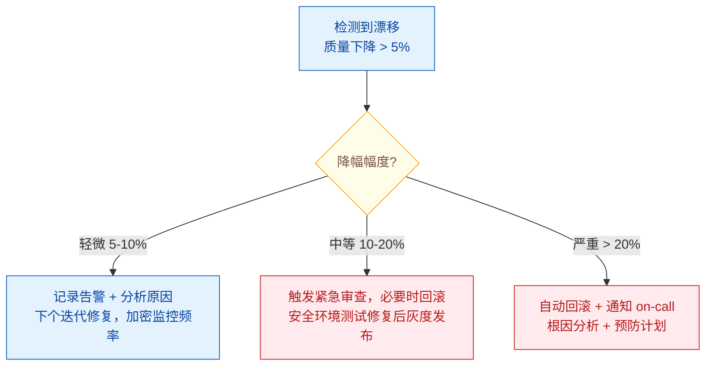

# Prompt Drift 管理：如何避免 Prompt 退化？

> 难度：中级
> 分类：Production & Deployment

## 简短回答

Prompt Drift 是 LLM 应用中**即使 Prompt 没有修改，输出行为也会随时间逐渐变化**的现象——API 返回 200 状态码，响应看似正常，但质量在悄悄退化。三大根因：(1) **模型版本更新**——提供商静默更新模型权重或安全过滤器（GPT-4 曾在 4 个月内准确率显著波动（2023 年 Chen et al. 研究发现））；(2) **输入分布偏移**——用户群变化导致 Prompt 遇到了设计时未覆盖的输入类型；(3) **级联漂移**——在 Agent 系统中，一个环节的微小变化通过多步链路放大。未监控的模型在数月后错误率可显著上升（行业经验数据）。检测方法：持续对生产流量抽样评估 + 对比基线指标 + 漂移告警。管理策略：(1) **Prompt 版本控制**——Git 管理所有 Prompt，变更需要通过 CI 评估；(2) **持续监控**——每周抽样 100 条生产请求与基线对比，退化 > 5% 则告警；(3) **Prompt 管理平台**——使用 Humanloop/LangSmith/Agenta 等工具管理 Prompt 生命周期；(4) **自动优化**——进化算法自动寻找更抗漂移的 Prompt 变体。

## 详细解析

### Prompt Drift 的根因

```
为什么 Prompt 会"退化"？

1. 模型版本漂移（Provider-side）
   ├── 提供商静默更新模型权重
   ├── 安全过滤器调整导致输出风格变化
   ├── 解码参数微调改变生成倾向
   └── 案例：GPT-4 + GPT-3.5 在 4 个月内准确率显著波动（2023 年 Chen et al. 研究）

2. 输入分布偏移（User-side）
   ├── 新用户群体带来新的查询模式
   ├── 季节性变化改变热门问题类型
   ├── 边缘情况从罕见变常见
   └── Prompt 没变，但面对的输入已经不同了

3. 级联漂移（Agent-specific）
   ├── 单轮对话中漂移只是 UX 问题
   ├── Agent 系统中漂移是系统工程问题
   ├── 一个环节的微小变化通过多步链路放大
   └── RAG 索引更新也会导致上下文变化
```

### 检测 Prompt Drift

```python
class DriftDetector:
    """Prompt Drift 检测系统"""

    def __init__(self, baseline_scores):
        self.baseline = baseline_scores
        self.alert_threshold = 0.05  # 退化超过 5% 告警

    async def weekly_drift_check(self):
        """每周漂移检查"""
        # 1. 从生产流量中随机抽样
        samples = await self.sample_production(n=100)

        # 2. 对每个样本运行评估
        current_scores = {}
        for metric in ["quality", "relevance", "safety"]:
            scores = await self.evaluate_batch(samples, metric)
            current_scores[metric] = np.mean(scores)

        # 3. 与基线对比
        drifts = {}
        for metric, current in current_scores.items():
            baseline = self.baseline[metric]
            drift = (current - baseline) / baseline
            drifts[metric] = drift

            if drift < -self.alert_threshold:
                await self.alert(
                    level="warning",
                    message=f"{metric} 下降 {abs(drift)*100:.1f}%",
                )

        return drifts

    def monitor_model_version(self):
        """监控模型版本变化"""
        # 记录每次请求的模型版本标识
        # 版本变化时自动触发评估
        current_version = self.get_model_version()
        if current_version != self.last_known_version:
            self.trigger_full_eval()
            self.alert("模型版本已更新，触发全量评估")
```

### 管理策略

```python
class PromptDriftManager:
    """Prompt Drift 管理策略"""

    # 策略 1：版本控制（基础）
    version_control = {
        "工具": "Git 管理所有 Prompt 文件",
        "流程": [
            "Prompt 修改提交 PR",
            "CI 自动运行评估（对比基线）",
            "评估通过后合并",
            "部署到生产（灰度发布）",
        ],
        "规范": "每个 Prompt 文件包含：版本号、修改原因、评估结果",
    }

    # 策略 2：持续监控（核心）
    continuous_monitoring = {
        "方法": "定期对生产流量抽样评估",
        "频率": "每周至少一次，关键系统每日",
        "流程": [
            "1. 随机抽样 100 条生产请求",
            "2. 用 LLM Judge 评分（质量、相关性、安全性）",
            "3. 与基线对比",
            "4. 退化 > 5% 触发告警",
            "5. 退化 > 10% 触发紧急审查",
        ],
        "工具": "Langfuse + DeepEval + Prometheus 告警",
    }

    # 策略 3：Prompt 管理平台
    management_platforms = {
        "Humanloop": "Prompt 版本管理 + 评估 + 部署",
        "LangSmith": "Trace + 评估 + Playground",
        "Agenta": "Prompt 实验 + A/B 测试",
        "PromptLayer": "Prompt 注册表 + 分析",
    }

    # 策略 4：模型版本锁定
    version_pinning = {
        "方法": "锁定特定模型版本（如 gpt-4-0613）",
        "优势": "避免提供商更新导致的意外行为变化",
        "劣势": "错过改进，旧版本可能被弃用",
        "建议": "锁定版本 + 定期在新版本上跑评估 + 主动迁移",
    }
```

### 预防性 Prompt 工程

```python
# 编写更抗漂移的 Prompt 技巧

drift_resistant_prompts = {
    "明确的输出规范": {
        "说明": "越明确的指令越不容易漂移",
        "差": "请回答用户的问题",
        "好": "用 JSON 格式回答，包含 answer(str), confidence(0-1), sources(list)",
    },
    "Few-shot 锚定": {
        "说明": "提供示例锚定输出风格和格式",
        "方法": "3-5 个高质量示例覆盖主要场景",
        "效果": "减少模型更新导致的输出风格漂移",
    },
    "约束性指令": {
        "说明": "明确告诉模型不要做什么",
        "示例": "不要编造信息。如果不确定，说'我不确定'",
        "效果": "减少幻觉率的漂移",
    },
    "结构化分离": {
        "说明": "将指令、上下文和查询用明确标记分离",
        "方法": "XML 标签或分隔符",
        "效果": "减少指令和数据混淆的风险",
    },
}
```

### 漂移响应流程


*漂移按幅度分级响应：5% 记录观察、10% 紧急审查、20% 自动回滚拉 on-call。*

## 常见误区 / 面试追问

1. **误区："Prompt 没改过就不会退化"** — 这是最大的误区。模型提供商的静默更新、输入分布偏移都会导致退化。GPT-4 在 2023 年 6-10 月间的行为变化影响了大量生产应用（Chen et al., 2023）。必须假设漂移一定会发生，主动监控。

2. **误区："锁定模型版本就安全了"** — 锁定版本能防止提供商更新带来的漂移，但不能防止输入分布偏移。而且旧版本最终会被弃用。正确做法是版本锁定 + 持续监控 + 定期主动评估新版本。

3. **追问："如何区分是 Prompt 漂移还是用户行为变化？"** — 关键方法：在固定的 Golden Dataset 上定期评估（这排除了输入变化的影响）。如果 Golden Dataset 得分稳定但生产指标下降 → 是输入分布偏移；如果 Golden Dataset 得分也下降 → 是模型漂移。

4. **追问："Agent 系统中如何定位漂移源？"** — 多步 Agent 系统需要在每个节点独立监控：规划质量、工具选择准确率、工具输出解读准确率、最终回答质量。通过 Trace 定位哪个环节的指标先开始退化，就能找到漂移源。

## 参考资料

- [Prompt Drift: What It Is and How to Detect It (Agenta)](https://agenta.ai/blog/prompt-drift)
- [Managing Prompt Drift in Agentic Systems (Comet)](https://www.comet.com/site/blog/prompt-drift/)
- [LLM Drift, Prompt Drift & Cascading (Kore.ai)](https://www.kore.ai/blog/llm-drift-prompt-drift-cascading)
- [Understanding Model Drift and Data Drift in LLMs (Orq.ai)](https://orq.ai/blog/model-vs-data-drift)
- [Top 5 AI Prompt Management Tools of 2025 (Arize AI)](https://arize.com/blog/top-5-ai-prompt-management-tools-of-2025/)
