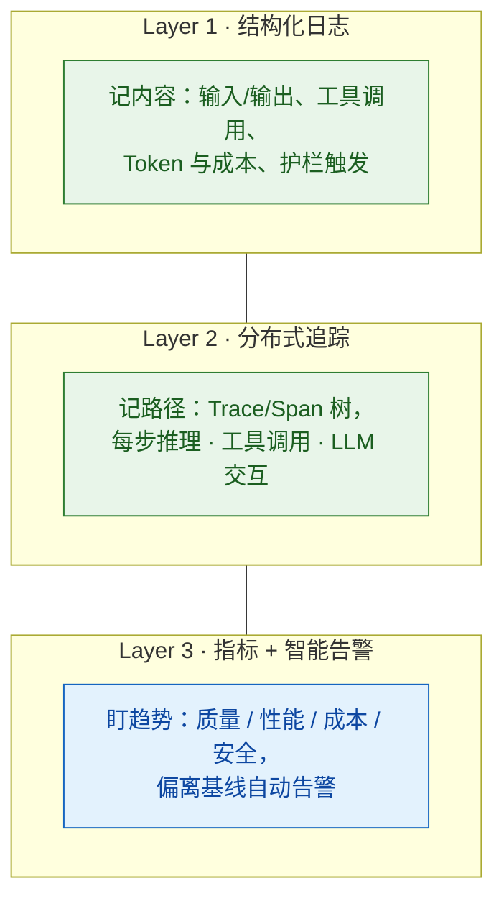

# Agent 系统的日志、监控与告警设计

> 难度：中级
> 分类：Production & Deployment

## 简短回答

Agent 系统的可观测性需要**全新的监控栈**——传统软件的日志+指标+告警不够用，因为 LLM 输出非确定性、故障模式是"质量退化"而非"服务崩溃"、成本与用量直接关联。2025 年的最佳实践是三层可观测性：(1) **结构化日志**——记录每个 Prompt、Completion、工具调用和错误，附带元数据（模型、Token 数、用户 ID、时间戳）；(2) **分布式追踪**——用 Trace/Span 捕获完整的 Agent 执行路径（每步推理、工具调用、LLM 交互），支持单请求全链路排查；(3) **多维度指标+智能告警**——监控质量（LLM Judge 评分）、性能（TTFT/P95 延迟）、成本（每请求/每用户成本）、安全（护栏触发率），在指标偏离基线时自动告警。关键原则："存储很便宜，事故中缺少数据很贵"——宁可多记少用。主流平台：Langfuse（开源）、LangSmith（LangChain 生态）、Datadog（企业级）、Braintrust（评估+监控）。告警规则示例：预算使用 80% → 警告；P95 延迟 > 5s → 警告；质量评分连续下降 3 天 → 紧急。

## 详细解析

### 为什么传统监控不够

| 传统 Web 服务监控 | Agent 系统需要的监控 |
| --- | --- |
| HTTP 状态码（200/500） | 输出质量评分（语义层面） |
| 响应时间 | 多步执行的完整轨迹 |
| CPU/内存使用率 | Token 消耗和成本 |
| 错误率 | 幻觉检测 |
| 吞吐量 | 安全护栏触发率 |
| | Prompt 漂移检测 |
| | 工具调用成功率 |
| | 模型版本变化追踪 |

核心区别：Agent 的“失败”通常不是崩溃，而是质量退化——API 返回 200，输出看似合理，但实际不准确或不安全。这种“静默失败”只有通过语义级别的监控才能发现。

### 三层可观测性架构


*三层可观测性：日志记内容、Trace 记路径、指标+告警盯趋势——Agent 的静默失败只有语义层抓得到。*

```python
# Layer 1: 结构化日志
class AgentLogger:
    """Agent 专用的结构化日志"""

    def log_request(self, request_id, data):
        """记录完整的请求-响应对"""
        log_entry = {
            "request_id": request_id,
            "timestamp": datetime.utcnow().isoformat(),
            "user_id": data["user_id"],

            # 输入
            "input": data["user_message"],
            "system_prompt_version": data["prompt_version"],

            # 模型信息
            "model": data["model"],
            "model_version": data["model_version"],
            "temperature": data["temperature"],

            # 输出
            "output": data["response"],
            "tool_calls": data.get("tool_calls", []),

            # 资源消耗
            "input_tokens": data["usage"]["input_tokens"],
            "output_tokens": data["usage"]["output_tokens"],
            "cost_usd": data["cost"],
            "latency_ms": data["latency_ms"],
            "ttft_ms": data.get("ttft_ms"),

            # 安全
            "guardrail_triggered": data.get("guardrail_triggered", False),
            "guardrail_details": data.get("guardrail_details"),
        }
        self.store.write(log_entry)


# Layer 2: 分布式追踪
class AgentTracer:
    """Agent 执行的分布式追踪"""

    def trace_agent_execution(self, task):
        """追踪 Agent 的完整执行路径"""
        with self.tracer.start_trace("agent_execution") as trace:
            trace.set_attribute("task", task)

            # Span 1: 规划
            with trace.span("planning") as span:
                span.set_attribute("model", "gpt-4o")
                plan = self.agent.plan(task)
                span.set_attribute("steps_count", len(plan.steps))

            # Span 2-N: 每步执行
            for i, step in enumerate(plan.steps):
                with trace.span(f"step_{i}") as span:
                    span.set_attribute("step_name", step.name)

                    if step.tool_call:
                        # 工具调用子 Span
                        with trace.span("tool_call") as tool_span:
                            tool_span.set_attribute("tool", step.tool_name)
                            result = self.execute_tool(step)
                            tool_span.set_attribute("success", result.success)

            # 记录总体指标
            trace.set_attribute("total_cost", trace.total_cost)
            trace.set_attribute("total_steps", len(plan.steps))


# Layer 3: 指标和告警
class AgentMetrics:
    """Agent 系统的核心监控指标"""

    metrics = {
        "质量指标": {
            "quality_score": "LLM Judge 自动评分（0-5）",
            "hallucination_rate": "幻觉检测率",
            "task_success_rate": "任务完成率",
            "user_satisfaction": "用户反馈（👍/👎）",
        },
        "性能指标": {
            "ttft_ms": "首 Token 时间（感知延迟）",
            "latency_p50": "P50 延迟",
            "latency_p95": "P95 延迟",
            "latency_p99": "P99 延迟",
            "throughput_qps": "每秒请求数",
        },
        "成本指标": {
            "cost_per_request": "每请求平均成本",
            "cost_per_user_day": "每用户日均成本",
            "total_daily_cost": "每日总成本",
            "token_usage": "Token 消耗趋势",
        },
        "安全指标": {
            "guardrail_trigger_rate": "护栏触发率",
            "injection_detection_rate": "注入检测率",
            "pii_leak_rate": "PII 泄露率",
            "blocked_request_rate": "被拦截的请求比例",
        },
    }
```

### 告警规则设计

```python
alert_rules = {
    # 成本告警
    "budget_warning": {
        "condition": "daily_cost > budget * 0.8",
        "severity": "warning",
        "action": "通知 Slack + 考虑启用模型降级",
    },
    "budget_critical": {
        "condition": "daily_cost > budget",
        "severity": "critical",
        "action": "PagerDuty + 自动切换到低成本模型",
    },

    # 质量告警
    "quality_degradation": {
        "condition": "quality_score 连续 3 天低于基线 5%",
        "severity": "warning",
        "action": "触发漂移检查 + 通知团队",
    },
    "quality_critical": {
        "condition": "quality_score 低于基线 15%",
        "severity": "critical",
        "action": "自动回滚到上个稳定版本",
    },

    # 性能告警
    "latency_high": {
        "condition": "p95_latency > 5000ms",
        "severity": "warning",
        "action": "检查模型提供商状态 + 考虑缓存优化",
    },

    # 安全告警
    "injection_spike": {
        "condition": "injection_detection_rate > 正常值 3x",
        "severity": "critical",
        "action": "通知安全团队 + 增强护栏",
    },

    # 可用性告警
    "error_rate_high": {
        "condition": "error_rate > 5% 持续 5 分钟",
        "severity": "critical",
        "action": "触发故障转移到备用模型",
    },
}
```

### 监控平台选择

| 平台 | 类型 | 适用场景 |
| --- | --- | --- |
| Langfuse | 开源 | 预算有限 + 需要自部署 |
| LangSmith | 商业 | LangChain/LangGraph 生态 |
| Datadog LLM | 企业级 | 已有 Datadog + 需要统一监控 |
| Braintrust | 商业 | 评估+监控一体化 |
| Maxim AI | 商业 | Agent 评估+可观测全栈 |
| Opik (Comet) | 开源/商业 | 多 Agent 工作流监控 |
| LangWatch | 商业 | 实时评估+监控+告警 |

选择建议：
- 小团队/起步 → Langfuse（免费开源）
- LangChain 技术栈 → LangSmith
- 企业级/已有 Datadog → Datadog LLM Observability
- 专注评估质量 → Braintrust

## 常见误区 / 面试追问

1. **误区："记录所有请求太贵了"** — 日志存储远比你想象的便宜。S3 存储成本约 $0.023/GB/月，一天 10 万请求的完整日志约 1-5GB。而一次线上事故排查时缺少日志的代价远高于此。原则：宁可多记少用。

2. **误区："有了 Trace 就不需要日志了"** — Trace 和日志互补。Trace 展示请求的执行路径和时间分布，日志记录详细的输入输出内容。排查"为什么这个请求输出了错误答案"需要日志；排查"为什么这个请求很慢"需要 Trace。

3. **追问："如何平衡监控粒度和性能开销？"** — (1) 日志：全量记录元数据（Token 数、延迟），抽样记录完整内容（10-20% 的请求记录完整 Prompt/Response）；(2) 评估：抽样评估（5-10% 的请求做 LLM Judge 评分）；(3) Trace：全量记录 Span 结构，按需记录详细属性。

4. **追问："告警太多导致疲劳怎么办？"** — (1) 分级：只有 critical 发 PagerDuty，warning 发 Slack；(2) 聚合：相同告警在 1 小时内合并；(3) 自动恢复：短暂的指标波动自动取消告警；(4) 定期回顾：每月审查告警规则，删除无效告警。

5. **场景追问："你的监控系统突然告警'成本异常激增'，每日预算在下午 4 点就被用完，正常情况是晚上 10 点。如何快速定位并止损？"** — 这是成本失控的紧急情况。快速响应路径：(1) 立即检查 Token 消耗详情 → 找出消耗激增的接口或功能模块；(2) 对比异常请求和正常请求的差异 → 可能是某个查询触发了无限循环或过度检索；(3) 检查是否有模型降级失效 → 主模型故障时降级到更昂贵的模型；(4) 立即实施熔断 → 对问题接口限流或直接下线；(5) 长期优化：(a) 增加单请求 Token 上限；(b) 实施预算熔断机制，达到阈值自动降级或拒绝请求；(c) 加入成本预测，提前预警预算耗尽风险。

6. **场景追问："你的监控显示 Agent 的质量评分在每天下午 2 点到 4 点出现规律性下降，其他时间段正常。如何分析根因？"** — 这是有规律的性能退化问题。分析路径：(1) 时间维度分析 → 2-4 点是否对应特定业务场景（如用户群变化或特定类型查询集中）；(2) 资源维度分析 → 该时间段是否有系统资源竞争（如批处理任务运行）；(3) 模型维度分析 → 是否有模型轮换或限流策略在此时段生效；(4) 检查相关 Trace → 对比降分请求和正常请求的执行路径差异；(5) 长期解决：(a) 针对高负载时段优化算法；(b) 实施智能扩容，在高峰前自动增加资源；(c) 调整模型路由策略，不同时段使用不同配置。

7. **场景追问："你的监控平台突然无响应，所有 Trace 和日志都无法查询，但 Agent 系统本身运行正常。如何恢复并防止再次发生？"** — 这是监控系统自身的故障。恢复路径：(1) 检查监控平台的存储是否满 → 日志/Trace 数据可能爆满；(2) 检查监控系统依赖的外部服务（如向量库、消息队列）是否正常；(3) 临时降级监控 → 暂停非关键的日志收集，只保留核心指标；(4) 重启监控服务组件；(5) 长期预防：(a) 监控系统自身也需要监控（元监控）；(b) 实施数据保留策略，自动清理过期数据；(c) 监控系统多副本部署，避免单点故障；(d) 定期演练监控系统故障的恢复流程。

## 参考资料

- [Top 10 LLM Observability Tools: Complete Guide for 2025 (Braintrust)](https://www.braintrust.dev/articles/top-10-llm-observability-tools-2025)
- [LLM Observability: Best Practices for 2025 (Maxim AI)](https://www.getmaxim.ai/articles/llm-observability-best-practices-for-2025/)
- [7 Best AI Observability Platforms for LLMs in 2025 (Braintrust)](https://www.braintrust.dev/articles/best-ai-observability-platforms-2025)
- [Top 8 LLM Observability Tools: Complete Guide for 2025 (LangWatch)](https://langwatch.ai/blog/top-10-llm-observability-tools-complete-guide-for-2025)
- [5 Best Tools for Monitoring LLM Applications in 2026 (Braintrust)](https://www.braintrust.dev/articles/best-llm-monitoring-tools-2026)
