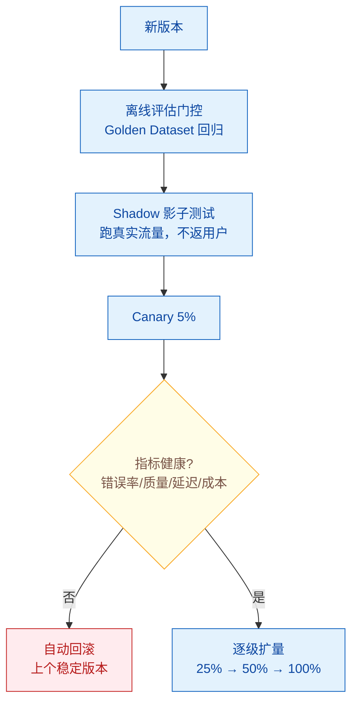

# 如何实现 Agent 的灰度发布和 A/B 测试？

> 难度：中级
> 分类：Production & Deployment

## 简短回答

Agent 系统的灰度发布和 A/B 测试是安全上线变更的核心工程实践。**灰度发布（Canary Deployment）**——将新版本暴露给小比例流量（5%→25%→100%），持续监控质量指标，异常时自动回滚，确保技术稳定性。**A/B 测试**——同时运行两个版本，对比业务指标（任务成功率、用户满意度、成本），做出数据驱动的决策。Agent 系统的特殊挑战：输出非确定性（同一输入不同输出），质量评估需要 LLM-as-Judge 而非简单指标，多步执行使得变量控制更复杂。实施流程：(1) 离线评估通过质量门控 → (2) Shadow Testing（对生产流量运行新版本但不返回给用户）→ (3) Canary 发布（5-10% 流量）→ (4) 逐步扩量，每步都有自动回滚触发器。关键指标：任务成功率、首次解决率、延迟 P95、每会话成本、幻觉检测率、升级率。工具链：Feature Flags（LaunchDarkly）+ AI Gateway（Portkey/LiteLLM）+ 监控（Langfuse）+ Progressive Delivery（Argo Rollouts/Flagger）。

## 详细解析

### 灰度发布 vs A/B 测试

| 维度 | 灰度发布（Canary） | A/B 测试 |
| --- | --- | --- |
| 目的 | 验证技术稳定性 | 比较业务效果 |
| 关注 | 有没有 bug/退化 | 哪个版本更好 |
| 流程 | 小流量→逐步扩量→全量 | 同时运行两个版本 |
| 决策 | 通过/回滚 | 选择胜出版本 |
| 时间 | 小时到天 | 天到周 |
| 指标 | 错误率、延迟、质量下限 | 业务指标、用户偏好 |

### Agent 灰度发布流程


*灰度四道闸：离线评估→Shadow→Canary 5%→逐级扩量，任一指标不健康即自动回滚。*

```python
class AgentCanaryDeployment:
    """Agent 系统的灰度发布"""

    async def deploy_canary(self, new_version):
        """渐进式发布流程"""

        # Phase 1: 离线评估（质量门控）
        eval_result = await self.run_offline_eval(
            version=new_version,
            dataset="golden_dataset_v3",
            metrics=["quality", "safety", "latency"],
        )
        if eval_result.quality < self.baseline.quality * 0.95:
            return {"status": "blocked", "reason": "离线评估未通过"}

        # Phase 2: Shadow Testing（不影响用户）
        shadow_result = await self.shadow_test(
            new_version=new_version,
            duration_hours=4,
            # 对真实流量运行新版本，但不返回给用户
        )
        if shadow_result.has_critical_issues:
            return {"status": "blocked", "reason": "Shadow 测试发现问题"}

        # Phase 3: Canary 发布（5% 流量）
        await self.set_traffic_split(canary=0.05, stable=0.95)
        canary_metrics = await self.monitor(duration_hours=2)
        if not self.check_health(canary_metrics):
            await self.rollback()
            return {"status": "rolled_back", "reason": "Canary 指标异常"}

        # Phase 4: 逐步扩量
        for pct in [0.25, 0.50, 1.00]:
            await self.set_traffic_split(canary=pct, stable=1-pct)
            metrics = await self.monitor(duration_hours=1)
            if not self.check_health(metrics):
                await self.rollback()
                return {"status": "rolled_back", "stage": f"{pct*100}%"}

        return {"status": "deployed", "version": new_version}

    def check_health(self, metrics):
        """健康检查——任一指标不通过则失败"""
        return (
            metrics.error_rate < 0.05 and          # 错误率 < 5%
            metrics.quality_score > self.baseline.quality * 0.95 and
            metrics.p95_latency < self.baseline.p95 * 1.2 and
            metrics.cost_per_request < self.baseline.cost * 1.3 and
            metrics.safety_score > 0.95
        )
```

### A/B 测试框架

```python
class AgentABTest:
    """Agent 系统的 A/B 测试"""

    def __init__(self):
        self.experiments = {}

    def create_experiment(self, name, variants, traffic_split):
        """创建 A/B 实验"""
        self.experiments[name] = {
            "variants": variants,   # {"control": v1, "treatment": v2}
            "split": traffic_split, # {"control": 0.5, "treatment": 0.5}
            "metrics": [
                "task_success_rate",    # 任务完成率
                "first_contact_resolution",  # 首次解决率
                "user_satisfaction",    # 用户满意度
                "cost_per_session",     # 每会话成本
                "hallucination_rate",   # 幻觉率
                "escalation_rate",      # 升级率
            ],
            "min_sample_size": 500,  # 最小样本量
            "confidence_level": 0.95,
        }

    async def route_request(self, user_id, request):
        """根据用户 ID 路由到实验组"""
        # 确定性路由：同一用户始终在同一组
        variant = self.assign_variant(user_id)
        agent_version = self.experiments["current"]["variants"][variant]

        response = await agent_version.invoke(request)

        # 记录指标
        self.record_metric(user_id, variant, response)
        return response

    def analyze_results(self, experiment_name):
        """统计分析实验结果"""
        exp = self.experiments[experiment_name]
        control = self.get_metrics("control")
        treatment = self.get_metrics("treatment")

        results = {}
        for metric in exp["metrics"]:
            # 统计检验
            stat, p_value = mannwhitneyu(
                control[metric], treatment[metric]
            )
            results[metric] = {
                "control_mean": np.mean(control[metric]),
                "treatment_mean": np.mean(treatment[metric]),
                "p_value": p_value,
                "significant": p_value < 0.05,
                "winner": "treatment" if np.mean(treatment[metric]) > np.mean(control[metric]) else "control",
            }
        return results
```

### Agent A/B 测试的特殊考量

```python
agent_ab_challenges = {
    "非确定性输出": {
        "问题": "同一输入可能产生不同输出，增加噪声",
        "解决": "增大样本量（至少 500 次/组）+ 固定 temperature=0",
    },
    "多步执行": {
        "问题": "Agent 每步决策不同，变量控制困难",
        "解决": "记录完整轨迹，按步骤分析差异",
    },
    "质量评估": {
        "问题": "没有简单的对/错指标",
        "解决": "LLM-as-Judge 自动评分 + 用户反馈",
    },
    "长期效应": {
        "问题": "用户行为会随时间适应 Agent 变化",
        "解决": "实验持续至少 1 周，观察趋势而非单点",
    },
    "成本变量": {
        "问题": "不同版本的成本可能差异很大",
        "解决": "将成本作为核心 A/B 指标之一",
    },
}
```

### 自动化渐进式发布

```yaml
# Argo Rollouts + Prometheus 自动化灰度发布示例
apiVersion: argoproj.io/v1alpha1
kind: Rollout
spec:
  strategy:
    canary:
      steps:
        - setWeight: 5           # 5% 流量
        - pause: {duration: 2h}  # 观察 2 小时
        - analysis:              # 自动分析指标
            templates:
              - templateName: agent-quality-check
            args:
              - name: quality-threshold
                value: "3.5"     # 质量分 > 3.5
        - setWeight: 25          # 25% 流量
        - pause: {duration: 1h}
        - analysis:
            templates:
              - templateName: agent-quality-check
        - setWeight: 100         # 全量发布

# 分析模板：自动检查 Prometheus 中的 Agent 质量指标
# 不通过则自动回滚
```

## 常见误区 / 面试追问

1. **误区："A/B 测试只需要看准确率"** — Agent 系统需要多维度评估：任务成功率、用户满意度、成本、延迟、安全性。一个版本可能质量更高但成本翻倍，需要综合权衡。建议定义加权综合得分。

2. **误区："灰度发布就是改个流量比例"** — Agent 灰度发布需要：(1) 确定性路由（同一用户始终在同一组）；(2) 自动健康检查和回滚；(3) 完整的可观测性对比两个版本；(4) Shadow Testing 前置验证。

3. **追问："样本量不够怎么办？"** — (1) 使用贝叶斯方法替代频率学方法，更适合小样本；(2) 用更敏感的指标（如用户反馈评分而非二元成功/失败）；(3) 延长实验时间；(4) 在实验前用离线评估做初步筛选，只有差异明显的版本才进入在线实验。

4. **追问："如何处理 Prompt 变更的 A/B 测试？"** — Prompt 变更和代码变更一样需要走灰度流程。通过 Prompt 管理平台（LangSmith/Humanloop）管理版本，Feature Flag 控制流量分配，CI 中运行回归测试，生产中 A/B 测试对比效果。

## 参考资料

- [5 Strategies for A/B Testing for AI Agent Deployment (Maxim AI)](https://www.getmaxim.ai/articles/5-strategies-for-a-b-testing-for-ai-agent-deployment/)
- [Canary Deployments and A/B Testing: Safer, Smarter Model Rollouts (Medium)](https://medium.com/@sebuzdugan/day-60-100-canary-deployments-and-a-b-testing-safer-smarter-model-rollouts-d9245042baf9)
- [A/B Testing and Canary Deployments for Models (APXML)](https://apxml.com/courses/advanced-ai-infrastructure-design-optimization/chapter-4-high-performance-model-inference/ab-testing-canary-deployments-models)
- [Canary Deployment at a Glance (Wallaroo.AI)](https://wallaroo.ai/canary-deployment-at-a-glance/)
- [What Is Canary Deployment? A Complete 2025 Guide (LoadFocus)](https://loadfocus.com/blog/2025/10/canary-deployment)
