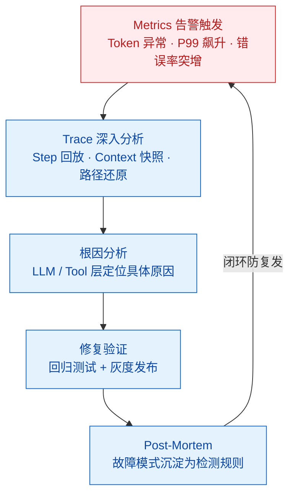

# 场景题：你的 Agent 在生产环境出了故障，如何系统性排查和修复？

> 难度：高级
> 分类：Production & Deployment

## 简短回答

Agent 生产环境故障排查需要建立**系统性的可观测性体系**，核心方法论是"**Trace 驱动排查**"——从 **Trace ID** 出发，逐步还原 Agent 每一步的决策路径、工具调用和上下文状态。排查流程遵循 **OODA 循环**（Observe → Orient → Decide → Act）：先通过 **Metrics 告警**发现异常，再通过 **Distributed Tracing** 定位到具体 step，然后分析 **LLM Input/Output** 和 **Tool Response** 找到根因，最后制定修复方案并验证。关键原则是**不要猜测，要用数据说话**——每个故障都必须有对应的 Trace 证据。常见的 Agent 生产故障包括无限循环、幻觉输出、工具超时、权限越界和模型版本漂移，每类故障都有特定的排查模式和防御性修复策略。修复后必须进行 **Post-Mortem**，将故障模式沉淀为自动化检测规则，防止同类问题复发。

## 详细解析

### Agent 生产故障的特殊性

与传统软件不同，Agent 故障具有**非确定性**——同样的输入可能产生不同的执行路径。这使得排查必须依赖完整的 Trace 记录而非简单的日志回放。


*Trace 驱动排查四步：告警发现→Trace 定位→根因分析→修复验证，Post-Mortem 把故障沉淀回检测规则。*

### 核心排查工具集

```python
import time, json, hashlib, asyncio, random, difflib
from dataclasses import dataclass
from typing import Optional
from collections import Counter


@dataclass
class TraceStep:
    """单个 Agent 执行步骤的 Trace 记录"""
    step_id: int
    action: str           # "llm_call" | "tool_call" | "observation"
    tool_name: Optional[str] = None
    input_text: str = ""
    output_text: str = ""
    token_count: int = 0
    latency_ms: float = 0.0
    timestamp: float = 0.0
    error: Optional[str] = None


class TraceAnalyzer:
    """Agent Trace 分析器 —— 故障排查核心工具"""

    def __init__(self, steps: list[TraceStep]):
        self.steps = steps

    def detect_infinite_loop(self, max_repeats: int = 3) -> dict:
        """检测无限循环 —— 滑动窗口发现重复 tool_call 模式"""
        seq = [s.tool_name for s in self.steps if s.action == "tool_call" and s.tool_name]
        for win in range(1, len(seq) // 2 + 1):
            for i in range(len(seq) - win * max_repeats + 1):
                pattern = seq[i:i + win]
                count = sum(1 for j in range(i, len(seq) - win + 1, win)
                            if seq[j:j + win] == pattern)
                if count >= max_repeats:
                    return {"detected": True, "pattern": pattern,
                            "repeat_count": count, "severity": "critical"}
        return {"detected": False}

    def analyze_context_placement(self) -> dict:
        """分析检索内容在 Context 中的位置 —— 排查 Lost-in-the-Middle"""
        for step in self.steps:
            if step.action == "llm_call" and "[RETRIEVED_CONTEXT]" in step.input_text:
                pos = step.input_text.find("[RETRIEVED_CONTEXT]")
                ratio = pos / len(step.input_text)
                return {"position_ratio": ratio,
                        "risk": "high" if 0.3 < ratio < 0.7 else "low"}
        return {"risk": "unknown"}

    def get_tool_latency_stats(self) -> dict:
        """各工具延迟分布 —— 排查超时问题"""
        buckets: dict[str, list[float]] = {}
        for s in self.steps:
            if s.action == "tool_call" and s.tool_name:
                buckets.setdefault(s.tool_name, []).append(s.latency_ms)
        return {name: {"p50": sorted(lats)[len(lats)//2],
                       "p99": sorted(lats)[int(len(lats)*0.99)],
                       "error_rate": sum(1 for s in self.steps
                                         if s.tool_name == name and s.error) / len(lats)}
                for name, lats in buckets.items()}


class TokenBudgetMonitor:
    """Token 预算监控器 —— 实时追踪和预警"""

    def __init__(self, max_tokens: int = 100_000, max_steps: int = 30):
        self.max_tokens, self.max_steps = max_tokens, max_steps
        self.consumed, self.step_count = 0, 0
        self.history: list[int] = []

    def record(self, step: TraceStep) -> dict:
        self.consumed += step.token_count
        self.step_count += 1
        self.history.append(step.token_count)
        alert = None
        if self.consumed >= self.max_tokens:
            alert = "CRITICAL: Token 预算耗尽"
        elif self.step_count >= self.max_steps:
            alert = "CRITICAL: 步数超限"
        elif len(self.history) >= 3:
            avg = sum(self.history[-3:-1]) / 2
            if avg > 0 and self.history[-1] > avg * 3:
                alert = f"WARNING: Token 突增 (当前{self.history[-1]}, 均值{avg:.0f})"
        return {"step": self.step_count, "used": self.consumed, "alert": alert}

    def should_terminate(self) -> tuple[bool, str]:
        if self.consumed >= self.max_tokens: return True, "Token 预算耗尽"
        if self.step_count >= self.max_steps: return True, "步数超限"
        return False, ""
```

### Scenario 1: Agent 陷入无限循环

**问题描述**：监控告警显示某 Agent 会话 Token 消耗在 5 分钟内暴涨 20 倍，LLM 反复调用 `query_database`，每次调用后又判断"需要重试"。

**排查步骤**：

```
┌─────────────────────────────────────────────────────────────┐
│              无限循环排查路径                                  │
├─────────────────────────────────────────────────────────────┤
│  Step 1: Token 告警触发                                      │
│     ▼                                                       │
│  Step 2: 查看 Trace → step_count = 47（正常 < 10）           │
│     ▼                                                       │
│  Step 3: 分析 tool_call pattern → query_database × 42       │
│     ▼                                                       │
│  Step 4: 检查 tool response                                  │
│     │    → "Error: connection timeout, please retry"         │
│     ▼                                                       │
│  Step 5: 根因 → LLM 将 "please retry" 解读为重试指令         │
└─────────────────────────────────────────────────────────────┘
```

**根因**：工具错误信息含 `"please retry"`，LLM 将其解读为系统指令而非错误报告。缺少循环检测和 max_steps 限制，Agent 陷入无限重试。

**修复方案**：

```python
class LoopDetector:
    """循环检测器 —— 防止 Agent 无限循环"""
    def __init__(self, max_same_calls: int = 3, max_steps: int = 25):
        self.max_same_calls = max_same_calls
        self.max_steps = max_steps
        self.history: list[str] = []

    def check(self, tool_name: str) -> dict:
        self.history.append(tool_name)
        if len(self.history) >= self.max_same_calls:
            if len(set(self.history[-self.max_same_calls:])) == 1:
                return {"action": "interrupt",
                        "reason": f"连续 {self.max_same_calls} 次调用 {tool_name}"}
        if len(self.history) >= self.max_steps:
            return {"action": "terminate", "reason": "步数超限"}
        return {"action": "continue"}

def normalize_tool_error(raw_error: str) -> str:
    """规范化工具错误 —— 消除误导 LLM 的自然语言"""
    return (f"[TOOL_ERROR] 工具执行失败。原始信息: {raw_error}。"
            f"[INSTRUCTION] 不要重试，请告知用户并建议替代方案。")
```

### Scenario 2: RAG 检索正常但回答仍然幻觉

**问题描述**：用户反馈 Agent 回答错误。检查 RAG Pipeline 发现检索到的文档正确（Recall 正常），但最终回答与检索内容完全不符。

**排查步骤**：

```
┌──────────────────────────────────────────────────────────────┐
│            RAG 幻觉排查路径                                    │
├──────────────────────────────────────────────────────────────┤
│  ┌──────────┐     ┌──────────────┐     ┌──────────────────┐ │
│  │ 检索日志  │────→│ LLM Input    │────→│ LLM Output      │ │
│  │ Top-5 Doc │     │ 完整 Prompt  │     │ 最终回答        │ │
│  │ ✓ 正确    │     │              │     │ ✗ 与检索不符    │ │
│  └──────────┘     └──────────────┘     └──────────────────┘ │
│                         ▼                                    │
│               ┌──────────────────┐                           │
│               │ Prompt 结构分析   │                           │
│               │ System      300t │                           │
│               │ History    2000t │                           │
│               │ Docs       1500t │ ← ⚠ 中间位置             │
│               │ Query        50t │                           │
│               │ Instruct    200t │                           │
│               └──────────────────┘                           │
│                         ▼                                    │
│          Lost-in-the-Middle：LLM 注意力不足                   │
└──────────────────────────────────────────────────────────────┘
```

**根因**：检索结果被放在 Prompt 中间位置，受 **Lost-in-the-Middle** 效应影响，LLM 对中间信息关注度下降，更倾向于依赖自身参数知识。

**修复方案**：

```python
class ContextWindowOptimizer:
    """Context Window 优化器 —— 解决 Lost-in-the-Middle"""

    def build_prompt(self, system: str, docs: list[dict],
                     history: list[dict], query: str) -> str:
        # 只保留最近 3 轮对话，减少噪声
        recent = history[-3:] if len(history) > 3 else history
        history_text = "\n".join(f"{m['role']}: {m['content']}" for m in recent)
        # 按相关性排序，只取 Top-3
        sorted_docs = sorted(docs, key=lambda d: d["score"], reverse=True)[:3]
        docs_text = "\n\n".join(
            f"[文档{i+1}] (相关性:{d['score']:.2f})\n{d['content']}"
            for i, d in enumerate(sorted_docs))
        # 关键：检索内容紧跟 System Prompt，利用 Primacy Bias
        return f"""{system}

## 参考资料（必须优先基于以下内容回答，不得编造未提及的信息）
{docs_text}

## 对话历史
{history_text}

## 当前问题
{query}

请严格基于参考资料回答。如无相关信息，明确告知用户。"""
```

### Scenario 3: 工具调用间歇性超时

**问题描述**：14:00-16:00 高峰期工具调用失败率从 1% 飙升到 35%，非高峰完全正常。

**排查步骤**：

| 排查阶段 | 检查项 | 发现 |
|---------|--------|------|
| 1. 时间维度 | 错误率 vs 时间曲线 | 错误集中在 14:00-16:00 |
| 2. 工具维度 | 按工具分类统计 | 仅 `search_api` 受影响 |
| 3. 错误类型 | 分析响应码 | 429 Too Many Requests (78%) |
| 4. 流量分析 | 统计 QPS 峰值 | 高峰 QPS 达限额的 120% |
| 5. 根因确认 | 检查 API 文档 | Rate Limit: 100 req/min |

**根因**：第三方 API 有 100 req/min 限制，高峰期并发超限触发 HTTP 429。

**修复方案**：

```python
class RateLimitAwareToolCaller:
    """限流感知调用器 —— 指数退避 + 缓存 + 限流预检"""

    def __init__(self, rate_limit: int = 90):  # 留 10% 余量
        self.rate_limit = rate_limit
        self.timestamps: list[float] = []
        self.cache: dict[str, dict] = {}

    async def call(self, tool_name: str, args: dict, func, retries: int = 3) -> dict:
        # 1. 缓存命中检查
        key = hashlib.md5(f"{tool_name}:{json.dumps(args, sort_keys=True)}".encode()).hexdigest()
        if key in self.cache and time.time() - self.cache[key]["ts"] < 300:
            return {"result": self.cache[key]["data"], "source": "cache"}

        # 2. 限流预检
        now = time.time()
        self.timestamps = [t for t in self.timestamps if now - t < 60]
        if len(self.timestamps) >= self.rate_limit:
            return {"error": "接近限流阈值", "action": "backoff"}

        # 3. 指数退避重试
        for attempt in range(retries):
            try:
                self.timestamps.append(time.time())
                result = await asyncio.wait_for(func(**args), timeout=10.0)
                self.cache[key] = {"data": result, "ts": time.time()}
                return {"result": result, "source": "live"}
            except (asyncio.TimeoutError, Exception) as e:
                if attempt < retries - 1:
                    wait = (2 ** attempt) * (5 if "429" in str(e) else 1) + random.uniform(0, 1)
                    await asyncio.sleep(wait)
        return {"error": "多次重试失败", "action": "fallback"}
```

### Scenario 4: Agent 执行了危险的不可逆操作

**问题描述**：用户要求"清理过期数据"，Agent 直接调用 `delete_records` 删除了 50,000 条记录（含有效数据），无确认、无备份。

**排查步骤**：

```
┌──────────────────────────────────────────────────────────────────┐
│            危险操作排查路径                                        │
├──────────────────────────────────────────────────────────────────┤
│  用户输入: "清理过期数据"                                         │
│       ▼                                                          │
│  LLM 决策: delete_records(filter="created_at < 2024-01")        │
│       ├──→ ⚠ filter 条件由 LLM 自行推断，未经确认                │
│       ├──→ ⚠ delete_records 无权限分级                           │
│       ├──→ ⚠ 无 dry-run 预览                                    │
│       └──→ ⚠ 无审批流程                                         │
│       ▼                                                          │
│  直接删除 50,000 条记录 → 不可逆                                 │
└──────────────────────────────────────────────────────────────────┘
```

**根因**：工具权限过于粗放，`delete_records` 无条件执行；缺少 Human-in-the-Loop 审批；LLM 自行推断 filter 条件无人审核。

**修复方案**：

```python
from enum import Enum
from typing import Callable

class RiskLevel(Enum):
    LOW = "low"       # 只读，无需确认
    MEDIUM = "medium" # 写操作，需 dry-run 预览
    HIGH = "high"     # 不可逆操作，需人工审批

class SafeToolExecutor:
    """安全执行器 —— 最小权限 + 分级审批 + Dry-Run"""
    RISK_REGISTRY = {
        "search_documents": RiskLevel.LOW,
        "query_database": RiskLevel.LOW,
        "update_record": RiskLevel.MEDIUM,
        "delete_records": RiskLevel.HIGH,
        "drop_table": RiskLevel.HIGH,
    }

    def __init__(self, approval_fn: Callable):
        self.approve = approval_fn

    async def execute(self, tool_name: str, args: dict, func) -> dict:
        risk = self.RISK_REGISTRY.get(tool_name, RiskLevel.HIGH)
        if risk == RiskLevel.LOW:
            return await func(**args)
        # 中/高风险：先 dry-run
        preview = await func(**args, dry_run=True)
        confirm = await self.approve(
            action=tool_name, preview=preview, risk=risk.value,
            require_reason=(risk == RiskLevel.HIGH))
        if not confirm["approved"]:
            return {"status": "cancelled", "reason": confirm.get("reason")}
        if risk == RiskLevel.HIGH:
            backup_id = f"backup_{tool_name}_{int(time.time())}"  # 自动备份
        return await func(**args, dry_run=False)
```

### Scenario 5: 模型 API 升级后 Agent 行为突变

**问题描述**：某天大量用户反馈输出格式异常——JSON 变为自然语言叙述，多步规划退化。前一天无任何代码变更。

**排查步骤**：

| 排查阶段 | 操作 | 发现 |
|---------|------|------|
| 1. 代码变更 | git log、CI/CD | 无部署 |
| 2. 基础设施 | 服务器、网络 | 正常 |
| 3. Trace 对比 | 昨日 vs 今日同类请求 | 同 Prompt，输出格式完全不同 |
| 4. 模型版本 | API Response Header | `gpt-4-0613` → `gpt-4-0125-preview` |
| 5. 根因确认 | 供应商更新日志 | 默认模型静默升级 |

**根因**：模型供应商静默升级默认版本，新版本 Instruction Following 行为变化。Agent 未 pin 具体版本，直接受影响。

**修复方案**：

```python
class ModelVersionGuard:
    """模型版本守卫 —— 防止静默升级"""

    def __init__(self, pinned: str, allowed: list[str]):
        self.pinned = pinned
        self.allowed = allowed
        self.baselines: dict[str, str] = {}

    def verify(self, headers: dict) -> dict:
        actual = headers.get("x-model-version", "unknown")
        if actual not in self.allowed:
            return {"status": "mismatch", "expected": self.pinned,
                    "actual": actual, "action": "回退到 pinned 版本"}
        return {"status": "ok"}

    def regression_test(self, cases: list[dict], model_fn) -> dict:
        results = []
        for c in cases:
            out = model_fn(c["input"])
            fmt_ok = self._check_format(out, c.get("format"))
            sim = difflib.SequenceMatcher(None, self.baselines.get(c["id"], ""), out).ratio()
            results.append({"id": c["id"], "format_ok": fmt_ok,
                            "similarity": sim, "pass": fmt_ok and sim > 0.7})
        rate = sum(1 for r in results if r["pass"]) / len(results)
        return {"pass_rate": rate,
                "recommendation": "安全切换" if rate >= 0.95 else "保持 pinned 版本"}

    def _check_format(self, output: str, fmt: str | None) -> bool:
        if fmt == "json":
            try: json.loads(output); return True
            except: return False
        return True

class GrayScaleDeployment:
    """灰度切换 —— 安全升级模型版本"""
    def __init__(self, old: str, new: str):
        self.old, self.new, self.ratio = old, new, 0.0

    def route(self, request_id: str) -> str:
        h = int(hashlib.md5(request_id.encode()).hexdigest(), 16) % 100
        return self.new if h < self.ratio * 100 else self.old

    def increase(self, step: float = 0.1):
        self.ratio = min(1.0, self.ratio + step)
```

### 五大场景对比总结

| 场景 | 核心症状 | 排查关键指标 | 根因类别 | 防御性修复 |
|------|---------|-------------|---------|-----------|
| 无限循环 | Token 消耗暴涨 | step_count, tool_call 重复模式 | Prompt/Tool 交互 | 循环检测 + max_steps |
| RAG 幻觉 | 回答与检索不符 | Context 位置、Prompt 结构 | Context Window 管理 | 位置优化 + 内容压缩 |
| 工具超时 | 间歇性失败率飙升 | 工具延迟 P99、HTTP 429 比例 | 外部依赖限流 | 退避重试 + 缓存 + 限流感知 |
| 危险操作 | 不可逆数据损失 | 工具权限审计、审批记录 | 权限设计缺陷 | 最小权限 + HITL + Dry-Run |
| 模型突变 | 输出格式/逻辑变化 | 模型版本、输出 diff | 外部模型版本漂移 | Pin 版本 + 回归测试 + 灰度 |

### 构建 Agent 可观测性体系

```
┌────────────────────────────────────────────────────────────────────┐
│                   Agent 可观测性三支柱                              │
├────────────────────────────────────────────────────────────────────┤
│  ┌──────────────┐  ┌──────────────────┐  ┌──────────────────────┐ │
│  │   Metrics    │  │   Tracing        │  │   Logging            │ │
│  │   指标监控    │  │   分布式追踪      │  │   结构化日志         │ │
│  ├──────────────┤  ├──────────────────┤  ├──────────────────────┤ │
│  │ Token 消耗/s │  │ Trace ID 串联    │  │ Step 级别日志        │ │
│  │ 延迟 P50/99  │  │ 每步 Input/Output│  │ 错误堆栈            │ │
│  │ 工具成功率   │  │ Tool Response    │  │ 决策理由(CoT)        │ │
│  │ 步数分布     │  │ Context 快照     │  │ 审计操作日志         │ │
│  └──────┬───────┘  └────────┬─────────┘  └──────────┬───────────┘ │
│         └───────────────────┼───────────────────────┘             │
│                             ▼                                     │
│                  ┌───────────────────┐                             │
│                  │  Alerting & Dash  │                             │
│                  │  告警 + 仪表盘     │                             │
│                  └───────────────────┘                             │
└────────────────────────────────────────────────────────────────────┘
```

### Post-Mortem 模板

```python
POST_MORTEM_TEMPLATE = {
    "incident_id": "INC-2025-042",
    "severity": "P1",
    "duration": "2h 15m",
    "impact": "影响 1,200 个用户会话",
    "timeline": [
        "14:00 - Token 消耗告警触发",
        "14:05 - On-call 确认，开始排查",
        "14:20 - 定位到无限循环",
        "14:30 - 临时修复：终止异常会话",
        "15:00 - 根因确认：工具错误格式导致 LLM 误读",
        "15:30 - 部署修复：循环检测 + 错误格式规范化",
        "16:15 - 验证通过，告警恢复",
    ],
    "root_cause": "工具错误信息含 'please retry'，LLM 解读为重试指令",
    "action_items": [
        {"task": "工具错误返回格式规范化", "owner": "平台组", "deadline": "1周"},
        {"task": "全局循环检测中间件", "owner": "框架组", "deadline": "2周"},
        {"task": "Token 预算强制上限", "owner": "平台组", "deadline": "1周"},
        {"task": "无限循环回归测试", "owner": "QA", "deadline": "2周"},
    ],
    "lessons_learned": [
        "工具错误信息必须结构化，避免自然语言误导 LLM",
        "Agent 执行必须有硬性上限（Token + Steps）",
        "监控需覆盖 Token 消耗速率异常",
    ]
}
```

## 常见误区 / 面试追问

1. **误区："直接看日志就够了，不需要专门的 Trace 系统"** — Agent 执行路径是非确定性的，传统日志只能看到离散事件点，无法还原完整决策链路。必须有 Trace 系统将 LLM 调用、工具调用、Context 变化串联成完整轨迹。多步推理中某一步的错误可能几步之后才显现，没有 Trace 串联根本无法回溯。

2. **误区："出了问题直接回滚代码就能解决"** — Agent 故障很多时候不是代码问题，而是模型行为变化、外部 API 状态变化、数据分布漂移等非代码因素。回滚代码对这类问题完全无效。正确做法是先通过 Trace 定位根因类别（Prompt / 模型 / 工具 / 数据），然后针对性修复。

3. **追问："如何设计 Agent 的可观测性体系？"** — 三个层次：**Metrics**（Token 消耗速率、工具成功率、端到端延迟、步数分布）发现异常；**Tracing**（每步 Input/Output、Tool Response、Context 快照、模型版本）定位根因；**Logging**（结构化决策日志、错误堆栈、审计记录）事后分析。三者通过 Trace ID 关联，告警阈值基于历史基线动态设定。

4. **追问："生产故障后如何做 Post-Mortem？"** — 遵循 Blameless Post-Mortem：建立完整事件时间线，用 "5 Whys" 追溯根因到系统性缺陷，产出有负责人和截止日期的 Action Items。关键是将每次故障模式沉淀为自动化检测规则——发现无限循环就添加循环检测中间件，确保同类问题不复发。

## 参考资料

- [Building Reliable AI Agents: Lessons from Production (Anthropic Blog)](https://www.anthropic.com/research/building-reliable-agents)
- [Observability for LLM Applications (LangSmith Docs)](https://docs.smith.langchain.com/observability)
- [Lost in the Middle: How Language Models Use Long Contexts (arXiv 2307.03172)](https://arxiv.org/abs/2307.03172)
- [Practices for Governing Agentic AI Systems (OpenAI)](https://openai.com/index/practices-for-governing-agentic-ai-systems/)
- [The Blameless Post-Mortem Guide (Atlassian)](https://www.atlassian.com/incident-management/postmortem/blameless)
