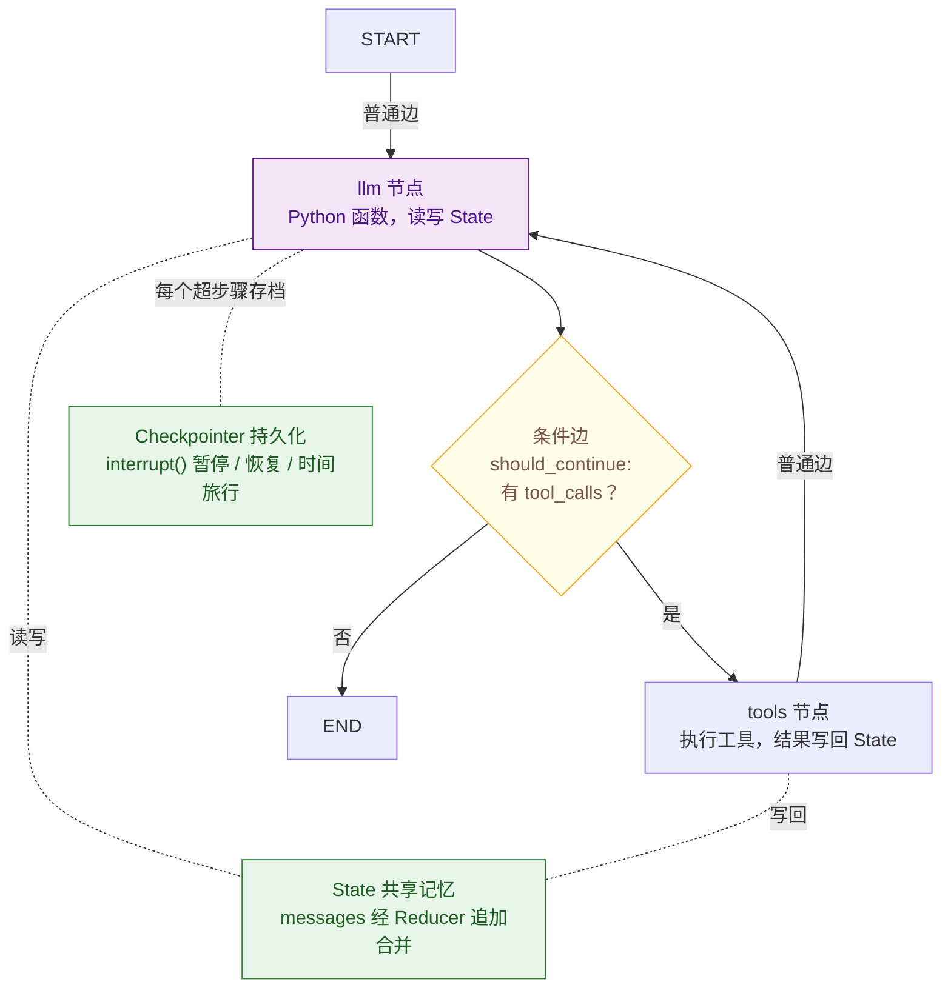

# LangGraph 的核心概念：节点、边、状态

> 难度：基础
> 分类：Frameworks

## 简短回答

LangGraph 是 LangChain 生态中专门用于构建**有状态、可恢复（durable）的多步骤 Agent 工作流**的框架，于 2025 年 10 月 22 日发布 1.0 GA，成为 durable agent（持久化 Agent）框架领域首个稳定版本，月 PyPI 下载量超 3800 万（2026），被称为"Agent 编排的 React"。1.0 GA 之后，2026 Q2 更新进一步补齐生产级能力：**per-node 超时**（逐节点设置执行时限，防止单步卡死拖垮整图）、**v2 streaming**（新一代结构化流式输出，配合 DeltaChannel 实现增量推送）；LangChain 侧也同步重构，聚焦核心 agent loop 并引入 **middleware**（中间件）概念，便于统一拦截、改写请求与响应。其核心思想是将 Agent 的执行流程建模为一个**有向图（Graph）**，包含三个基本构建块：(1) **State（状态）**——图的共享记忆，是一个 TypedDict，所有节点通过读写 State 来传递信息，支持 Reducer 函数自定义状态合并逻辑（如消息列表追加而非覆盖）；(2) **Node（节点）**——图中的"工作单元"，每个节点是一个 Python 函数，接收当前 State 并返回 State 更新（可以是 LLM 调用、工具执行、条件判断等任何操作）；(3) **Edge（边）**——连接节点的"路由器"，分为普通边（固定路由）和条件边（基于 State 动态路由，实现分支逻辑）。LangGraph 还提供 **Checkpointer（检查点）** 实现状态持久化，支持 Human-in-the-Loop（`interrupt()` 暂停等待人工审批）、错误恢复、长时间任务。执行模型是"超步骤（Super-step）"——每个超步骤中并行执行所有就绪节点，然后同步 State，直到到达 END 节点。

## 详细解析

### 核心架构图



*LangGraph 把 Agent 建成图：节点读写共享 State，条件边决定循环还是终止，Checkpointer 让图可暂停、可恢复。*

### State：图的共享记忆

```python
from typing import Annotated, TypedDict
from langgraph.graph import StateGraph, START, END
from langgraph.graph.message import add_messages
from langchain_core.messages import BaseMessage

# 定义 State：所有节点共享的数据结构
class AgentState(TypedDict):
    # Annotated + add_messages = Reducer 模式
    # 新消息追加到列表，而非覆盖
    messages: Annotated[list[BaseMessage], add_messages]

    # 普通字段：新值直接覆盖旧值
    current_task: str
    step_count: int
    final_answer: str

# State 设计原则：
# 1. 只放需要跨节点共享的数据
# 2. 用 Reducer 处理需要"累加"的字段（如消息历史）
# 3. 默认行为是覆盖（最后写入的值生效）
# 4. State 是不可变的——节点返回更新字典，由框架合并

# Reducer 示例：自定义合并逻辑
def merge_tool_results(existing: dict, new: dict) -> dict:
    """工具结果合并：新结果追加到已有结果"""
    merged = {**existing, **new}
    return merged

class AdvancedState(TypedDict):
    messages: Annotated[list[BaseMessage], add_messages]
    tool_results: Annotated[dict, merge_tool_results]
```

### Node：图中的工作单元

```python
from langchain_openai import ChatOpenAI
from langchain_core.messages import HumanMessage, AIMessage

llm = ChatOpenAI(model="gpt-4o")

# 节点 1：调用 LLM
def call_llm(state: AgentState) -> dict:
    """每个节点接收 State，返回 State 更新"""
    response = llm.invoke(state["messages"])
    # 返回的字典会与当前 State 合并
    return {"messages": [response]}

# 节点 2：执行工具
def execute_tools(state: AgentState) -> dict:
    """执行 LLM 请求的工具调用"""
    last_message = state["messages"][-1]
    results = []
    for tool_call in last_message.tool_calls:
        result = run_tool(tool_call)
        results.append(result)
    return {"messages": results}

# 节点 3：检查是否完成
def should_continue(state: AgentState) -> str:
    """条件边的路由函数——返回下一个节点的名称"""
    last_message = state["messages"][-1]
    if last_message.tool_calls:
        return "tools"      # 有工具调用 → 去执行工具
    else:
        return END           # 无工具调用 → 结束

# 节点的本质：
# - 就是普通的 Python 函数
# - 输入：当前 State
# - 输出：State 更新字典（不是完整 State）
# - 可以包含任何逻辑：LLM 调用、API 请求、数据处理
```

### Edge：连接节点的路由器

```python
# 构建完整的 Graph
graph = StateGraph(AgentState)

# 添加节点
graph.add_node("llm", call_llm)
graph.add_node("tools", execute_tools)

# 普通边：固定路由（A → B）
graph.add_edge(START, "llm")        # 入口 → LLM
graph.add_edge("tools", "llm")      # 工具执行后 → 回到 LLM

# 条件边：动态路由（基于 State 决定去哪）
graph.add_conditional_edges(
    "llm",                           # 从 LLM 节点出发
    should_continue,                  # 路由函数
    {
        "tools": "tools",            # 返回 "tools" → 去 tools 节点
        END: END,                     # 返回 END → 结束
    }
)

# 编译图
app = graph.compile()

# 边的类型：
# 1. 普通边 add_edge(A, B)：A 执行后一定去 B
# 2. 条件边 add_conditional_edges(A, func, mapping)：
#    A 执行后，由 func(state) 返回值决定去哪
# 3. START：虚拟入口节点
# 4. END：虚拟终止节点
```

### Checkpointer：状态持久化与 Human-in-the-Loop

```python
from langgraph.checkpoint.memory import MemorySaver
from langgraph.checkpoint.postgres import PostgresSaver

# 开发环境：内存检查点
checkpointer = MemorySaver()

# 生产环境：PostgreSQL 检查点
# checkpointer = PostgresSaver(conn_string="postgresql://...")

# 编译时注入 Checkpointer
app = graph.compile(checkpointer=checkpointer)

# 使用 thread_id 管理对话
config = {"configurable": {"thread_id": "user-123"}}
result = app.invoke(
    {"messages": [HumanMessage(content="帮我查一下订单")]},
    config=config,
)

# 同一个 thread_id 的后续调用会自动加载历史 State
result2 = app.invoke(
    {"messages": [HumanMessage(content="退款怎么操作？")]},
    config=config,  # 自动携带之前的对话历史
)

# Human-in-the-Loop：interrupt() 暂停等待人工
from langgraph.types import interrupt

def sensitive_action(state: AgentState) -> dict:
    """执行敏感操作前暂停，等待人工确认"""
    approval = interrupt(
        {"question": "是否批准执行此操作？", "details": state["current_task"]}
    )
    if approval == "yes":
        return {"messages": [AIMessage(content="操作已执行")]}
    else:
        return {"messages": [AIMessage(content="操作已取消")]}

# Checkpointer 使能的能力：
# 1. 对话持久化——跨请求保持状态
# 2. 错误恢复——从最后一个检查点重试
# 3. Human-in-the-Loop——暂停/恢复执行
# 4. 时间旅行——回滚到任意历史状态
```

### 1.0 GA 与 2026 生产化新特性

LangGraph 1.0 GA（2025-10-22）的标志性意义在于把"durable agent"从实验概念确立为**生产标准**——凭借 Checkpointer 持久化 + 超步骤执行模型，Agent 进程可在任意超步骤崩溃后从最近检查点恢复，长时任务不再依赖进程常驻。2026 Q2 更新围绕"生产可控性"补齐了三块关键能力：

| 特性 | 解决的问题 | 要点 |
|------|-----------|------|
| **per-node 超时** | 单个节点（如一次外部 API 调用、一段 LLM 推理）卡死会拖垮整图 | 在节点粒度声明执行时限，超时自动中断并触发重试或错误分支，与 `retry_policy`、`interrupt()` 组合形成分级容错 |
| **v2 streaming** | 旧版 streaming 只能拿到最终结果或粗粒度 token 流，难以按结构化事件增量消费 | 新一代流式接口按节点输出粒度增量推送，配合 **DeltaChannel** 只下发状态变更部分（delta），降低流式场景的带宽和延迟 |
| **middleware（中间件）** | 横切逻辑（日志、鉴权、改写请求/响应）散落在各节点难以维护 | LangChain 侧引入 middleware 概念，统一拦截 agent loop 的请求与响应，便于插拔可观测、限流、审计等横切关注点 |

> 选型提示：1.0 GA 之前，"超时""流式增量""横切拦截"这些生产刚需大多要手写 wrapper 绕行；1.0 GA + 2026 Q2 后已转为框架一等能力，自研编排层前应先核对 LangGraph 是否已覆盖，避免重复造轮子。

### 完整 ReAct Agent 示例

```python
# LangChain 1.0 GA（2025-10）：推荐 langchain.agents.create_agent
# langgraph.prebuilt.create_react_agent 已 deprecated
from langchain.agents import create_agent
from langgraph.checkpoint.memory import MemorySaver
from langchain_openai import ChatOpenAI
from langchain_core.tools import tool

@tool
def get_weather(city: str) -> str:
    """获取城市天气"""
    return f"{city}：晴天，25°C"

@tool
def search_flights(origin: str, destination: str) -> str:
    """搜索航班"""
    return f"{origin}→{destination}：找到 3 个航班"

# 一行创建完整的 ReAct Agent（v1.0 GA 推荐方式）
agent = create_agent(
    model=ChatOpenAI(model="gpt-4o"),
    tools=[get_weather, search_flights],
    checkpointer=MemorySaver(),
)

# 执行
result = agent.invoke(
    {"messages": [("human", "我想去北京，先查天气再搜航班")]},
    config={"configurable": {"thread_id": "trip-1"}},
)

# 注：create_agent 底层仍是 LangGraph 图；旧版 create_react_agent 在 v1.x 仍可用
# 但官方明确建议新代码使用 langchain.agents.create_agent
# 1.0 GA 后可通过 middleware 参数挂载日志/鉴权/改写等横切逻辑，无需侵入节点函数
```

## 常见误区 / 面试追问

1. **误区："LangGraph 就是 LangChain 的升级版"** — LangGraph 不是 LangChain 的替代品，而是补充。LangChain 处理单步链式调用（Prompt → LLM → Parser），LangGraph 处理多步有状态工作流（循环、分支、人工审核）。简单任务用 LangChain，复杂 Agent 用 LangGraph。

2. **误区："State 就是全局变量"** — State 不是可变的全局变量。节点不能直接修改 State，只能返回更新字典，由框架通过 Reducer 合并。这种设计保证了状态变更的可追踪性和一致性。

3. **追问："LangGraph 的执行模型是什么？"** — "超步骤（Super-step）"模型：每个超步骤中，所有没有未满足依赖的节点并行执行，执行完毕后同步 State，然后进入下一个超步骤。这类似于 Pregel 图计算模型（Google 的大规模图处理框架）。

4. **追问："LangGraph 如何处理错误？"** — 三层错误处理：(1) 节点内 try/catch 处理预期错误；(2) Checkpointer 支持从失败点重试（不丢失已完成步骤）；(3) Graph 级别的 `retry_policy` 配置自动重试策略。结合 `interrupt()` 还可以在错误时暂停并请求人工介入。1.0 GA 后还可在节点粒度配 **per-node 超时**，单步卡死时自动中断并走重试/错误分支，避免拖垮整图。

5. **追问："什么是 durable agent？LangGraph 为什么适合生产部署？"** — Durable agent 指 Agent 执行状态可持久化、崩溃后可从检查点恢复、长时任务不依赖进程常驻。LangGraph 靠 Checkpointer（每完成一个超步骤就落盘状态）实现这一点，2026 Q2 又补齐了 per-node 超时（防单步卡死）和 v2 streaming / DeltaChannel（增量流式输出）。这也是它月下载量超 3800 万、成为 durable agent 框架首个 GA 版本的核心原因。面试可顺势对比：纯内存编排（如裸 ReAct 循环）一旦进程退出则全部状态丢失，生产场景必须上 durable 化方案。

## 参考资料

- [LangChain & LangGraph 1.0 (Official Announcement)](https://www.langchain.com/blog/langchain-langgraph-1dot0)
- [LangGraph Overview (Official Docs)](https://docs.langchain.com/oss/python/langgraph/overview)
- [A Beginner's Guide to LangGraph: Core Concepts (Medium)](https://medium.com/@ajaykumargajula7/a-beginners-guide-to-langgraph-understanding-the-core-concepts-bc2b1011d675)
- [Mastering AI Agent Systems with LangGraph in 2025 (Towards AI)](https://pub.towardsai.net/from-single-brains-to-team-intelligence-mastering-ai-agent-systems-with-langgraph-in-2025-3520af4fc758)
- [Understanding Core Concepts of LangGraph Deep Dive (Dev.to)](https://dev.to/raunaklallala/understanding-core-concepts-of-langgraph-deep-dive-1d7h)
- [LangGraph Basics: Understanding State, Schema, Nodes, and Edges (Medium)](https://medium.com/@vivekvjnk/langgraph-basics-understanding-state-schema-nodes-and-edges-77f2fd17cae5)
