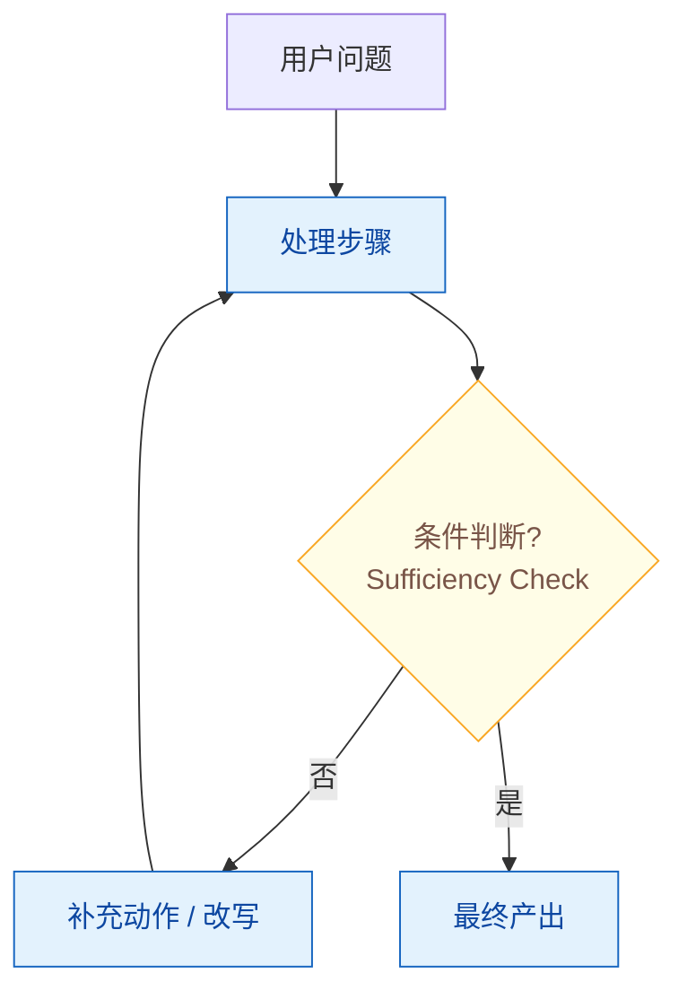
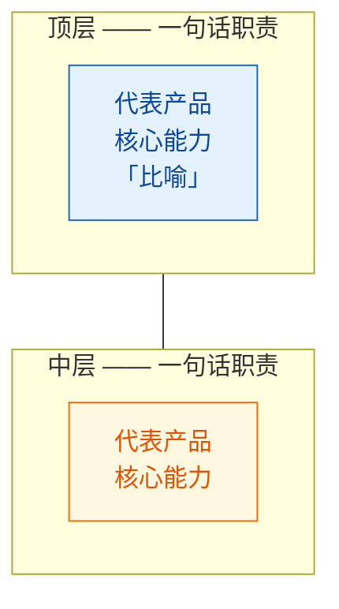
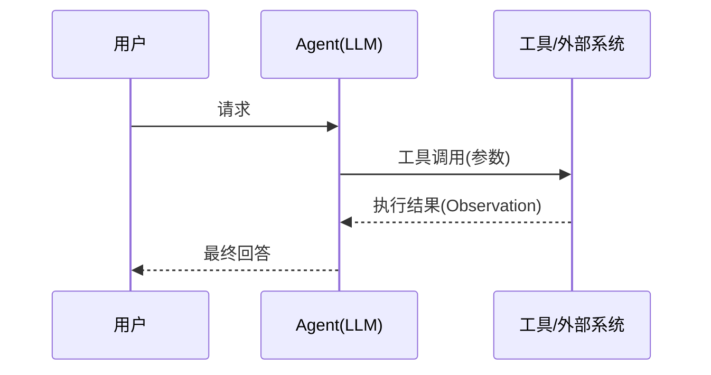
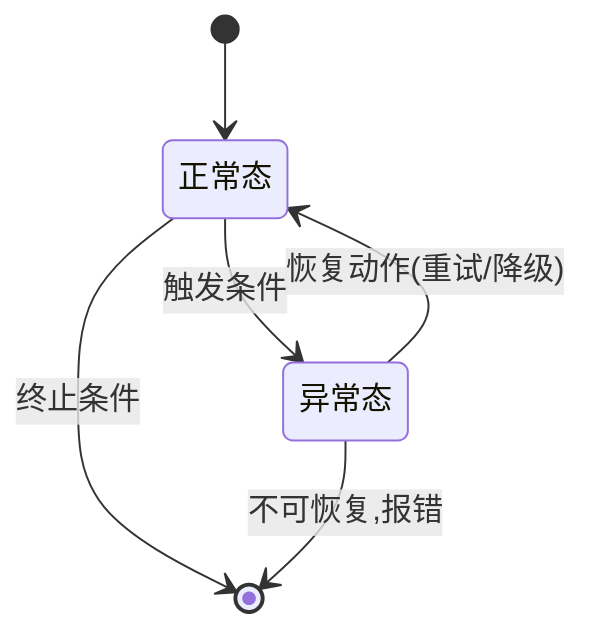

# 配图标准(diagram-standards)

> 本库插图遵循的唯一标准:**图即代码(Mermaid)、一图一论点、面试可复现**。
> 配图的目标不是"每篇都有图",而是"每个值得图的结构都有唯一一张好图"。
>
> 制定日期:2026-08-15 ｜ 背景:全库 104 篇中 82 篇含 ASCII 图,但 ASCII 画在代码块里,GitHub 永远不会渲染成图。本标准以 Mermaid 取代 ASCII:保留"图随文活、进 diff、可追溯"的优点,消灭"不渲染"的缺点。范例:[109 三层抽象](../01-agent-architecture/109-what-is-agent-harness.md)、[114 Deep Research 循环](../01-agent-architecture/114-deep-research-agent.md)。

## 一、配图三关

一张图值不值得画,过三道门,**全过才画;任何一关过不了,表格或文字就是最优解**。

### 1. 结构关 —— 内容的核心主张是不是空间结构?

只有当文章的论点本身就是**顺序、循环、分支、层次、时序、拓扑、状态转移**时,图才优于文字。
判断方法:这段内容用文字说,读者需要在脑内"组装零件"才能看懂——值得外化成图;文字本身线性可读——画图就是装饰。

### 2. 复现关 —— 读者看完能在白板上重画吗?

这是面试库独有的判据,也是最硬的一条:好图是**面试复现锚点**——被问到这道题,应能在 30 秒内画出骨架。
推论:**节点 ≤ 10~12 个**。超过的图是"文档",不是"学习资产",拆图或退回文字。

### 3. 论点关 —— 能用一句话写出图注吗?

一图一论点。每张图下方必须有一句话图注,例如"同模型换 harness,Terminal Bench 排名 #33 → #5"。
写不出一句话论点的图,没有独立存在的理由。

## 二、内容形态 → 图类型映射

| 内容形态 | 图类型 | 本库典型适用 |
|---------|--------|------------|
| 循环 / 流水线 | `flowchart TD` + 判断菱形 | 114 Deep Research 循环、011 RAG 流水线 |
| 分层 / 堆叠架构 | `flowchart` + subgraph | 109 三层抽象、005 分层架构 |
| 交互 / 调用顺序 | `sequenceDiagram` | 021 Function Calling、027 MCP、101 A2A、037 Handoff |
| 状态机 / 生命周期 | `stateDiagram-v2` | 006 Agent Loop、任务/会话生命周期 |
| 决策 / 选路 | `flowchart` + 菱形分支 | 109 决策树、007 Workflow vs Agent |
| 对比 / 选型 | ❌ 不画,用表格 | 014 向量库选型、060 Few-shot vs Zero-shot |
| 概念辨析 / 误区 | ❌ 不画,用文字 | 各篇"常见误区"段 |

## 三、负面清单

- **不画并列要点的"图化"** —— 五个盒子排一排,那叫列表;
- **不画 30 节点全景图** —— 那是地图不是知识,拆成多张或退回文字;
- **不在节点里塞长句** —— 标签超过一行半,就是段落伪装成图,用 `<br/>` 折行或精简;
- **不放 PNG / SVG / drawio 资产文件** —— 一律 Mermaid 内嵌。理由:图片资产无法 diff、双周扫描改文字时不会同步改图,几个迭代内必然图文漂移;
- **"简短回答"段不配图** —— 它本身就是文字版摘要,图只属于"详细解析"里的核心模型。

## 四、工程规范

1. **每篇 ≤ 2 张**,放在"详细解析"里核心模型首次出现处,必带一句话图注;
2. **风格统一**:中文标签、`<br/>` 折行、按第五节模板选图选色;
3. **语法保守**:只用 flowchart / sequenceDiagram / stateDiagram-v2 的基础特性(GitHub 渲染环境为准),实验性特性不进库;
4. **维护责任进双周扫描**:改动相关文字时必须同步图。Mermaid 与文字同屏出现在 diff 里,改文不改图在 review 时一眼可见;
5. **优先级公式:被引次数 × ASCII 吃力程度** —— 先覆盖 top 20 枢纽文章,配合双周扫描每次 3~5 篇,不搞全量运动。

## 五、Mermaid 模板与配色

### 通用配色(classDef)

语义化六色,所有图共用;一张图内的用色应少于等于三种。唯一例外:分层堆叠图(模板 B)按层配色,每层一色、层数即色数(≤5 层),因为"颜色 = 层"本身就是该类图要传达的信息。

```
classDef proc     fill:#e3f2fd,stroke:#1565c0,color:#0d47a1   「蓝·常规处理」
classDef decision fill:#fffde7,stroke:#f9a825,color:#795548   「黄·判断分支」
classDef store    fill:#e8f5e9,stroke:#2e7d32,color:#1b5e20   「绿·存储/数据」
classDef agent    fill:#f3e5f5,stroke:#6a1b9a,color:#4a148c   「紫·LLM/Agent 角色」
classDef err      fill:#ffebee,stroke:#c62828,color:#b71c1c   「红·错误/失败路径」
classDef neutral  fill:#eceff1,stroke:#546e7a,color:#37474f   「灰·外部系统/边界」
```

### 模板 A:循环 / 流水线(范例:114)



### 模板 B:分层 / 堆叠架构(范例:109)



### 模板 C:交互 / 调用顺序(适用:021 / 027 / 101 / 037)



### 模板 D:状态机 / 生命周期(适用:006 等)



## 六、新增一张图的 checklist

- [ ] 三关全过(结构 / 复现 / 论点);
- [ ] 按第二节映射选对图类型,对比选型内容放弃画图改用表格;
- [ ] 节点 ≤ 12,标签中文、`<br/>` 折行、无长句;
- [ ] 套用第五节模板与配色,一张图用色 ≤ 3 种;
- [ ] 图下有一句话图注;
- [ ] 在 GitHub 上渲染验证通过后再合入。

## 附:范例索引

| 文章 | 图 | 说明 |
|------|-----|------|
| [114 Deep Research](../01-agent-architecture/114-deep-research-agent.md) | 核心循环 flowchart | 全库第一张 Mermaid,模板 A 雏形 |
| [109 Agent Harness](../01-agent-architecture/109-what-is-agent-harness.md) | 三层抽象堆叠 | 模板 B 范例,由 ASCII 字符墙改造而来 |
